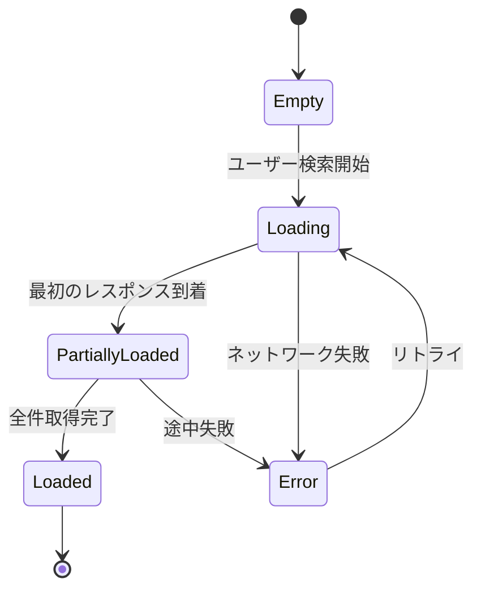

# ui-inventory.md — UI Inventory 規約

> `docs/design/inventory/` 配下に画面・コンポーネント・状態・フローの記録を網羅的に置き、
> リファクタ時の Behavior Preservation の根拠とする規約。
> 本格生成は A10 で `ui-snapshot` Skill が担当 (ADR 0023)。

## ディレクトリ構造

| ディレクトリ | 内容 | ファイル例 |
|---|---|---|
| `docs/design/inventory/screens/` | 画面ごと | `home.md` / `search.md` / `preview.md` / `myidols.md` |
| `docs/design/inventory/components/` | コンポーネントごと | `idol-card.md` / `brand-chip.md` / `color-swatch.md` |
| `docs/design/inventory/states/` | 状態パターン | `empty.md` / `loading.md` / `error.md` / `partially-loaded.md` |
| `docs/design/inventory/flows/` | ユーザーフロー | `login.md` / `add-favorite.md` / `share-list.md` |
| `docs/design/inventory/screenshots/` | Roborazzi 生成 baseline PNG | `<composable>-<device>-<theme>.png` |

## 各種別の frontmatter 必須キー

### screens / components / states / flows 共通

```yaml
---
id: inventory-<type>-<slug>
type: screen | component | state | flow
title: <タイトル>
status: living
last_updated: YYYY-MM-DD
related_specs:
  - SPEC-IDOL-001-3
related_screenshots:
  - <composable>-mobile-light.png
  - <composable>-mobile-dark.png
  - <composable>-desktop-light.png
  - <composable>-desktop-dark.png
related_design_tokens:
  - colors.brand.imas-cg-rin
  - typography.heading-large
  - spacing.medium
related_components:
  - inventory-component-idol-card
---
```

- 配列は block 形式必須 (`docs-structure.md` 規約)
- `related_screenshots` は 4 パターン全て列挙 (1 パターン欠落は CI 警告、A10 完了後)
- `related_design_tokens` は Component 階層トークンを優先 (`design-tokens.md` 3 階層構造と整合)
- `related_components` で他 Inventory ファイルへの双方向リンク

## 本文構造

| セクション | 内容 |
|---|---|
| 概要 (5 行以内 summary) | この画面 / コンポーネント / 状態 / フローの役割 |
| 構成要素 | 含まれるコンポーネント一覧 (テーブル) |
| 状態と遷移 | Mermaid `stateDiagram-v2` で UiState の状態遷移 |
| データソース | どの API / Repository / SPEC を参照するか |
| アクセシビリティ | semantic role / contentDescription / フォーカス順序 |
| 参考 screenshot | `docs/design/inventory/screenshots/` への相対リンク (4 パターン) |
| Open Questions | 未解決の意思決定 (append-only) |

## Mermaid 例 (状態と遷移)



## 構成要素テーブル例

| 要素 | コンポーネント | 関連 SPEC | 動的色 |
|---|---|---|---|
| アイドルカード | `IdolCard` | SPEC-IDOL-001-3 | ✅ (brand color) |
| ブランドチップ | `BrandChip` | SPEC-BRAND-002-1 | ✅ |
| カラーパレット | `ColorSwatch` | SPEC-COLOR-003-2 | ✅ |
| 検索バー | `SearchBar` | SPEC-SEARCH-001-1 | ❌ (Semantic.Primary 固定) |

## 更新ポリシー

- **新規 Composable / 状態を追加したら、対応する Inventory ファイルを作成** (`ui-snapshot` Skill が Plan 起票)
- **リファクタで構造が変わったら Behavior Preservation 検証** (visual regression + spec-conformance) を通した上で Inventory を更新
- **削除されたコンポーネントは Inventory ファイルも削除**、削除コミットメッセージに理由を明記
- **Open Questions は append-only**、解決時は別行に解決日と方法を追記

## Inventory ⇄ Spec ⇄ 実装の対応

- `related_specs` で SPEC-ID 双方向リンク (`docs-structure.md` 規約)
- `related_screenshots` で Roborazzi baseline 双方向リンク (`ui-snapshot.md`)
- `related_design_tokens` で DESIGN.md トークン双方向リンク (`design-tokens.md`)
- `related_components` で Inventory ファイル間の双方向リンク (`component → screen` の包含関係等)

## 機械検証 (A6 + A10 で段階導入)

- **A6**: Gradle カスタムタスクで frontmatter 必須キー + 5 行 summary + 日本語見出し検証
- **A6**: `related_screenshots` の参照先ファイル実在検証 (4 パターン揃いの warning)
- **A10**: Konsist で全 Composable に対応する Inventory ファイル存在検証 (新規 Composable → Inventory 不在は CI 警告)
- **A10**: `related_design_tokens` の参照先トークンが DESIGN.md Component 階層に実在検証

## Gotchas

- **Inventory は AI が次のリファクタを設計する際の Behavior Preservation 根拠**、網羅性が重要
- **4 パターン screenshot を必ずペアでリンク** (1 パターン欠落 = CI 警告を A10 完了後に enable)
- **新規 Composable 追加時は Inventory ファイル作成を必ず Plan 起票**: `ui-snapshot` Skill が検出 → Plan 起票、人間レビュー
- **Open Questions は append-only**、削除禁止、解決時は別行追記
- **Mermaid `stateDiagram-v2` の構文エラー**: 文法ミスで render されない、`mermaid.live` 等で事前確認推奨
- **`related_components` の双方向性**: `IdolCard` (component) → `home-screen` (screen) のように上向きリンクも双方向で記録
- **アクセシビリティセクション必須**: semantic role / contentDescription / フォーカス順序を明記、TalkBack / VoiceOver で動作確認

## 関連

- ADR 0023 (UI 凍結三本柱)
- `docs/harness/plan.md` §3.9 / R-22
- `.claude/rules/{ui-snapshot,design-tokens,behavior-preservation,composable,docs-structure}.md`
- `.claude/skills/ui-snapshot/SKILL.md`
- `docs/design/README.md` (補助ドキュメント、A10 で本格化)
- `docs/design/inventory/screenshots/` (baseline 配置先)
