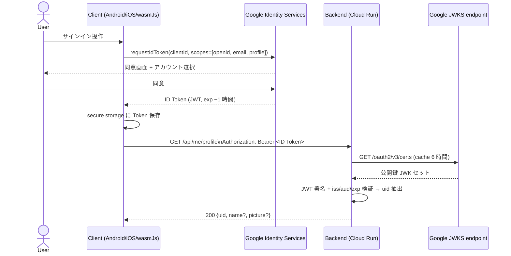

# 認証 API (GIS 統一)

> **5 行以内 summary**: 全 target で Google Identity Services (GIS) に統一。フロント
> (Android / iOS / wasmJs) で ID Token を取得 → Backend が JWKS で検証 → uid (sub claim)
> を抽出して認可に用いる。Firebase Auth は完全撤廃 (`dev.gitlive:firebase-*` /
> `core/network/auth/` を C5 で削除)。本格実装は C5 (EPIC-003)、本ファイルは規約 + 設計判断。

## 認証フロー (5 ステップ)



### ステップ詳細

1. **フロント側で ID Token 取得** — 各 target ごとに GIS SDK を呼ぶ
   - Android: `GoogleSignIn` / `Identity.getSignInClient()`
   - iOS: `GIDSignIn` (Google Identity SDK for iOS)
   - wasmJs: GIS JavaScript Library (`google.accounts.id.initialize/prompt`)
2. **Backend へ Bearer 送信** — `Authorization: Bearer <ID Token>` ヘッダで `/api/me/*` を呼ぶ
3. **Backend の JWKS 検証** — `https://www.googleapis.com/oauth2/v3/certs` で取得した公開鍵で JWT 署名を検証 (cache 6 時間)
4. **claim 検証** — `iss == https://accounts.google.com` / `aud == <Backend で許可した client_id 群>` / `exp` 未来
5. **uid 抽出** — `sub` claim を `Uid` value class に変換、`requireUid()` ヘルパで context に格納

## エンドポイント

| パス | 認証 | 用途 | 状態 |
|---|---|---|---|
| (フロント側 GIS フロー) | — | ID Token 取得 | 各 platform で C5 / C8 / C9 で実装 |
| (Backend の JWKS 検証ミドルウェア) | — | 自動検証 (全 `/api/me/*` 共通) | C5 で実装 |
| `GET /api/me/profile` | Bearer | uid + GIS userinfo (memory cache TTL 15 分) を返す | C5 |
| `DELETE /api/me` | Bearer | ユーザーアカウント削除 (uid + favorites 物理削除) | C5 |

## JWKS 検証規約 (`.claude/rules/backend-auth.md` で本格化、A2-2)

- **検証必須項目**:
  - 署名 (RS256、Google JWKS の公開鍵)
  - `iss` (`https://accounts.google.com` のみ許容)
  - `aud` (Backend で許可した client_id allowlist、env で設定)
  - `exp` (現在時刻より未来)
  - `iat` (clock skew 許容 5 分)
- **検証失敗時**: 全て 401 を返却、エラー応答に **詳細を含めない** (`code: unauthorized` のみ)
- **JWKS cache**: Google が返す `Cache-Control: max-age=21600` (6 時間) に従い、Backend memory cache に保存。期限切れ時は背景で再取得 (stale-while-revalidate)
- **JWKS 取得失敗時**: `503 service_unavailable` + `Retry-After: 60` ヘッダ、クライアントは exponential backoff で retry

## `requireUid()` 規約

Backend `/api/me/*` 系の全ハンドラは `requireUid()` を呼んで `Uid` を取得する必要がある。
Konsist で機械検証 (A2-2 + A6 で本格化、`.claude/rules/backend-auth.md`):

```kotlin
// 例 (C5 で実装、ここでは規約のみ)
get("/api/me/profile") {
    val uid = call.requireUid()      // ← 必須
    val profile = profileService.get(uid)
    call.respond(profile)
}
```

- `requireUid()` は内部で JWKS 検証 → claim 抽出 → `Uid` 化を行い、失敗時は `respondError(401)` で短絡
- ハンドラ本体は `requireUid()` 後の uid を **uid フィルタ条件** として全 DB クエリに使う
- uid 単位での所有権チェックを必須化 (他人の uid のデータには触れない、403)

## エラーケース

| ケース | HTTP | `error.code` | クライアント挙動 |
|---|---|---|---|
| `Authorization` ヘッダ不在 | 401 | `unauthorized` | サインインへ誘導 |
| Bearer 形式不正 | 401 | `unauthorized` | 同上 |
| 署名検証失敗 | 401 | `unauthorized` | 同上 + log (運用通知) |
| `iss` / `aud` 不一致 | 401 | `unauthorized` | 同上 |
| `exp` 切れ | 401 | `token_expired` | クライアントは GIS で新規 ID Token 取得後 retry |
| `iat` clock skew 過大 | 401 | `unauthorized` | クライアント端末時刻ずれを疑う、サインアウト誘導 |
| JWKS 取得失敗 | 503 | `service_unavailable` | exponential retry (最大 3 回) |
| `sub` claim 不在 | 401 | `unauthorized` | サインアウト誘導 |
| uid 不一致 (他人のデータ操作) | 403 | `forbidden` | ローカル状態を破棄、サインアウト誘導 |

## PII 取扱

- **DB に保存する PII は `uid` のみ** (ADR 0020、`.claude/rules/pii.md`)
- `email` は **クライアントに返さない** (Backend は GIS userinfo から取得するが、レスポンスに含めない)
- `name` / `picture` は表示用にレスポンスに含めるが、**memory cache TTL 15 分** のみ
- ID Token 自体はログに **平文出力禁止** (`Authorization` ヘッダごとマスク)
- エラー応答に `details` を含める場合も PII フィールドを含めない (`pii.md` redaction 規約)

## クライアント側の Token 管理

| target | secure storage |
|---|---|
| Android | EncryptedSharedPreferences (Jetpack Security) |
| iOS | Keychain |
| wasmJs | Memory only (sessionStorage / cookie は使わない、XSS リスク) |
| JVM Desktop | テスト用のみ、永続化なし |

- ID Token は **永続化を最小化** (Android / iOS は EncryptedSharedPreferences / Keychain、wasmJs は memory)
- exp 失効時に refresh は **しない** (refresh token は使わず、GIS のサイレントログインに任せる)
- サインアウト時は secure storage から削除 + Backend `/api/me/profile` の cache も破棄

## Firebase 撤去 (ADR 0011 / `.claude/rules/{firebase-boundary,no-firebase}.md`)

- `dev.gitlive:firebase-{app,auth,firestore}` の依存削除 (C5)
- `core/network/auth/` (Firebase Auth 連携層) を撤去 (C5)
- `core/network/firestore/` を撤去、`/api/me/*` 経由のアクセスに統一 (C5)
- `firebase.json` / `.firebaserc` を C7 で Cloudflare Pages 移行と同時に削除
- 新規追加禁止規約は `.claude/rules/no-firebase.md` (A2-2 で本格化)、Skill 起草時の事前ガード

## ローカル開発時の認証

- ローカル Backend (`./gradlew :backend:server:run`) は **mock JWKS** を提供する開発モードを実装 (C5)
- mock モードでは `Authorization: Bearer dev-<uid>` を許容、JWKS 検証をスキップして `uid` を即座に抽出
- 本番ビルドでは mock モードを無効化 (`if (BuildConfig.DEBUG)` 相当のガード、Konsist で検証)

## 現状 (B0 段階、2026-05-17 時点)

- `backend/server/` の認証ミドルウェアは **未実装** (C5)
- `core/network/auth/` は **Firebase Auth 経由の旧実装** が現存 (C5 で撤去)
- GIS Client ID は **未発行** (C5 着手時に GCP コンソールで発行)
- 本ファイルが記述する仕様は **C5 完了後の最終形**

## 関連

- ADR 0011 (GIS 統一認証 + Firebase 撤去) / 0020 (PII 保護: uid のみ DB 保存) / 0021 (Secrets 管理)
- `.claude/rules/{backend-auth,pii,no-firebase,firebase-boundary,secrets}.md`
- `colormaster-api.yaml` (security scheme `bearerAuth`)
- `me.md` (uid を使う API 詳細)
- `../architecture/sequences.md` (ユースケース 1: ログインのフロー図)
