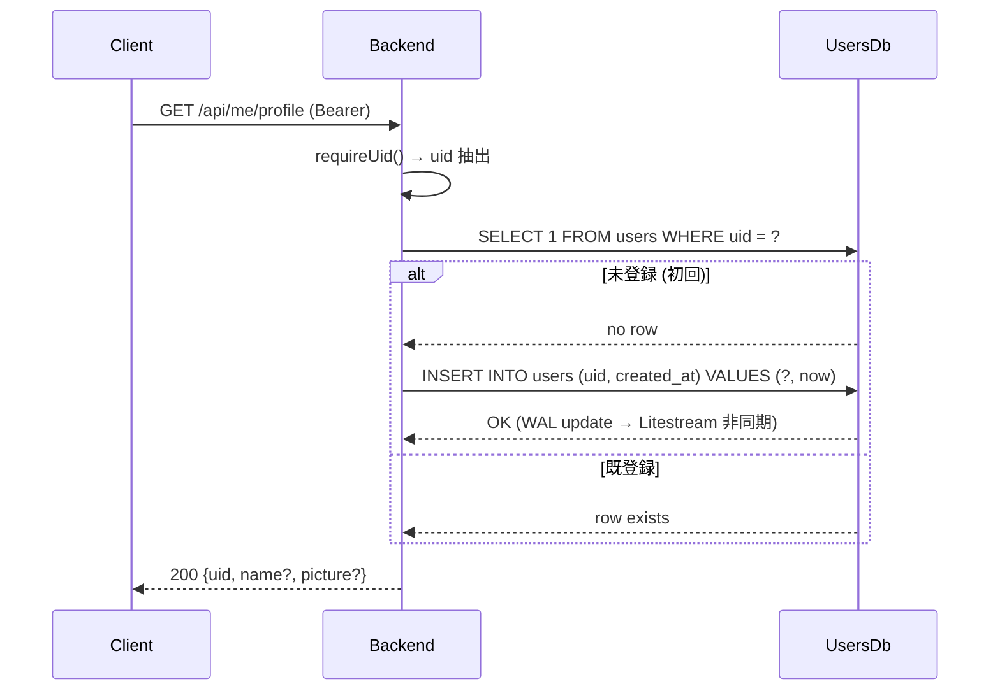
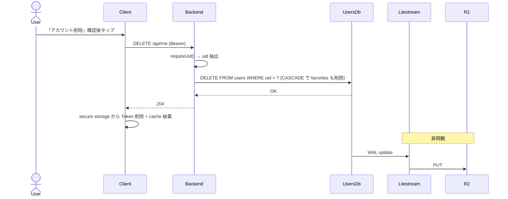

# ユーザーデータ API (/api/me/*)

> **5 行以内 summary**: 認証済ユーザーの担当・推し一覧 / プロフィール参照 / アカウント削除を
> 扱う。GIS ID Token Bearer 認証必須、Backend 内蔵 SQLite (`users.db`) に **uid のみ** 保存
> (PII 最小化、ADR 0020)。Litestream で R2 に WAL replicate + 起動時 restore (ADR 0008)。
> 本格実装は C5 (EPIC-003)、本ファイルは規約 + 設計判断 + スキーマ。

## エンドポイント

| メソッド | パス | 用途 | 認証 | 主要レスポンス |
|---|---|---|---|---|
| GET | `/api/me/profile` | uid + GIS userinfo (memory cache TTL 15 分) | Bearer | `Profile` |
| GET | `/api/me/favorites` | 担当・推し一覧 (`kind` でフィルタ可) | Bearer | `FavoriteList` |
| POST | `/api/me/favorites` | 担当・推し追加 | Bearer | `Favorite` (201) |
| DELETE | `/api/me/favorites/{idolId}` | 担当・推し削除 | Bearer | (204) |
| DELETE | `/api/me` | ユーザーアカウント削除 (uid + favorites 物理削除) | Bearer | (204) |

スキーマ詳細は `colormaster-api.yaml` を参照。

## 認可規約

- **全エンドポイントで `Authorization: Bearer <GIS ID Token>` 必須**
- Backend は **`requireUid()` ヘルパで uid を抽出** (`auth.md` 参照)
- **`requireUid()` を呼ばないハンドラは Konsist 規約違反** (A2-2 + A6 で機械化、`.claude/rules/backend-auth.md`)
- **uid 単位での所有権チェック**: 全 SQL クエリの WHERE 条件に `uid = :authedUid` を必須化
  - 他人の uid のデータには触れない (Konsist で `INSERT/UPDATE/DELETE` 文の WHERE 句を検証)
  - 違反は `403 forbidden` ではなく **そもそも到達不可** な設計とする

## DB スキーマ (`users.db`、PII 最小化 / ADR 0020)

| テーブル | カラム | 制約 | 説明 |
|---|---|---|---|
| `users` | `uid` TEXT PK | NOT NULL、length 21 | Google Account ID (sub claim)。**他の PII は保存しない** |
| `users` | `created_at` INTEGER | NOT NULL | Unix epoch seconds (uid 初回作成時刻) |
| `favorites` | `uid` TEXT FK → users(uid) | NOT NULL、ON DELETE CASCADE | 所有者 uid |
| `favorites` | `idol_id` TEXT | NOT NULL | アイドル ID (`idols.db` には外部キー張らない、リポジトリ分離) |
| `favorites` | `kind` TEXT | CHECK (kind IN ('tantou', 'oshi')) | 担当 / 推し |
| `favorites` | `added_at` INTEGER | NOT NULL | Unix epoch seconds |
| `favorites` | (uid, idol_id) | PRIMARY KEY | 重複追加を物理的に防ぐ |

> 補足: `users.db` と `idols.db` は **別 DB ファイル** (前者は private、後者はコンテナ焼込)、
> SQLite の `ATTACH DATABASE` も使わない。クライアント側で結合表示する場合は両 API を並行
> 呼出してアプリ層で join (オフライン耐性・キャッシュ戦略の分離のため)。

## ユーザー初回サインイン時の挙動



- 初回サインイン時に **暗黙的に `users` テーブルに upsert** (専用エンドポイント不要)
- 副作用: Backend memory cache に `uid → GIS userinfo` を 15 分 TTL で格納

## ユーザー削除フロー (`DELETE /api/me`)



- **物理削除** (論理削除 / soft delete は採用しない、PII 最小化のため)
- R2 上の WAL は **古いものから期限切れで自然消滅** (Litestream の retention policy、`.claude/rules/r2-litestream.md` で本格化)
- 削除後の Token は **クライアントが破棄**、Token 自体の revoke は GIS 側 (Google アカウント設定で revoke 可能、Backend は介入しない)
- 削除 runbook は `docs/runbooks/user-deletion.md` (C5 + 法務要件があれば前倒し作成)

## エラーケース

| HTTP | `error.code` | 発生条件 |
|---|---|---|
| 400 | `validation_failed` | POST body の schema 違反 (`kind` enum 外、`idolId` 空) |
| 401 | `unauthorized` | Bearer ヘッダ不在 / 署名検証失敗 / iss/aud/exp 違反 |
| 401 | `token_expired` | ID Token 期限切れ |
| 403 | `forbidden` | (本来到達不可、Konsist 検証漏れの場合のみ) uid 不一致 |
| 404 | `not_found` | `DELETE /api/me/favorites/{idolId}` で対象が存在しない |
| 500 | `internal_error` | DB 破損 / Litestream 異常 (詳細は redaction) |
| 503 | `service_unavailable` | JWKS 取得失敗 / Litestream restore 中 / R2 unreachable |

## キャッシュ戦略

| レイヤ | 戦略 | TTL |
|---|---|---|
| Backend → Client (HTTP) | `Cache-Control: private, no-store` | 0 (CDN キャッシュ禁止) |
| Backend memory | GIS userinfo cache (key: uid) | **15 分** (`.claude/rules/pii.md`) |
| クライアント Repository | 画面表示中の memory cache | 画面遷移で破棄 |

- **CDN キャッシュは禁止** (個人データ、`private, no-store` を必須)
- クライアントの長期キャッシュも採用しない (自分のデータの即時反映を優先、stale 化を避ける)

## レスポンス例 (参考)

```json
GET /api/me/favorites?kind=tantou
Authorization: Bearer eyJhbGc...

200 OK
Content-Type: application/json; charset=utf-8
Cache-Control: private, no-store

{
  "favorites": [
    {
      "idolId": "imas_Idol_天海春香",
      "addedAt": "2026-05-10T12:34:56Z",
      "kind": "tantou"
    }
  ]
}
```

```json
POST /api/me/favorites
Authorization: Bearer eyJhbGc...
Content-Type: application/json

{ "idolId": "imas_Idol_如月千早", "kind": "oshi" }

201 Created
Content-Type: application/json; charset=utf-8
Cache-Control: private, no-store

{
  "idolId": "imas_Idol_如月千早",
  "addedAt": "2026-05-17T09:12:34Z",
  "kind": "oshi"
}
```

## 機械検証 (`.claude/rules/`、A2-2 + A6 で本格化)

| 規約 | 検証手段 |
|---|---|
| 全 `/api/me/*` ハンドラで `requireUid()` 呼出必須 | Konsist で関数本体パターンマッチ (`backend-auth.md`) |
| 全 SQL クエリの WHERE に `uid` 含むこと | Konsist で SQLDelight `.sq` ファイルの解析 (`sql-delight.md`) |
| `users` テーブルに uid 以外の PII カラムを追加禁止 | Konsist で SQLDelight schema をチェック (`pii.md`) |
| `Cache-Control: private, no-store` 必須 | Konsist でハンドラ response 設定検証 |
| エラー応答の `details` に PII 含めない | Konsist + pii redaction 規約 |
| `Dockerfile` で `COPY data/users.db` しない | Konsist で Dockerfile を検証 (`db-protection.md`) |

## PII 取扱 (`.claude/rules/pii.md` 準拠)

- **DB 保存**: `uid` のみ
- **API レスポンスに含めて良い**: `uid` / `name` / `picture` / `addedAt` / `idolId` / `kind`
- **API レスポンスに含めない**: `email` / IP / `Authorization` ヘッダ
- **ログに含めて良い**: `uid` / `idolId` / endpoint パス / HTTP メソッド / status code
- **ログに含めない**: `name` / `email` / `picture` / `Authorization` ヘッダ生値 / SQL の bind 変数の生値 (uid 以外)
- **Skill (pr-retrospective / code-reviewer) 出力前**: 上記の含めない項目を `[REDACTED-*]` 置換

## 現状 (B0 段階、2026-05-17 時点)

- `backend/server/` の `/api/me/*` ハンドラは **未実装** (C5)
- `users.db` は **存在しない** (Backend 未稼働、Litestream + R2 連携も未構築)
- 既存の担当・推しデータは Firebase Firestore (`core/network/firestore/`) 上にある (C5 で migration、ADR で別途記録予定)
- 本ファイルが記述する仕様は **C5 完了後の最終形**

## 関連

- ADR 0008 (Backend SQLite + Litestream + R2) / 0011 (GIS 統一) / 0020 (PII 最小化) / 0021 (Secrets 管理) / 0022 (Cloudflare R2)
- `colormaster-api.yaml` (`/api/me/*` パスとスキーマ SoT)
- `auth.md` (Bearer 認証 + `requireUid()` 詳細)
- `../architecture/{data-flow,sequences}.md` (Litestream replicate / restore、担当追加シーケンス)
- `.claude/rules/{backend-auth,pii,db-protection,r2-litestream,sql-delight,sqlite-data-file}.md`
- `docs/runbooks/{r2-litestream,user-deletion,secrets-rotation}.md` (C5 で本格化)
