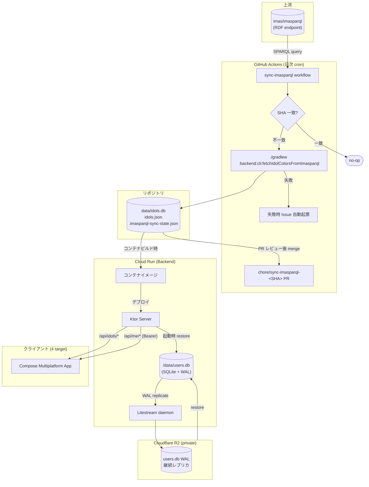

# データフロー

> **5 行以内 summary**: ColorMaster はアイドル情報を im@sparql (RDF) から日次 upstream-driven
> sync で `data/idols.db` (read-only) に取り込み、ユーザーデータ (担当・推し) は Backend
> 内蔵 `data/users.db` に保存して Litestream で R2 へ WAL レプリケート / 起動時 restore
> する。クライアントは `/api/idols/*` (公開) と `/api/me/*` (GIS 認証) 経由でアクセス。
> 詳細は §3.3 / `runbooks/sync-imasparql.md` / `runbooks/r2-litestream.md` 参照。

## データソース一覧

| ソース | 種別 | 同期戦略 | 保存場所 | 公開範囲 |
|---|---|---|---|---|
| `imas/imasparql` (RDF / SPARQL) | 上流マスタ | upstream-driven sync (GitHub Actions 日次 cron、SHA 監視、差分時のみ PR 自動作成) | リポジトリ外 (上流) | public |
| `data/idols.db` (SQLite) | 派生マスタ | リポジトリ commit + コンテナイメージ焼込、read-only | リポジトリ + コンテナ内 | public read |
| `data/idols.json` (JSON snapshot) | 派生マスタ (副) | 同上 (diff レビュー用 / wasmJs クライアント直読用) | リポジトリ + コンテナ内 | public read |
| `data/.imasparql-sync-state.json` | 同期メタ | 同期ジョブが latest SHA を記録 | リポジトリ内 | 公開 (機密性なし) |
| `data/users.db` (SQLite) | ユーザーデータ | Backend 内蔵 + Litestream で R2 へ WAL replicate + 起動時 restore | Cloud Run の `/data` + R2 private bucket | **private (PII 含む)** |

## 全体フロー図

> 凡例: 実線 = データの流れ、円柱 = 永続層、丸角 = workflow / プロセス。`data/users.db`
> は **コンテナイメージに焼き込まない** (`.dockerignore` で除外、ADR 0008 / 0020)。

## im@sparql 同期フロー (`docs/harness/plan.md` §3.3 詳細)

1. **SHA チェック** — GitHub Actions が `gh api repos/imas/imasparql/commits/master` で latest SHA を取得し、`data/.imasparql-sync-state.json` の `upstream_sha` と比較
2. **一致 → no-op** で正常終了 (API 呼び出し 1 回のみのコスト、Free tier 圧迫しない)
3. **不一致 → 取得** — `./gradlew :backend:cli:fetchIdolColorsFromImasparql` を実行し、`data/idols.db` と `data/idols.json` を更新
4. **レコード数 ±X% の異常検知** — 前回比で大幅な減少 / 増加があれば fail (上流の不具合を捕捉)
5. **PR 自動作成** — `chore/sync-imasparql-<short-sha>` ブランチで PR を起票、`<!-- evidence:imasparql-sync -->` メタデータを description に挿入、人間レビュー必須 (auto-merge 禁止、R-15)
6. **異常時** — im@sparql サーバが 5xx を返す等のケースで GitHub Issue を自動起票、次回 cron でリトライ
7. **ローカル検証** — 開発者がローカルで Fuseki Docker (ADR 0014) を起動して `:backend:cli:fetchIdolColorsFromImasparql` をテスト可能

詳細手順は `docs/runbooks/sync-imasparql.md` (C6 で本格化)。

## Litestream replicate / restore フロー (ADR 0008 / 0022)

### Replicate (Backend 稼働中)

1. Ktor Server が `/data/users.db` への書き込み (担当追加 / 削除 / プロファイル更新)
2. SQLite が WAL ファイル (`users.db-wal`) を更新
3. Litestream daemon が WAL の変化を検知し、R2 へ HTTP PUT (S3 互換 API)
4. R2 は private bucket、Cloud Run の service account に紐づく R2 access token のみ allow (ADR 0021)

### Restore (Backend 起動時)

1. Cloud Run が新コンテナを起動
2. エントリポイント (`scripts/startup.sh` 等) が Litestream `restore` を実行
3. R2 上の最新 WAL から `/data/users.db` を再構築
4. Litestream daemon を background で起動
5. Ktor Server が起動、`/api/me/*` の処理を開始

> **重要**: Cloud Run は ephemeral (コンテナ再起動で `/data` が初期化される) のため、
> 起動時 restore が **必須**。restore 失敗時は server を起動しない (起動順序の保証は
> ADR 0008 と `.claude/rules/cloud-run-deploy.md` で規約化、A2-2 で本格化)。

## クライアント側のキャッシュ戦略

| データ | キャッシュ | TTL | 理由 |
|---|---|---|---|
| アイドル一覧 / 個別 / 検索結果 | Repository 層で memory cache (全件) | なし (起動時取得後は永続) | read-only マスタ、データソースは日次 sync 時点で確定 |
| ブランド一覧 / カラー一覧 | 同上 | なし | 同上 |
| GIS userinfo (display name / email / picture) | Backend 側 memory cache (クライアントは経由のみ) | 15 分 | PII 最小化と取得コストのバランス (`pii.md`) |
| ID Token (GIS) | クライアント側 secure storage | GIS が発行する exp 値 (通常 1 時間) | exp 失効時はクライアントが再取得 |
| 担当・推し一覧 | クライアント側 memory cache (画面表示中のみ) | 画面遷移で破棄 | 自分のデータの即時反映を優先、stale 化を避ける |

クライアント実装は C3 (feature-first 再編) で `core/domain` の Repository に集約。

## Backend 側のキャッシュ戦略

| データ | キャッシュ | TTL | 備考 |
|---|---|---|---|
| `/api/idols/*` レスポンス | Cloud Run の HTTP `Cache-Control: public, max-age=86400` | 24 時間 | 日次 sync 後のデプロイで自然失効 |
| JWKS (Google 公開鍵) | Backend memory cache | Google が指定する Cache-Control (通常 6 時間) | `Authorization` ヘッダ検証で都度参照、JWKS 取得失敗時は 503 |
| GIS userinfo | Backend memory cache (key: uid) | 15 分 | PII 取扱い、Skill 出力前 redaction (`pii.md`) |

CDN レベルキャッシュ (Cloudflare CDN 等) は **採用していない** (Cloud Run の上に CDN を被せていない、`docs/harness/plan.md` §3.4)。将来 traffic が増えた場合は Cloudflare CDN + Cloud Run の組合せを ADR で検討する。

## エラーパスとリトライ

| 失敗箇所 | 検知 | 対応 |
|---|---|---|
| im@sparql 5xx / timeout | sync workflow | Issue 起票 + 次回 cron でリトライ |
| `idols.db` レコード数異常 (±X% 超) | sync workflow | PR 作成せず fail、人間が原因確認 |
| Litestream replicate 失敗 | Backend ヘルスチェック | アラート (Slack / 簡易 Webhook、C7 で整備) |
| Backend 起動時 R2 restore 失敗 | 起動 script | Backend を起動しない、Cloud Run が retry |
| GIS JWKS 取得失敗 | API ハンドラ | 503 + retry-after ヘッダ、クライアントは再試行 |
| ID Token 期限切れ | API ハンドラ | 401 + クライアントは GIS で再取得 |

## 現状 (B0 段階、2026-05-17 時点)

- `backend/cli/` は Gradle module が存在するのみで実装薄 (im@sparql fetch は C6 で本格化)
- `core/network/imasparql/` は SPARQL クライアントの骨格あり、本格化は C6
- `data/idols.db` は repo に commit 済 (read-only マスタとして稼働中)
- `data/users.db` は **存在しない** (Backend 未稼働、C5 で生成)
- Litestream は導入未済 (C5 で `docker-compose` または `Dockerfile` に追加)
- 上記フロー図は **C5-C7 完了後の最終形** を記述

## 関連

- `overview.md` / `layers.md` / `infrastructure.md` / `sequences.md`
- ADR 0007 (im@sparql upstream-driven 同期) / 0008 (Backend SQLite + Litestream + R2) / 0010 (idols.db repo 内 commit) / 0014 (ローカル Fuseki Docker) / 0022 (Cloudflare R2)
- `docs/runbooks/sync-imasparql.md` (C6 で本格化) / `docs/runbooks/r2-litestream.md` (C5 で本格化)
- `.claude/rules/{sync-job,sparql,sqlite-data-file,r2-litestream,db-protection}.md`
- `../api/colormaster-api.yaml` (API スキーマの SoT)
