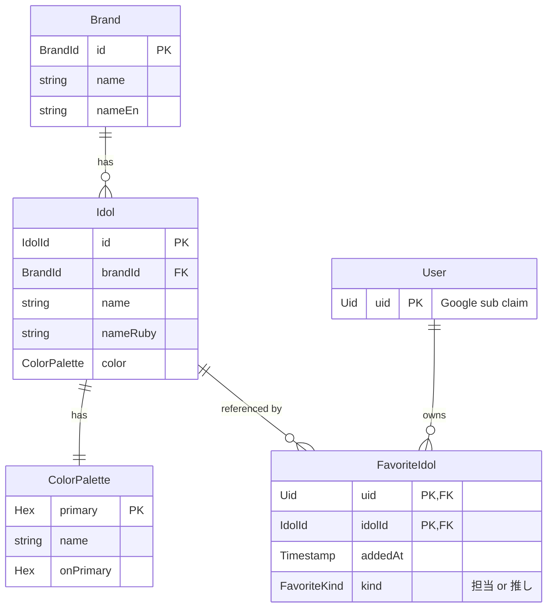

# ドメインモデル

> **5 行以内 summary**: ColorMaster のドメインモデル概観 (Idol / Brand / ColorPalette /
> FavoriteIdol)。アイドル情報は `data/idols.db` (read-only マスタ、im@sparql 由来)、
> 担当・推しは `users.db` (uid のみ保存) に分かれて永続化される。詳細な値オブジェクト・
> 集約境界・実装パスは C3 (`core/domain/` 新設) で本格定義。本ファイルは概観のみ。

## エンティティ関係 (erDiagram)

> 補足: `User` テーブルは PII 最小化のため **`uid` 列のみ** (ADR 0020)。display name /
> email / picture は GIS userinfo endpoint から都度取得し、Backend memory cache TTL 15 分
> を経由してクライアントに返す (`docs/api/auth.md` 参照)。

## エンティティ詳細 (骨格、A2-5 + C3 で本格化)

### Idol (アイドル)

| 属性 | 型 | 説明 | 値域・例 |
|---|---|---|---|
| `id` | `IdolId` (value class、内部は `String`) | アイドル一意 ID | im@sparql の RDF 識別子 (`imas:Idol_天海春香` 等) を slug 化 |
| `brandId` | `BrandId` (value class) | 所属ブランド | `765AS` / `CG` / `ML` / `SC` / `SS` / `SP` |
| `name` | `String` | アイドル名 (表示用) | 「天海春香」 |
| `nameRuby` | `String` | フリガナ (ソート / 検索用) | 「あまみはるか」 |
| `color` | `ColorPalette` | イメージカラー (集約所有) | 後述 |

### Brand (ブランド)

| 属性 | 型 | 説明 |
|---|---|---|
| `id` | `BrandId` | ブランド ID。enum 風だが将来追加に備え value class |
| `name` | `String` | 日本語表記 (「アイドルマスター」「シャイニーカラーズ」等) |
| `nameEn` | `String` | 英語表記 (「The IDOLM@STER」等) |

### ColorPalette (イメージカラー)

| 属性 | 型 | 説明 |
|---|---|---|
| `primary` | `Hex` (value class、`#RRGGBB`) | アイドルのイメージカラー本体 |
| `name` | `String` | カラー名称 (「桃色」「カナリヤ色」等、im@sparql 上に存在する場合のみ) |
| `onPrimary` | `Hex` | `primary` に重ねる文字色 (WCAG コントラスト計算済、`Hex.calcOnColor()` で導出) |

### FavoriteIdol (担当・推し)

| 属性 | 型 | 説明 |
|---|---|---|
| `uid` | `Uid` (value class、内部は `String` で 21 桁数字) | 所有ユーザーの Google sub claim |
| `idolId` | `IdolId` | 担当・推しのアイドル ID |
| `addedAt` | `Instant` | 追加時刻 (`Clock.System.now()`) |
| `kind` | `FavoriteKind` (sealed class: `Tantou` / `Oshi`) | 「担当」(プロデュース) と「推し」を区別 |

## 値オブジェクト (Phase C で本格化)

| 名前 | 制約 | 関連 rule |
|---|---|---|
| `Hex` | `#RRGGBB` 6 桁、`Hex.calcOnColor()` で onColor 導出 | `design-tokens.md` |
| `IdolId` | im@sparql RDF 識別子 slug、空文字禁止 | `sparql.md` / `naming.md` |
| `BrandId` | enum 風だが value class、未知の文字列は受け取らない | `naming.md` |
| `Uid` | 21 桁数字 (Google sub claim 仕様)、`@Spec` でテスト | `pii.md` / `backend-auth.md` |
| `FavoriteKind` | sealed class、`Tantou` / `Oshi` の 2 実装 | `ui-state.md` |

## 集約境界 (DDD 風、暫定方針)

- **Idol 集約**: `Idol` (root) + `ColorPalette` (内部値) — `ColorPalette` 単体での参照はせず、`Idol.color` 経由
- **Brand 集約**: `Brand` (root) のみ。`Brand.idols` の一対多は **遅延読み込み** (リレーション)、Brand 自身は idols リストを持たない
- **User 集約**: `User` (root) + `FavoriteIdol` (内部リスト) — Backend `/api/me/favorites` で取得・追加・削除
- **越境**: `FavoriteIdol.idolId` は `Idol` への参照 (集約間は ID 経由、エンティティ参照しない)

C3 (`core/domain/` 新設時) に DDD 風命名 (`IdolRepository.findById(id: IdolId): Idol`) と sealed class 構成を確定。本ファイルでは方向性のみ示す。

## データソースとの対応

| エンティティ | データソース | 永続化方式 | 詳細 |
|---|---|---|---|
| Idol / Brand / ColorPalette | `data/idols.db` (SQLite) | コンテナイメージ焼込、read-only | `data-flow.md` / ADR 0010 |
| FavoriteIdol | `data/users.db` (SQLite) | Backend 内蔵 + Litestream → R2 | `data-flow.md` / ADR 0008 |
| User (uid のみ) | `data/users.db` | 同上 | ADR 0020 (PII 最小化) |
| User の display name / email / picture | GIS userinfo endpoint | DB 保存せず、Backend memory cache TTL 15 分 | `../api/auth.md` |

## クエリパターン (将来の実装、C3 + C5)

- アイドル一覧: `GET /api/idols?brand=<id>&color=<hex>&page=<n>`
- アイドル個別: `GET /api/idols/{id}`
- キーワード検索: `GET /api/idols/search?q=<query>` (name / nameRuby / brand / colorName を全文検索)
- 担当・推し一覧: `GET /api/me/favorites?kind=<tantou|oshi>`
- 担当・推し追加: `POST /api/me/favorites` (body: `{idolId, kind}`)
- 担当・推し削除: `DELETE /api/me/favorites/{idolId}`

詳細は `../api/{idols,me}.md` を参照。

## 現状 (B0 段階、2026-05-17 時点)

- 既存実装: `core/model/` 配下に `IdolColor` 等の旧データクラス (Phase C 前のもの)
- `core/data/` 配下にも旧 Repository 実装あり (Firebase Firestore 経由のものを含む)
- 本ファイルが記述するモデルは **C3 (`core/domain/` 新設) 時点の最終形**。Firebase 撤去 (C5) と feature-first 再編 (C3) で旧モデルを順次置換

A2-5 (本 PR) では決定済の設計のみ記録、実装側との整合は EPIC-001 (C3) / EPIC-003 (C5) の Plan で順次取る。

## 関連

- `overview.md` / `layers.md` / `data-flow.md`
- `docs/glossary.md` (用語定義、A2-4 で本格化: アイドル / ブランド / 担当 / 推し / im@sparql / SPARQL prefix)
- ADR 0007 (im@sparql upstream-driven 同期) / 0010 (アイドル情報マスタ repo 内 SQLite) / 0020 (PII 最小化)
- `.claude/rules/{naming,sparql,design-tokens,pii}.md`
- `../api/colormaster-api.yaml` (DTO 側の SoT)
- `core/data/` / `core/model/` (将来の実装)
