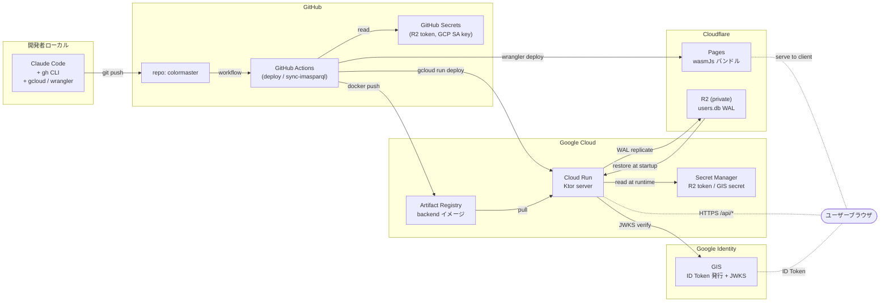
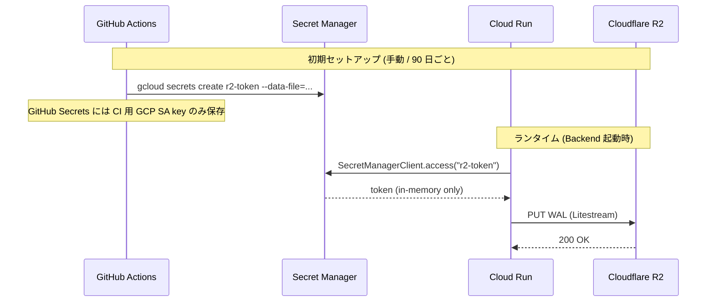

# インフラ構成

> **5 行以内 summary**: ColorMaster の本番インフラはハイブリッド構成 — Backend は GCP の
> Cloud Run、静的配信は Cloudflare Pages、Litestream バックアップ先は Cloudflare R2、
> 認証は GIS。Terraform は不採用、デプロイは GitHub Actions + `gcloud` CLI + `wrangler`
> で管理。本格化は A2-5 で骨格 + C7 (リリース Plan) で詳細化。

## 構成要素

| 要素 | 用途 | プロバイダ | デプロイ手段 | 関連 ADR |
|---|---|---|---|---|
| **Cloud Run** | Ktor Backend のホスティング (Free tier 内運用) | Google Cloud | GitHub Actions + `gcloud run deploy` | ADR 0009 |
| **Artifact Registry** | Backend コンテナイメージ保管 | Google Cloud | GitHub Actions + `docker push` | ADR 0009 |
| **Google Cloud Secret Manager** | 本番 secrets (R2 token / GIS Client Secret 等) | Google Cloud | `gcloud secrets create`、Cloud Run service account から参照 | ADR 0021 |
| **Cloudflare Pages** | wasmJs 静的バンドル配信 (unlimited bandwidth) | Cloudflare | `wrangler pages deploy` | ADR 0022 |
| **Cloudflare R2** | Litestream バックアップ先 (S3 互換、egress 無料) | Cloudflare | `wrangler r2` または Cloudflare MCP | ADR 0008 / 0022 |
| **GIS** (Google Identity Services) | 認証統一プロバイダ | Google | GCP コンソールで Client ID 発行 | ADR 0011 |
| **GitHub Actions** | CI/CD ジョブ / im@sparql 同期 / トラフィック router | GitHub | repo `.github/workflows/` で管理 | ADR 0017 (Claude API は呼ばない) |
| **GitHub Secrets** | CI 用 secrets (R2 token / GCP service account key 等) | GitHub | repo 設定で管理 | ADR 0021 |

## 構成図

## デプロイフロー (C7 で本格化)

### 通常リリース (master push)

1. `master` に push → GitHub Actions `release.yml` が発火
2. `./gradlew check` を全 module で実行 (Konsist / Roborazzi / kotlin-test、ADR 0023)
3. Backend Docker イメージビルド (`./gradlew :backend:server:dockerBuild`)
4. `docker push` で Artifact Registry に push (`asia-northeast1-docker.pkg.dev/<project>/backend/server:<sha>`)
5. `gcloud run deploy` で Cloud Run service を更新 (revision 切替、トラフィック 100% 即時)
6. wasmJs バンドルビルド (`./gradlew :wasmJsBrowserDistribution`)
7. `wrangler pages deploy` で Cloudflare Pages にアップロード (preview → production への昇格は人間 approve)
8. デプロイ完了通知 (Slack / 簡易 Webhook、C7 で整備)

### im@sparql 同期 (日次 cron)

1. GitHub Actions `sync-imasparql.yml` が cron で発火
2. upstream SHA を取得して比較 (`data-flow.md` 参照)
3. 差分時は `chore/sync-imasparql-<sha>` ブランチで PR 起票
4. 人間または AI レビューで内容確認 (auto-merge 禁止、R-15)
5. master merge → 通常リリースフローに follow-through

### 緊急ロールバック

- Cloud Run の `gcloud run services update-traffic --to-revisions <prev>=100` で前 revision に即時切替
- Cloudflare Pages の `wrangler pages rollback` (将来サポート時) または前 deploy の URL から再 promote
- `users.db` 自体のロールバックは Litestream の point-in-time restore で対応 (R2 の WAL 履歴から指定時刻に復元、`docs/runbooks/r2-litestream.md` で手順整備、C5)

## Secret Manager の経路

- Cloud Run service account が `roles/secretmanager.secretAccessor` を持つ
- secret 値はコンテナの環境変数 / ファイルに **書き出さない** (memory only)
- TTL 90 日でローテーション (`docs/runbooks/secrets-rotation.md`)
- 漏洩疑い時は即時 `gcloud secrets versions destroy` + 新 version 作成 (ADR 0021)

## 採用見送りの代替案

| 候補 | 採用見送り理由 |
|---|---|
| **Cloudflare Containers** | Workers Paid plan $5/月必須で完全無料運用が不可、Cloud Run の Free tier に劣後 (ADR 0009) |
| **Koyeb** (Backend) | Free tier の制約が Cloud Run より厳しい (ADR 0009 で代替候補として記録) |
| **Fly.io** | 2024 年に無料枠廃止 |
| **Render / Railway** | sleep / 実質有料 |
| **Firebase Hosting** | 10GB bandwidth 上限、Firebase 全廃方針と整合しない |
| **Vercel** (Hobby) | 商用利用不可 |
| **Terraform / Pulumi** | 管理対象が小さく、学習・保守コストが旨味を上回る (`docs/harness/plan.md` §3.5) |

## モニタリング (C7 で本格化)

| 観点 | ツール | 備考 |
|---|---|---|
| Cloud Run リクエスト数 / レイテンシ | Cloud Run 標準ダッシュボード | Free tier 圧迫検知も |
| Cloud Run 5xx エラー率 | Cloud Logging + alerting policy | 簡易、有償 oncall は未導入 |
| Litestream 健全性 | Backend `/health` endpoint で WAL lag を含める | C5 で実装 |
| Cloudflare Pages リクエスト数 | Cloudflare ダッシュボード | 無料枠内なら通知不要 |
| R2 ストレージ使用量 | Cloudflare ダッシュボード | 月次レビュー |
| GIS JWKS 取得失敗 | Cloud Logging | structured log で `event=jwks_fetch_fail` を発火 (`logging.md` 規約、A2-2 で本格化) |

詳細は `docs/runbooks/release.md` / `docs/runbooks/monitoring.md` (将来作成、C7) を参照。

## 関連

- `overview.md` / `data-flow.md` / `sequences.md`
- ADR 0008 (Backend SQLite + Litestream + R2) / 0009 (Cloud Run) / 0011 (GIS 統一) / 0021 (Secrets 管理) / 0022 (Cloudflare Pages + R2)
- `docs/runbooks/{release,secrets-rotation,r2-litestream}.md` (C5-C7 で本格化)
- `.claude/rules/{cloud-run-deploy,r2-litestream,cloudflare-pages,secrets,backend-auth}.md`
- `docs/harness/plan.md` §3.4 (ホスティング) / §3.5 (Terraform 不採用) / §3.8 (PII / Secrets)
