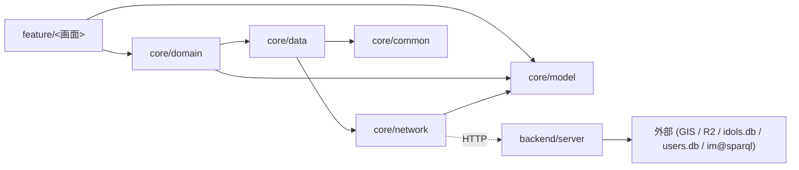

# 層別責務

> **5 行以内 summary**: ColorMaster の層構造 (`feature/<画面>` → `core/domain` → `core/data` →
> `core/network` → `backend/server`) と各層の責務、依存方向、越境ルール、撤去予定の
> 旧モジュールを記述する。EPIC-001 (C3) で feature-first 再編が完了した時点で本ファイルが
> 完全実装と整合する。本格化は A2-5 + C3 (実装着手に応じて追記)。

## 層の責務マトリクス

| 層 | パス | 主責務 | 出力 | 依存可能な層 | 関連 rule |
|---|---|---|---|---|---|
| **feature/<画面>** | `feature/<name>/` (C3 移行後) | 画面固有の `ViewModel` / `UiState` / `UiAction` / `Screen` Composable / `Route` / `di` | UiState / UiAction / Screen | core/domain, core/data, core/model | `viewmodel.md` / `composable.md` / `navigation.md` / `ui-state.md` |
| **core/domain** | `core/domain/` (C3 で新設) | ドメインモデル / UseCase / Repository インタフェース | UseCase 関数 / Repository interface | core/model | `repository.md` (interface 部) |
| **core/data** | `core/data/` | Repository 実装 / DB 抽象化 / マッパー | Repository impl / 永続層 | core/network, core/database | `repository.md` (impl) / `error-handling.md` |
| **core/network** | `core/network/{imasparql, colormaster-api}/` | Ktor Client / API DTO / シリアライゼーション | HTTP request / DTO | (外部のみ) | `network-client.md` / `error-handling.md` |
| **core/model** | `core/model/` | 全層共有の値オブジェクト / sealed class | データクラス | (なし、葉) | `naming.md` |
| **core/common** | `core/common/` | ロガー / coroutine helper / Result wrapper | utility 関数 | (なし、葉) | `error-handling.md` / `logging.md` |
| **backend/server** | `backend/server/` | Ktor Server / `/api/*` ハンドラ / JWKS 検証 / SQLite アクセス | HTTP response | (外部: GIS, R2, idols.db, users.db) | `backend-auth.md` |
| **backend/cli** | `backend/cli/` | im@sparql からのアイドル情報取得 / `data/idols.db` 生成 | SQLite ファイル | (外部: imas/imasparql) | `sync-job.md` / `sparql.md` |

## 依存方向 (上 → 下、逆向き禁止)

- 実線は **コンパイル時依存**、点線はランタイムの HTTP 通信
- `core/network` から `core/data` への逆参照は **禁止** (Konsist で機械検証、A2-2 で導入)
- `feature/*` から `core/network` への直接参照も **禁止** (必ず Repository / UseCase 経由)
- `core/model` / `core/common` は葉、他層への依存ゼロ (循環参照防止)

## 越境ルール

1. **`feature/*` → `core/network/*` 直接参照禁止**
   - 必ず Repository (`core/data`) または UseCase (`core/domain`) 経由
   - 理由: ネットワーク失敗時のリトライ / キャッシュ / モック差し替えを Repository に集約
2. **`core/network/*` から DB 直接アクセス禁止**
   - DTO ⇄ ドメインモデルのマッピングは `core/data/Mapper*.kt` で行う
   - 理由: API レスポンスとドメインモデルの分離 (Single Source は backend、クライアント側はビュー寄り)
3. **`feature/*` 間の直接依存禁止**
   - 共有ロジックは `core/domain` または `core/common` に昇格
   - 画面間遷移は Navigation 3 の `Route.kt` で表現
4. **`core/domain` から `core/network` 直接依存禁止**
   - Repository interface は `core/domain` で宣言、impl は `core/data` で `core/network` を使う
   - 理由: ドメイン層を純粋に保ち、テストでネットワーク不要にする
5. **`backend/server` の各 API ハンドラは `requireUid()` 呼出必須** (`/api/me/*` のみ)
   - Konsist で機械検証 (A2-2 + A6 で導入、`.claude/rules/backend-auth.md`)
6. **Composable から ViewModel 以外の Stateful オブジェクトを参照しない**
   - 画面状態は `StateFlow<UiState>` 経由のみ
   - `.claude/rules/{composable,ui-state}.md` 参照

## 機械検証 (Konsist、A2-2 + A6 で導入)

| 規約 | 検証手段 |
|---|---|
| feature → core/network 直接参照禁止 | Konsist `KoFileExtension.imports` で `core.network.*` を `feature.*` から検出 |
| feature 間の直接依存禁止 | Konsist で `feature.A.*` が `feature.B.*` を import していないことを検証 |
| `/api/me/*` ハンドラの `requireUid()` 必須 | Konsist で `backend.server.routing.me.*` の関数本体に `requireUid()` 呼出を要求 |
| `core/model` / `core/common` の葉性 | Konsist で他 `core.*` への依存ゼロを検証 |
| ViewModel から Composable の Context 系参照禁止 | Konsist で `androidx.compose.ui.*` の参照を ViewModel から検出 |

`docs/architecture/overview.md` の通り、機械検証の導入は A2-2 (rules 本格化) + A6 (Konsist 設定本格化)。本ファイルでは規約を明示するのみ。

## 撤去予定モジュール (Phase C)

| 撤去対象 | 撤去理由 | 撤去時期 | 関連 ADR |
|---|---|---|---|
| `core/network/auth/` | Firebase Auth 撤去 (GIS に統一) | C5 | ADR 0011 |
| `core/network/firestore/` | Firestore 撤去 (Backend SQLite に統一) | C5 | ADR 0008 / 0011 |
| `js/app/` / `js/material/` | wasmJs 移行のため | C9 | ADR 0012 |
| `kotlin-js-store/` | wasmJs 移行時に再生成 | C9 | ADR 0012 |
| `firebase.json` / `.firebaserc` | Cloudflare Pages 移行 | C7 | ADR 0022 |
| `core/features/*` | `feature/*` への再編 (feature-first) | C3 | ADR 0003 |

詳細な撤去手順は `.claude/rules/removed-modules.md` (A2-2 で本格化) + 各 Phase の Plan / Epic を参照。

## 新設モジュール (Phase C)

| 新設対象 | 用途 | 新設時期 | 関連 ADR |
|---|---|---|---|
| `core/domain/` | UseCase + Repository interface 集約 | C3 | ADR 0002 / 0003 |
| `core/network/colormaster-api/` | Backend `/api/*` 専用クライアント (旧 `core/network/auth` `core/network/firestore` を統合) | C5 | ADR 0011 |
| `feature/<画面>/` (各画面) | `core/features/*` から移行 | C3 | ADR 0003 |
| `backend/server/` 内 `/api/me/*` 系ハンドラ | ユーザーデータ API 本実装 | C5 | ADR 0008 / 0011 |

## 現状の差分 (B0 段階、2026-05-17 時点)

- 現存: `core/{common, model, data, test}` / `core/network/{firestore, auth, imasparql}` / `core/features/{home, search, myidols, preview}` / `android/` / `backend/{server, cli}`
- 不在: `feature/*` ディレクトリ (C3 で新設) / `core/domain/` (C3 で新設) / `core/network/colormaster-api/` (C5 で新設)
- Firebase 系依存 (`dev.gitlive:firebase-*`) は **現存**、C5 で削除

本ファイルが記述する層構造は **Phase C 完了後の最終形**。EPIC-A2 の docs 本格化フェーズでは未来の構造を Single Source として明文化し、Phase C 実装で本ファイルを差分更新する想定。

## 関連

- `overview.md` (アーキ全体俯瞰)
- ADR 0002 (Compose Multiplatform + 共通 ViewModel + Navigation 3) / 0003 (feature-first) / 0005 (Decompose 撤去) / 0011 (GIS 統一) / 0012 (js/app 撤去)
- `.claude/rules/{viewmodel,composable,navigation,repository,network-client,backend-auth,removed-modules,naming}.md`
- `docs/codebase-map.md` (主要パス → 責務、A2-4 で本格化)
