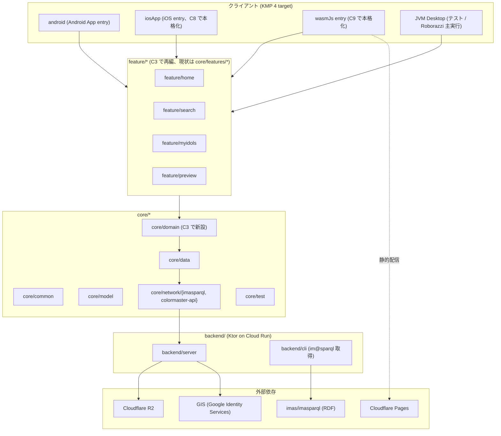

# アーキテクチャ概要

> **5 行以内 summary**: ColorMaster は Compose Multiplatform + 共通 ViewModel +
> Navigation 3 を採用した KMP プロジェクトで、Android / iOS / wasmJs / JVM (Desktop)
> の 4 target と Cloud Run 上の Ktor Backend をハイブリッドホスティングで運用する。
> 本ファイルは全体俯瞰と各サブ docs (`layers` / `data-flow` / `domain-model` /
> `state-machines` / `sequences` / `infrastructure`) への索引を担う。

## 採用スタック (Single Source: `docs/harness/plan.md` §3.1)

| 領域 | 採用 | 関連 ADR |
|---|---|---|
| アーキテクチャパターン | Compose Multiplatform + 共通 ViewModel + Navigation 3 | ADR 0002 |
| モジュール構造 | feature-first (`feature/<name>/{ViewModel, UiState, UiAction, Screen, di}.kt`) | ADR 0003 |
| 状態管理 | `StateFlow<UiState>` + `onAction(UiAction)` + `Channel<UiEffect>` の軽量 UDF | ADR 0002 |
| Navigation | Navigation 3 (Compose Multiplatform 1.10+ で全 target サポート) | ADR 0002 / 0005 |
| DI | Koin 4.0.4 | — |
| i18n | compose-multiplatform-resources (`composeResources/values-<locale>/strings.xml`) | ADR 0006 |
| Backend | Ktor (Kotlin/JVM) | ADR 0009 |
| 認証 | Google Identity Services (GIS) 全 target 統一、Firebase Auth 撤去 | ADR 0011 |
| データ永続化 (Backend) | Cloud Run 内蔵 SQLite (`users.db`) + Litestream → R2 | ADR 0008 |
| アイドル情報マスタ | `data/idols.db` (リポジトリ commit、コンテナ焼込、read-only) | ADR 0010 |
| 静的配信 | Cloudflare Pages (wasmJs) | ADR 0022 |
| バックアップ先 | Cloudflare R2 (private、egress 無料) | ADR 0022 |

撤去スタック: Decompose (ADR 0005)、Firebase 全廃 (ADR 0011)、`js/app` (ADR 0012)。

## モジュール俯瞰

> 凡例: 実線 = 依存方向 (上から下)、点線 = ホスティング配信。`feature/*` は EPIC-001 (C3) で `core/features/*` から移行予定 (現状は `core/features/*` に残存)。

## target / platform マトリクス

| target | source set | UI | 認証 | 配信 | 主用途 |
|---|---|---|---|---|---|
| Android | `androidMain` | Compose | GIS Android SDK | Google Play (将来) | モバイル本番 |
| iOS | `iosMain` | Compose for iOS (1.8 Stable) | GIS iOS SDK | App Store (将来、C8) | モバイル本番 |
| wasmJs | `wasmJsMain` | Compose for Web | GIS JavaScript Library | Cloudflare Pages | Web 本番 |
| JVM Desktop | `jvmMain` | Compose Desktop | (テスト用のみ) | (配布なし) | Roborazzi screenshot 実行ランタイム |

- `commonMain` に **全 target 共有のロジック・UiState・Composable** を配置 (Compose Multiplatform 統一)
- `wasmJsMain` の actual 実装は GIS フロー等の薄い層に限定 (Roborazzi 未対応のため Konsist + 単体テストで担保、ADR 0023)
- iOS は C8 で本格起動、wasmJs は C9 で本格化 (`docs/harness/plan.md` §6.3 / EPIC-A2 では touch しない)

## 外部依存とその役割

| 依存 | 役割 | ADR | 関連 docs |
|---|---|---|---|
| imas/imasparql | アイドル情報の上流マスタ (RDF / SPARQL) | ADR 0007 | `data-flow.md` |
| GIS (Google Identity Services) | 認証統一プロバイダ、ID Token 発行 | ADR 0011 | `../api/auth.md` |
| Cloud Run | Ktor Backend のホスティング (Free tier) | ADR 0009 | `infrastructure.md` |
| Cloudflare Pages | wasmJs バンドル静的配信 (unlimited bandwidth) | ADR 0022 | `infrastructure.md` |
| Cloudflare R2 | Litestream バックアップ先 (S3 互換 / egress 無料) | ADR 0008 / 0022 | `data-flow.md` / `infrastructure.md` |
| Google Cloud Secret Manager | 本番 secrets (R2 token / GIS Client Secret) | ADR 0021 | `infrastructure.md` |
| Artifact Registry | Backend コンテナイメージ保管 | ADR 0009 | `infrastructure.md` |

## アーキテクチャ上の重要な前提

- **クライアント / Backend 間の通信は全て `/api/*` 経由** (GIS ID Token Bearer 認証、`docs/api/colormaster-api.yaml` が SoT)
- **`core/network/` から DB 直接アクセス禁止**、必ず Repository 経由 (`layers.md` 越境ルール)
- **クライアントは GIS 経由で ID Token を取得**、Backend で JWKS 検証して `uid` 抽出 (`auth.md`)
- **アイドル情報はクライアント側でキャッシュ可** (read-only)、ユーザーデータはキャッシュせず常に Backend 取得
- **Cloud Run の ephemeral 性は Litestream で吸収** (起動時 R2 から restore、ADR 0008)

## 構成要素別 docs 索引 (lazy-load)

| ファイル | 内容 | 主読者 |
|---|---|---|
| `layers.md` | 層別責務 (feature → core/domain → core/data → core/network → backend) と依存方向、撤去予定モジュール | Kotlin 実装担当 AI / 人間レビュアー |
| `data-flow.md` | im@sparql → idols.db → Backend → Client のデータフロー、Litestream replicate/restore | Backend 実装担当 |
| `domain-model.md` | ドメインモデル (Idol / Brand / ColorPalette / FavoriteIdol) の概観 | feature/* 実装担当 |
| `state-machines.md` | UiState 状態遷移の共通語彙と画面別 TODO | UI 実装担当 |
| `sequences.md` | 主要 4 ユースケース (ログイン / 検索 / 担当追加 / 同期) のシーケンス図 | エンドツーエンド設計レビュー |
| `infrastructure.md` | Cloud Run + Cloudflare Pages + R2 + GIS の構成図とデプロイフロー | DevOps / Cloud Run 設定担当 |
| `../api/README.md` | API 全体規約 (バージョニング / 認証 / エラー / Cache-Control) | Backend / クライアント連携担当 |
| `../api/colormaster-api.yaml` | OpenAPI 3.1 (全リクエスト/レスポンス JSON スキーマの SoT) | 機械検証 / コード生成 |

## 本ファイルの本格化スコープ (現状: skeleton)

- **現状**: ADR 0001-0027 + plan.md §3 で決定済の設計を概観として記録。Mermaid 図はモジュール俯瞰のみで、層別の詳細は `layers.md` 等へ委譲
- **A2-5 (本 PR) で追加**: モジュール俯瞰 Mermaid、採用スタック表、target マトリクス、外部依存表、各 docs への索引
- **Phase C で更新**: 実装着手に伴い、`core/features/*` → `feature/*` への移行完了 / Firebase 撤去完了等の状態変化を反映。本ファイルは概観として `status: living` に昇格

## 関連

- `docs/harness/plan.md` §3.1 (アプリケーション設計) / §3.4 (ホスティング) / §3.6 (撤去対象)
- ADR 0002 (Compose Multiplatform + 共通 ViewModel + Navigation 3) / 0003 (feature-first) / 0005 (Decompose 撤去)
- ADR 0008 (Backend SQLite + Litestream + R2) / 0009 (Cloud Run) / 0011 (GIS 統一) / 0022 (Cloudflare Pages + R2)
- `docs/codebase-map.md` (主要パス → 責務、A2-4 で本格化)
- `docs/glossary.md` (ドメイン用語、A2-4 で本格化)
- `.claude/rules/{viewmodel,composable,navigation,ui-state,repository,network-client,backend-auth}.md`
