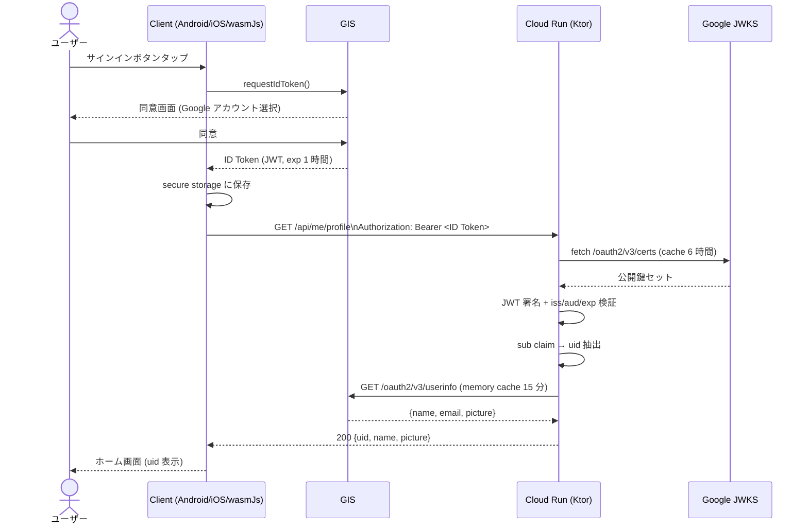
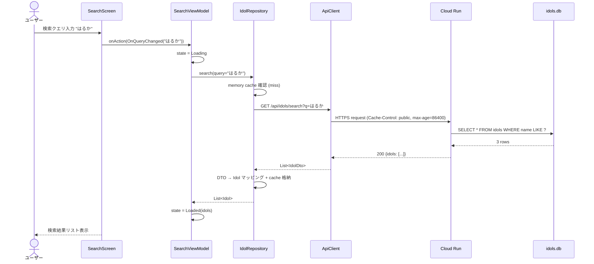
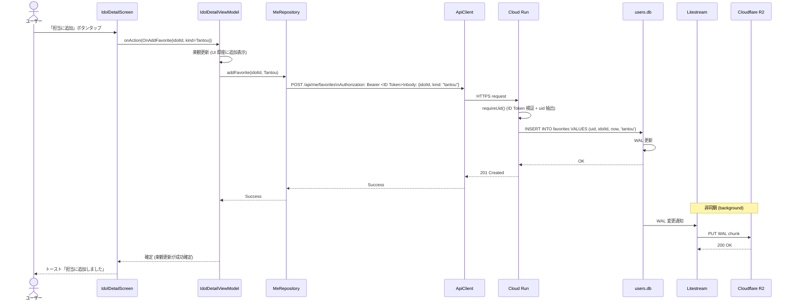
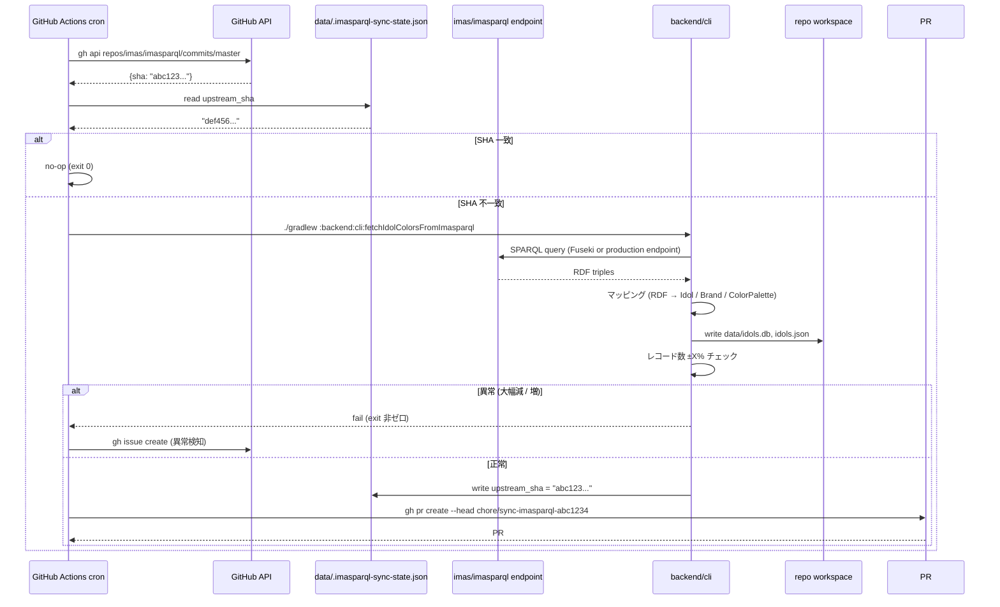
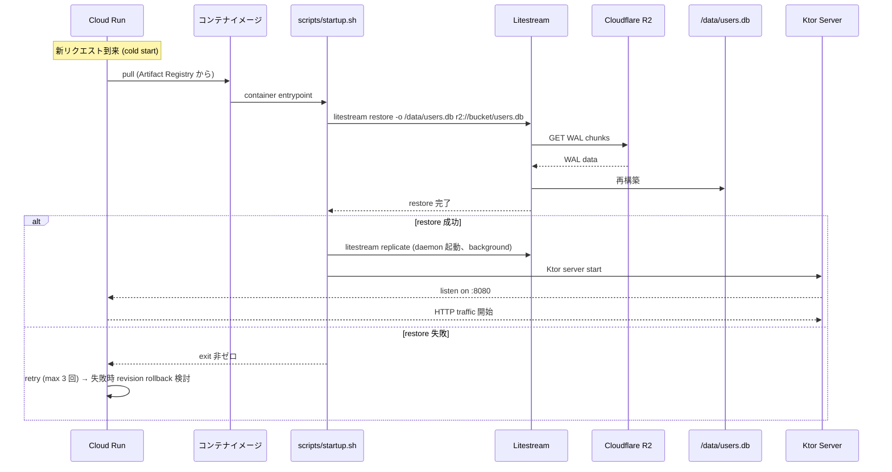

# 主要ユースケースのシーケンス

> **5 行以内 summary**: ColorMaster の主要 4 ユースケース (ログイン / アイドル検索 /
> 担当追加 / 同期実行) と Cloud Run 起動 (Litestream restore) のシーケンスを Mermaid
> `sequenceDiagram` で集約する。Phase C 進行に応じて各 EPIC の詳細設計
> (`docs/specifications/detail/`) で更新、本ファイルは概観として残す。本格化は A2-5 + C3-C7。

## ユースケース 1: ログイン (GIS)

> 補足: `email` は **クライアントには返さない** (PII 最小化、ADR 0020)。`name` と `picture`
> は表示用に返却するが、Backend memory cache TTL 15 分のみで永続化しない。

## ユースケース 2: アイドル検索

> 認証不要 (`/api/idols/*` は公開マスタ)。Cloud Run の `Cache-Control: public, max-age=86400`
> で CDN レイヤがあれば自動キャッシュ、クライアント側も Repository memory cache。

## ユースケース 3: 担当追加

> 失敗時は楽観更新をロールバック (UI から削除) + エラー表示。Backend の `INSERT` が失敗した
> 場合 Litestream は発火しない (原子性は SQLite が保証)。

## ユースケース 4: im@sparql 同期 (GitHub Actions cron)

> 詳細は `data-flow.md` および `docs/runbooks/sync-imasparql.md` (C6 で本格化) を参照。

## ユースケース 5: Cloud Run 起動 (Litestream restore)

> 起動順序の保証は ADR 0008 と `.claude/rules/cloud-run-deploy.md` で規約化 (A2-2 で本格化)。
> restore 失敗時の server 不起動は **必須** (空 DB で API を提供しない、PII 喪失リスク回避)。

## エラーパスの代表例

| ユースケース | 失敗箇所 | 応答 | クライアント挙動 |
|---|---|---|---|
| ログイン | JWKS 取得失敗 | 503 + Retry-After | クライアント側 exponential retry (3 回) |
| ログイン | ID Token 期限切れ | 401 | GIS で再取得 |
| 検索 | idols.db クエリ失敗 (broken DB) | 500 | エラー画面表示、運用通知 |
| 担当追加 | uid 不一致 (他人の uid に書こうとした) | 403 | ローカル状態を破棄、ログアウト誘導 |
| 同期 | im@sparql 5xx | sync workflow fail | Issue 起票、次回 cron で retry |
| Cloud Run 起動 | R2 unreachable | restore fail | Cloud Run retry → revision rollback |

## A2-5 + Phase C で本格化する内容

- 各ユースケースのエラーケース / リトライ / タイムアウトの分岐を Mermaid に明示
- 関連 Spec basic / detail へのリンク (REQ → SPEC → 実装のトレース)
- パフォーマンス目標 (検索 < 500ms、ログイン < 2s 等) の追記
- ユーザー削除フロー (`/api/me` DELETE + R2 WAL 期限切れ) の追加

## 関連

- `overview.md` / `layers.md` / `data-flow.md` / `infrastructure.md` / `state-machines.md`
- ADR 0007 (im@sparql upstream-driven 同期) / 0008 (Backend SQLite + Litestream + R2) / 0011 (GIS 統一) / 0014 (ローカル Fuseki)
- `docs/specifications/{basic,detail}/SPEC-*.md` (各機能の Spec、Phase C で個別作成)
- `docs/runbooks/{sync-imasparql,release,r2-litestream}.md` (C5-C7 で本格化)
- `../api/{auth,idols,me}.md` (API 詳細)
