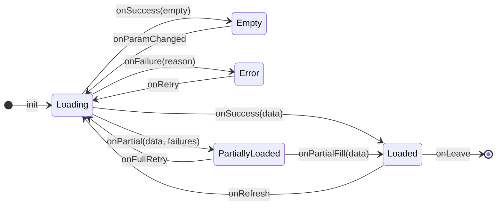
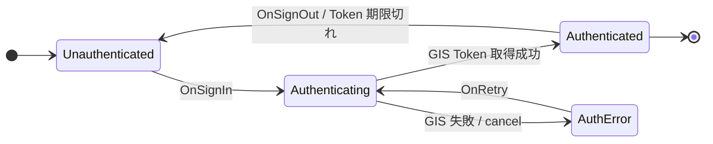

# 状態遷移 (UiState)

> **5 行以内 summary**: ColorMaster は `StateFlow<UiState>` + `onAction(UiAction)` +
> `Channel<UiEffect>` の軽量 UDF (Unidirectional Data Flow) を採用する。本ファイルは
> 共通の状態語彙 (Loading / Loaded / Empty / Error / PartiallyLoaded) と画面別の
> 状態機械概観を集約する。詳細な画面別実装は C3 + 各 EPIC の `docs/specifications/detail/`
> で個別に Mermaid `stateDiagram-v2` で記述。

## 共通の状態語彙

| 状態 | 意味 | UI 表示例 | 遷移先 |
|---|---|---|---|
| `Loading` | 初回ロード中 (またはリトライ中) | スピナー / スケルトン | → `Loaded` / `Empty` / `Error` |
| `Loaded(data)` | データ取得成功 | コンテンツ表示 | → `Loading` (refresh) / `Loaded(data')` (更新) |
| `Empty` | 取得成功だが結果が空 | 「該当なし」メッセージ | → `Loading` (検索条件変更) |
| `Error(reason)` | 取得失敗 | エラーメッセージ + リトライボタン | → `Loading` (retry) |
| `PartiallyLoaded(data, failures)` | 一部成功 / 一部失敗 | 取得分を表示 + 失敗分の警告 | → `Loading` (full retry) / `Loaded` (partial fill) |

## UDF 構造

> 凡例: `[*]` = 画面に進入 / 離脱、矢印ラベル = `UiAction` または ViewModel 内部イベント。
> ViewModel が `_state.update { ... }` で `StateFlow<UiState>` を遷移させ、Composable は
> `collectAsStateWithLifecycle()` で観測する。

## UiAction → 状態遷移の対応

| UiAction | 受信時の状態 | 遷移先 | 副作用 (UiEffect) |
|---|---|---|---|
| `OnInit` | (初期) | `Loading` | Repository へ取得依頼 |
| `OnRefresh` | `Loaded` / `PartiallyLoaded` | `Loading` | 同上 |
| `OnRetry` | `Error` | `Loading` | 同上 |
| `OnParamChanged(p)` | 任意 | `Loading` | 同上 (新 param で) |
| `OnSelectItem(id)` | `Loaded` | (遷移なし) | `UiEffect.Navigate(Route.Detail(id))` |
| `OnAddFavorite(idolId)` | `Loaded` | (遷移なし、楽観更新後リトライ) | Backend `POST /api/me/favorites` |
| `OnSignIn` | 全状態 (Auth 上位) | (Auth 状態変化) | GIS フロー起動 |

## 画面別の状態機械 (骨格、A2-5 + C3 で本格化)

各画面の Mermaid `stateDiagram-v2` は EPIC-001 (C3) 着手時に `docs/specifications/detail/`
で個別に詳細化する。本ファイルでは概観のみを表で持つ。

| 画面 | パス (将来) | 主要状態 | 関連 SPEC | 関連 EPIC |
|---|---|---|---|---|
| Home | `feature/home/` | `Loading` → `Loaded(idolGrid)` / `Empty` / `Error` | SPEC-IDOL-001 (C3) | EPIC-001 |
| Search | `feature/search/` | `Loading(query)` → `Loaded(results)` / `Empty` / `Error` + `Idle` (検索前) | SPEC-IDOL-002 (C3) | EPIC-001 |
| Preview | `feature/preview/` | `Loaded(idol)` / `Error` (id 不存在) | SPEC-IDOL-003 (C3) | EPIC-001 |
| MyIdols (担当・推し) | `feature/myidols/` | `Loading` → `Loaded(favorites)` / `Empty` / `Error` + `Unauthenticated` | SPEC-USER-001 (C5) | EPIC-003 |
| Auth (上位) | `feature/auth/` | `Unauthenticated` ⇄ `Authenticating` ⇄ `Authenticated(uid)` / `AuthError` | SPEC-AUTH-001 (C5) | EPIC-003 |

## 共通状態 (横断、Auth / Network)

> Auth 状態はアプリ全体の上位状態として `core/domain/auth/` (C5 で新設) に集約。各画面は
> `Authenticated(uid)` を前提条件として動作し、`Unauthenticated` 検知時は Auth 画面に
> リダイレクト。Navigation 3 の上位グラフで分岐。

## 規約

- **UiState は sealed class** で表現 (`.claude/rules/ui-state.md` で本格化、A2-2)
  - 状態を網羅可能にし、`when` 式での compile-time exhaustive check を効かせる
- **UiAction (intent) も sealed class** で受信
- **状態遷移は ViewModel が一元管理**、Composable は State を hoist して受け取る
- **`UiEffect` は `Channel` (Flow ではなく)** で一回性副作用 (画面遷移 / Toast) を表現
- **state hoisting**: Composable は `state: UiState` と `onAction: (UiAction) -> Unit` を引数で受ける
- **Composable は ViewModel への参照を持たない** (Stateful Composable で集約、Stateless Composable は state のみ受ける)
- 詳細実装規約は `.claude/rules/{ui-state,viewmodel,composable}.md` (A2-2 で本格化)

## 機械検証 (Konsist、A2-2 + A6 で導入)

| 規約 | 検証手段 |
|---|---|
| `UiState` は sealed class | Konsist で `*UiState.kt` の sealed 修飾子を検証 |
| `UiAction` は sealed class | 同上 |
| Stateless Composable は ViewModel を受け取らない | Konsist で `@Composable fun` の引数型に ViewModel を含まないことを検証 |
| ViewModel の `_state` は private | Konsist で `MutableStateFlow` の可視性を検証 |

## A2-5 + C3 + EPIC 詳細設計での本格化内容

- 各画面 (Home / Search / Preview / MyIdols / Auth) の状態遷移を Mermaid `stateDiagram-v2` で記述
- 各画面の `UiAction` → 状態遷移の対応表を完備
- 共通状態 (Auth / Network 可達性 / オフライン) の上位状態機械
- 状態遷移とエラーリカバリパターン (Exponential backoff / circuit breaker 等は採用しない方針) の明示

## 関連

- `overview.md` / `layers.md` / `sequences.md`
- ADR 0002 (Compose Multiplatform + 共通 ViewModel + Navigation 3)
- `.claude/rules/{ui-state,viewmodel,composable,navigation}.md`
- `docs/design/inventory/states/` (状態別 UI パターン、A10 で本格化)
- `docs/specifications/detail/SPEC-*.md` (各画面の状態遷移詳細、C3-C5 で個別作成)
