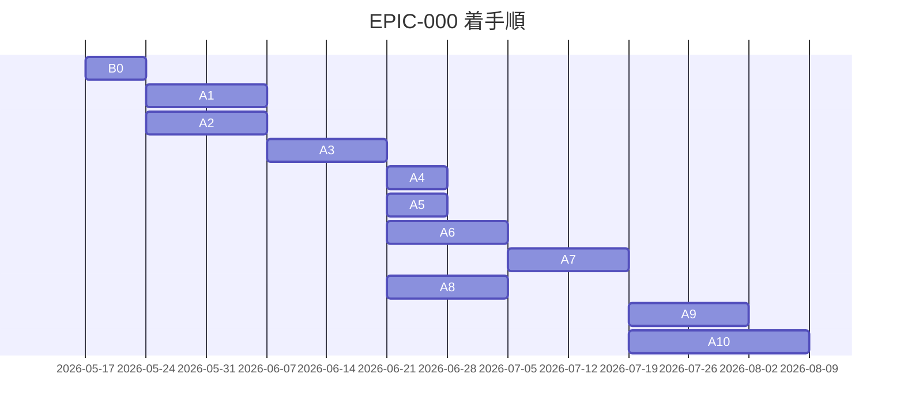

# EPIC-000 ロードマップ

> **5 行以内 summary**: EPIC-000 (ハーネス基盤構築) 配下の PR 進捗トラッカー。
> B0 + A1〜A10 を対象とし、Plan 単体は列挙しない (R-34)。`roadmap-tracker` Skill が
> 自動更新する。`docs/harness/roadmap.md` (全体ロードマップ) と整合する。
> Open Questions / 障壁 / 着手順変更履歴は append-only。

## 項目一覧

| ID | タイトル | status | expected_modules | 完了根拠 |
|---|---|---|---|---|
| **B0** | ブートストラップ PR | completed | `.claude/**`, `docs/**`, `.github/**`, `scripts/**`, `DESIGN.md`, `CLAUDE.md`, `AGENTS.md` | PR [#117](https://github.com/subroh0508/colormaster/pull/117) (2026-05-17 マージ、commit `0256be9`) |
| **A1** | ADR 0001-0027 一括起草 | completed | `docs/adr/**` | PR [#119](https://github.com/subroh0508/colormaster/pull/119) (2026-05-17 マージ、commit `7f155b5`) |
| **A2** | `.claude/rules/*` 全ファイル本格化 + docs 全面拡充 (EPIC-A2 で 5 PR に分割) | in-progress (A2-1 完了、A2-2/A2-4 着手準備中) | `.claude/rules/**`, `docs/{architecture,api,security,requirements,specifications,runbooks}/**` | A2-1: PR [#121](https://github.com/subroh0508/colormaster/pull/121) (2026-05-17 マージ、commit `feb41b5`)。残 A2-2/A2-3/A2-4/A2-5 は `docs/epics/EPIC-A2-rules-docs-extension/roadmap.md` 参照 |
| **A3** | 専用 Skill 群実装 PR | proposed | `.claude/skills/**` | — |
| **A4** | ローカルポーリング機構の本格化 | proposed | `.claude/skills/pr-poller/**`, `.claude/rules/harness-meta-criteria.md` | — |
| **A5** | 不要モジュール撤去 (Firebase 系) | proposed | `js/**`, `kotlin-js-store/**`, `public/**`, `core/network/{auth,firestore}/**`, `firebase.json`, `.firebaserc`, `web-build-and-deploy.yml` | — |
| **A6** | Lint / Format 基盤 + trufflehog | proposed | `build.gradle.kts`, `plugins/**`, `.github/workflows/**` | — |
| **A7** | 三層テスト品質基盤 (Kover + Konsist Spec coverage + PITest) | proposed | `build.gradle.kts`, `plugins/**` | — |
| **A8** | im@sparql ローカル Docker (Fuseki) | proposed | `docker-compose.yml`, `docs/runbooks/local-imasparql.md`, `backend/**` | — |
| **A9** | 既存コード baseline 記録 + Spec coverage 適用準備 | proposed | `docs/specifications/basic/**`, `core/**`, `feature/**` (Spec 逆生成) | — |
| **A10** | UI/UX 現状記録 EPIC (DESIGN.md + UI Inventory + Roborazzi baseline) | proposed | `DESIGN.md`, `docs/design/inventory/**`, `feature/**` (Preview 追加) | — |

## 完了根拠

| ID | PR 番号 | マージ日 | 主要ファイル |
|---|---|---|---|
| B0 | [#117](https://github.com/subroh0508/colormaster/pull/117) | 2026-05-17 | `.claude/{rules,skills,mcp.json,settings.json}/**`, `docs/**` 骨格, `.github/PULL_REQUEST_TEMPLATE/**`, `scripts/install-git-hooks.sh`, `CLAUDE.md`, `AGENTS.md`, `DESIGN.md` (commit `0256be9`) |
| A1 | [#119](https://github.com/subroh0508/colormaster/pull/119) | 2026-05-17 | `docs/adr/ADR-{0001..0027}-*.md` (27 ADR 一括起草、commit `7f155b5`) |

## 着手順とブロック関係

## 保留中の意思決定・不明事項 (Open Questions)

| 起票日 | 内容 | 暫定方針 | 解決状態 |
|---|---|---|---|

## 技術的障壁と回避策 (Blockers and Workarounds)

| 起票日 | 障壁 | 回避策 | 解決日 | 解決方法 |
|---|---|---|---|---|

## 着手順変更履歴 (append-only)

| 日付 | 変更内容 | 理由 |
|---|---|---|
| 2026-05-17 | 初期ロードマップ起草 (B0 PR 内で) | EPIC-000 起票と同時 |
| 2026-05-17 | B0 → completed、A1 → completed、A2 → in-progress (A2-1 PR で更新) | B0 PR #117 / A1 PR #119 がマージ済、A2 は EPIC-A2 で 5 PR に分割して A2-1 着手 |
| 2026-05-17 | A2-1 (EPIC-A2 配下、初の EPIC PR) マージ完了 | PR #121 commit `feb41b5`。本 PR (`harness/roadmap-mirror-a2-1`) は `roadmap-tracker` Phase 8 自動同期の手動代替 |

## 次の推奨着手 (並行実装観点)

A1 マージ後・A2-1 着手時点の手動更新例:

1. **A2-1 (A1 レトロ即時消化)** — 現 worktree `feature/A2-rules-docs-extension` で着手中
2. **A2-4 (docs/ コア + runbooks 拡充)** — A2-1 マージ後に並走可 (`docs/` のみ touch)
3. **A2-2 (rules 実装・コード系本格化)** — A2-1 マージ後に並走可 (`.claude/rules/` のみ touch)
4. A3 着手は EPIC-A2 完了後 (ADR + 本格化された rules を参照する Skill 群実装)

## 関連

- `docs/epics/EPIC-000-harness-foundation/README.md`
- `docs/harness/roadmap.md` (全体ロードマップ)
- `docs/harness/plan.md` §6.1-6.2
- `.claude/rules/roadmap.md`
