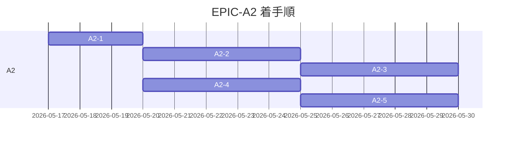

# EPIC-A2 ロードマップ

> **5 行以内 summary**: EPIC-A2 (`.claude/rules/*` 全ファイル本格化 + docs 全面拡充)
> 配下の PR 進捗トラッカー。A2-1 〜 A2-5 の 5 PR を対象とし、Plan 単体は列挙しない
> (R-34)。`roadmap-tracker` Skill が自動更新する。`docs/harness/roadmap.md` の A2 行と
> 整合する。Open Questions / 障壁 / 着手順変更履歴は append-only。

## 項目一覧

| ID | タイトル | status | expected_modules | 完了根拠 |
|---|---|---|---|---|
| **A2-1** | A1 レトロ即時消化 + ハーネス即時改善 | completed | EPIC-A2 起票 + `CLAUDE.md` / `.claude/rules/{rules-index,template-language,mcp-usage,db-protection,commit-message,roadmap}.md` / `.claude/skills/code-reviewer/SKILL.md` / `.github/PULL_REQUEST_TEMPLATE/{harness,feature,bugfix}.md` / `docs/adr/README.md` / `docs/harness/{plan,learnings/flaky-tests,learnings/INDEX,learnings/2026-05-17-pr-117,roadmap}.md` / `scripts/install-git-hooks.sh` | PR [#121](https://github.com/subroh0508/colormaster/pull/121) (2026-05-17 マージ、commit `feb41b5`) |
| **A2-2** | rules 実装・コード系本格化 | proposed | `.claude/rules/{plan,epic,adr,roadmap,viewmodel,ui-state,composable,navigation,repository,network-client,naming,error-handling,logging,i18n,wasm-compat,firebase-boundary,no-firebase,gradle,kotlin-test,screenshot-test,sql-delight,sparql,test-paired-class,markdown,pii,secrets,db-protection,sync-job,sqlite-data-file,cloud-run-deploy,removed-modules,backend-auth,cloudflare-pages,r2-litestream,rules-index}.md` | — |
| **A2-3** | rules プロセス・ハーネス・UI系本格化 | proposed | `.claude/rules/{pr-template,branch-naming,merge-readiness,pr-draft-policy,spec-living-sync,harness-meta-criteria,retrospective-format,pr-poller,skill-authoring,harness-evolution,implementation-workflow,code-reviewer-aspects,design-tokens,ui-snapshot,ui-inventory,behavior-preservation,docs-structure,template-language,rules-index}.md` | — |
| **A2-4** | docs/ コア + runbooks 拡充 | proposed | `docs/{README,glossary,codebase-map}.md`, `docs/security/README.md`, `docs/requirements/{README,template}.md`, `docs/specifications/{README,basic/template,detail/template}.md`, `docs/runbooks/{local-development,testing,i18n,mcp-setup}.md` | — |
| **A2-5** | docs/architecture + api 拡充 | proposed | `docs/architecture/{overview,layers,data-flow,domain-model,state-machines,sequences,infrastructure}.md`, `docs/api/{README,colormaster-api.yaml,auth,idols,me}.md` | — |

## 完了根拠

| ID | PR 番号 | マージ日 | 主要ファイル |
|---|---|---|---|
| A2-1 | [#121](https://github.com/subroh0508/colormaster/pull/121) | 2026-05-17 | EPIC-A2 5 ファイル起票 (`docs/epics/EPIC-A2-rules-docs-extension/{README,roadmap,open-questions,decisions,progress}.md`)、`docs/epics/INDEX.md` 更新、`.claude/rules/{rules-index,template-language,mcp-usage,db-protection,commit-message (新規),roadmap}.md`、`.claude/skills/code-reviewer/SKILL.md` Gotchas、`.github/PULL_REQUEST_TEMPLATE/{harness (新規),feature,bugfix}.md`、`CLAUDE.md` lookup table 注記、`docs/adr/README.md` 索引拡充、`docs/harness/learnings/{flaky-tests.md (新規),2026-05-17-pr-117.md,INDEX.md}`、`docs/harness/{plan,roadmap}.md` (commit `feb41b5`、squash merge、code-reviewer 4 aspect 並列 review 通過 + fix loop で Critical 1 解消) |

## 着手順とブロック関係

A2-1 完了後、A2-2/A2-3 (rules 系) と A2-4/A2-5 (docs 系) は **並走可** (`.claude/rules/`
と `docs/` で touch ファイル分離)。A2-2 と A2-3 は `rules-index.md` の連続編集になるため
直列。A2-4 と A2-5 は `docs/` 内の異なるサブツリーで並走可。

## 保留中の意思決定・不明事項 (Open Questions)

| 起票日 | 内容 | 暫定方針 | 解決状態 |
|---|---|---|---|

## 技術的障壁と回避策 (Blockers and Workarounds)

| 起票日 | 障壁 | 回避策 | 解決日 | 解決方法 |
|---|---|---|---|---|

## 着手順変更履歴 (append-only)

| 日付 | 変更内容 | 理由 |
|---|---|---|
| 2026-05-17 | EPIC-A2 起票 + A2 を 5 PR に分割 | B0 (96 files / +5408 行) のレビュー負荷が上限近く、A2 全体は B0 を超える規模が想定されるため。A1 レトロ Try「巨大 PR の aspect 並列 review における入力分割」と整合 |
| 2026-05-17 | A2-1 着手 (現 worktree `feature/A2-rules-docs-extension` を reuse) | A1 レトロ 15 提案のうち消化可能項目を最優先で消化、後続 PR の規約・索引基盤を整える |
| 2026-05-17 | A2-1 status を in-progress → completed (PR #121 マージ、commit `feb41b5`) | A1 レトロ 15 提案中 11 件を消化、後続 A2-2 / A2-4 並走着手の前提が整う。本 PR は `roadmap-tracker` Phase 8 自動同期の手動代替 (A3 で Skill 本格化まで継続) |

## 次の推奨着手 (並行実装観点)

A2-1 マージ済 (PR #121、commit `feb41b5`)。次のステップ:

1. **A2-4 (docs/ コア + runbooks 拡充)** — `docs/` のみ touch、`.claude/rules/` に依存しない。別 worktree で並走着手可
2. **A2-2 (rules 実装・コード系本格化)** — A2-4 と並走可 (touch ファイル重複ゼロ)。別 worktree で並走着手可
3. A2-3 (rules プロセス系) 着手は A2-2 完了後 (`.claude/rules/rules-index.md` の連続編集回避のため)
4. A2-5 (docs/architecture + api) 着手は A2-4 完了後または並走 (`docs/` 内のサブツリーが異なれば衝突なし)

## 関連

- `docs/epics/EPIC-A2-rules-docs-extension/README.md`
- `docs/harness/roadmap.md` (全体ロードマップ、A2 行)
- `docs/harness/plan.md` §6.2 A2
- `.claude/rules/roadmap.md`
