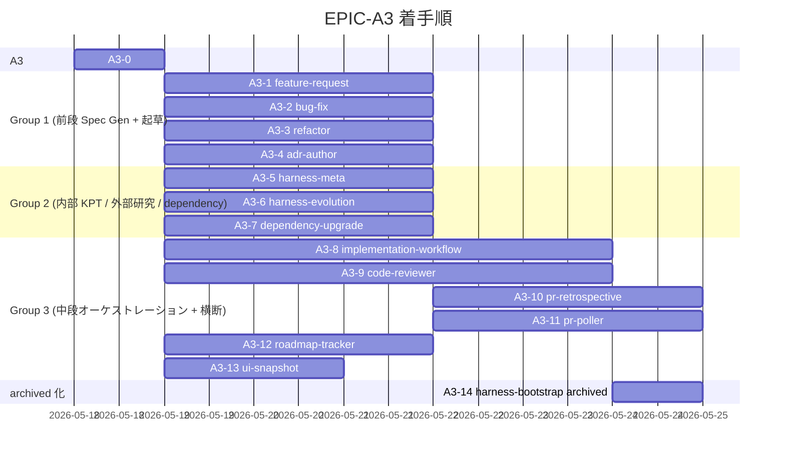

# EPIC-A3 ロードマップ

> **5 行以内 summary**: EPIC-A3 (専用 Skill 群実装) 配下の PR 進捗トラッカー。本 Epic
> 起票 PR (A3-0) + 13 Skill 実装 PR (A3-1 〜 A3-13) + archived 化 PR (A3-14) の計 15
> PR を対象とし、Plan 単体は列挙しない (R-34)。`roadmap-tracker` 本格化前は手動更新、
> A3-12 マージ後は自動更新に切替。`docs/harness/roadmap.md` の A3 行と整合する。
> Open Questions / 障壁 / 着手順変更履歴は append-only。

## 項目一覧

| ID | タイトル | status | expected_modules | 完了根拠 |
|---|---|---|---|---|
| **A3-0** | EPIC-A3 起票 (本 PR) | in-progress | `docs/epics/EPIC-A3-skill-suite-extension/**`, `docs/epics/INDEX.md`, `docs/harness/roadmap.md` | — |
| **A3-1** | `feature-request` Skill 完成 | proposed | `.claude/skills/feature-request/SKILL.md` | — |
| **A3-2** | `bug-fix` Skill 完成 | proposed | `.claude/skills/bug-fix/SKILL.md` | — |
| **A3-3** | `refactor` Skill 完成 | proposed | `.claude/skills/refactor/SKILL.md` | — |
| **A3-4** | `adr-author` Skill 完成 | proposed | `.claude/skills/adr-author/SKILL.md` | — |
| **A3-5** | `harness-meta` Skill 完成 | proposed | `.claude/skills/harness-meta/SKILL.md` | — |
| **A3-6** | `harness-evolution` Skill 完成 | proposed | `.claude/skills/harness-evolution/SKILL.md` | — |
| **A3-7** | `dependency-upgrade` Skill 完成 | proposed | `.claude/skills/dependency-upgrade/SKILL.md` | — |
| **A3-8** | `implementation-workflow` Phase 0-9 完全実装 | proposed | `.claude/skills/implementation-workflow/SKILL.md` | — |
| **A3-9** | `code-reviewer` 8 aspect binary checklist + Coordinator | proposed | `.claude/skills/code-reviewer/SKILL.md` | — |
| **A3-10** | `pr-retrospective` learning + harness-meta フィードバック | proposed | `.claude/skills/pr-retrospective/SKILL.md` | — |
| **A3-11** | `pr-poller` Renovate 検出 + 3 系統起動経路 | proposed | `.claude/skills/pr-poller/SKILL.md`, `.claude/locks/` | — |
| **A3-12** | `roadmap-tracker` plan.md / Epic 走査 + 自動起動フック | proposed | `.claude/skills/roadmap-tracker/SKILL.md` | — |
| **A3-13** | `ui-snapshot` skeleton 拡張 (A10 で本格運用) | proposed | `.claude/skills/ui-snapshot/SKILL.md` | — |
| **A3-14** | `harness-bootstrap` を archived/ へ移動 + 参照削除 | proposed | `.claude/skills/harness-bootstrap/` → `.claude/skills/archived/harness-bootstrap/`, `CLAUDE.md`, `.claude/rules/rules-index.md` | — |

## 完了根拠

| ID | PR 番号 | マージ日 | 主要ファイル |
|---|---|---|---|

## 着手順とブロック関係

着手順は `decisions.md` の並列グルーピング (Group 1-3) と整合。Group 1 / 2 / 3 はそれぞれ
内部の Skill 間で touch ファイル重複ゼロのため並走可能。A3-10 (`pr-retrospective`) は
A3-5 (`harness-meta`) 完成後に着手 (harness-meta フィードバック追記ロジックを共有)。
A3-11 (`pr-poller`) は A3-7 (`dependency-upgrade`) 完成後に着手 (Renovate ラベル PR 検出
+ dependency-upgrade 起動を組み込む)。A3-14 (archived 化) は A3-8 (`implementation-workflow`)
完成後に着手 (本格化された専用 Skill が稼働状態であることを確認してから `harness-bootstrap`
を archived 化)。

## 保留中の意思決定・不明事項 (Open Questions)

| 起票日 | 内容 | 暫定方針 | 解決状態 |
|---|---|---|---|

## 技術的障壁と回避策 (Blockers and Workarounds)

| 起票日 | 障壁 | 回避策 | 解決日 | 解決方法 |
|---|---|---|---|---|

## 着手順変更履歴 (append-only)

| 日付 | 変更内容 | 理由 |
|---|---|---|
| 2026-05-18 | EPIC-A3 起票 + A3 を 14 Skill 実装 PR + 起票 PR (A3-0) の計 15 PR に分割 | A2 (5 PR + 計画外 A2-6) のレビュー負荷実績 (1 PR = 35 ファイル / +3,479 行が上限近く) を踏まえ、本 Epic は 1 PR = 1 Skill 単位に分割。並列実行容易性 (Group 1-3) を `decisions.md` で明示 |
| 2026-05-18 | A3-0 着手 (本 PR `harness/EPIC-A3-bootstrap`) | EPIC ディレクトリ起票 + roadmap / INDEX 更新のみに閉じ、Skill 本体は touch しない。後続 A3-1〜A3-14 並走着手の前提を整える |

## 次の推奨着手 (並行実装観点)

`roadmap-tracker` 本格化前は手動更新。本 Epic 起票 (A3-0) マージ後の推奨着手:

1. **Group 1 (前段 Spec Gen + 起草) を並列着手** — `feature-request` (A3-1) / `bug-fix` (A3-2) / `refactor` (A3-3) / `adr-author` (A3-4) は touch ファイル重複ゼロ (各 Skill 独立ディレクトリ) で並走可能。orchestrator (subroh0508) が cmux 4 per-task pane を spawn して並列実装
2. **Group 2 (内部 KPT / 外部研究 / dependency) を並列着手** — `harness-meta` (A3-5) / `harness-evolution` (A3-6) / `dependency-upgrade` (A3-7) も touch ファイル重複ゼロで並走可能。Group 1 と並行実行も可能
3. **Group 3 (中段オーケストレーション + 横断) を並列着手 (一部直列依存あり)** — `implementation-workflow` (A3-8) / `code-reviewer` (A3-9) / `roadmap-tracker` (A3-12) / `ui-snapshot` (A3-13) は並走可能。`pr-retrospective` (A3-10) は A3-5 完了後、`pr-poller` (A3-11) は A3-7 完了後
4. **A3-14 (archived 化) は最後** — A3-1〜A3-13 がマージ済で本格化された Skill が稼働状態であることを確認してから `harness-bootstrap` を archived 化

並列度の上限は orchestrator pane (subroh0508) の同時管理可能 per-task pane 数 (現状実証済 3-4 PR 同時) で決定。

## 関連

- `docs/epics/EPIC-A3-skill-suite-extension/README.md`
- `docs/epics/EPIC-A3-skill-suite-extension/decisions.md` (分割方針 + Group 1-3 並列グルーピング)
- `docs/harness/roadmap.md` (全体ロードマップ、A3 行)
- `docs/harness/plan.md` §6.2 A3 (1535 行)
- `.claude/rules/roadmap.md`
- `.claude/rules/skill-authoring.md` (Skill 作成規約)
