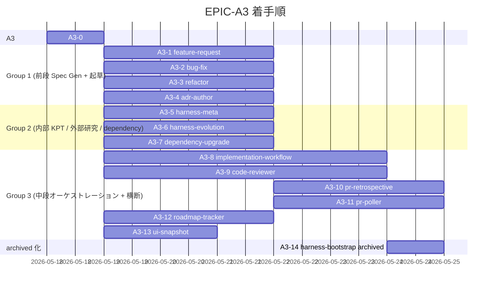

# EPIC-A3 ロードマップ

> **5 行以内 summary**: EPIC-A3 (専用 Skill 群実装) 配下の PR 進捗トラッカー。本 Epic
> 起票 PR (A3-0) + 13 Skill 実装 PR (A3-1 〜 A3-13) + archived 化 PR (A3-14) の計 15
> PR を対象とし、Plan 単体は列挙しない (R-34)。`roadmap-tracker` 本格化前は手動更新、
> A3-12 マージ後は自動更新に切替。`docs/harness/roadmap.md` の A3 行と整合する。
> Open Questions / 障壁 / 着手順変更履歴は append-only。

## 項目一覧

| ID | タイトル | status | expected_modules | 完了根拠 |
|---|---|---|---|---|
| **A3-0** | EPIC-A3 起票 (本 PR) | in-progress | `docs/epics/EPIC-A3-skill-suite-extension/**`, `docs/epics/INDEX.md`, `docs/harness/roadmap.md` | — |
| **A3-1** | `feature-request` Skill 完成 | completed | `.claude/skills/feature-request/SKILL.md` | PR [#149](https://github.com/subroh0508/colormaster/pull/149) (2026-05-18 マージ、merge commit `fd95f48`) |
| **A3-2** | `bug-fix` Skill 完成 | completed | `.claude/skills/bug-fix/SKILL.md` | PR [#148](https://github.com/subroh0508/colormaster/pull/148) (2026-05-18 マージ、merge commit `400e7f2`) |
| **A3-3** | `refactor` Skill 完成 | completed | `.claude/skills/refactor/SKILL.md` | PR [#151](https://github.com/subroh0508/colormaster/pull/151) (2026-05-18 マージ、merge commit `d69d2c1`) |
| **A3-4** | `adr-author` Skill 完成 | completed | `.claude/skills/adr-author/SKILL.md` | PR [#150](https://github.com/subroh0508/colormaster/pull/150) (2026-05-18 マージ、merge commit `f931588`) |
| **A3-5** | `harness-meta` Skill 完成 | proposed | `.claude/skills/harness-meta/SKILL.md` | — |
| **A3-6** | `harness-evolution` Skill 完成 | proposed | `.claude/skills/harness-evolution/SKILL.md` | — |
| **A3-7** | `dependency-upgrade` Skill 完成 | proposed | `.claude/skills/dependency-upgrade/SKILL.md` | — |
| **A3-8** | `implementation-workflow` Phase 0-9 完全実装 | proposed | `.claude/skills/implementation-workflow/SKILL.md` | — |
| **A3-9** | `code-reviewer` 8 aspect binary checklist + Coordinator | proposed | `.claude/skills/code-reviewer/SKILL.md` | — |
| **A3-10** | `pr-retrospective` learning + harness-meta フィードバック | proposed | `.claude/skills/pr-retrospective/SKILL.md` | — |
| **A3-11** | `pr-poller` Renovate 検出 + 3 系統起動経路 | proposed | `.claude/skills/pr-poller/SKILL.md`, `.claude/locks/` | — |
| **A3-12** | `roadmap-tracker` plan.md / Epic 走査 + 自動起動フック | proposed | `.claude/skills/roadmap-tracker/SKILL.md` | — |
| **A3-13** | `ui-snapshot` skeleton 拡張 (A10 で本格運用) | proposed | `.claude/skills/ui-snapshot/SKILL.md` | — |
| **A3-14** | `harness-bootstrap` を archived/ へ移動 + 参照削除 | proposed | `.claude/skills/harness-bootstrap/` → `.claude/skills/archived/harness-bootstrap/`, `CLAUDE.md`, `.claude/rules/rules-index.md` | — |

## 完了根拠

| ID | PR 番号 | マージ日 | 主要ファイル |
|---|---|---|---|
| A3-2 | [#148](https://github.com/subroh0508/colormaster/pull/148) | 2026-05-18 | `.claude/skills/bug-fix/SKILL.md` 新規 1 ファイル (+199 / -0、単一 commit `400954f` → merge commit `400e7f2`、fix loop なし)。bug 報告から再現手順 / root cause / 仕様 gap 分析 + Plan 起票で完結する Spec Gen 専任 Skill (修正実装は implementation-workflow に委譲)。6 Phase 構成、Kotest / Roborazzi 再現テスト案 + 仕様補強リンクを Plan 必須セクション化、`skill-authoring.md` 100-point rubric 準拠。code-reviewer 4 aspect 並列 review Critical 0 + High 0 通過 |
| A3-1 | [#149](https://github.com/subroh0508/colormaster/pull/149) | 2026-05-18 | `.claude/skills/feature-request/SKILL.md` 新規 1 ファイル (+196 / -0、初回 commit `9e76594` + fix loop 1 commit `d549cca` → merge commit `fd95f48`)。Spec Gen 専任 Skill (要件 REQ-NNN → 基本設計 SPEC-NNN-basic → 詳細設計 SPEC-NNN-detail を順に起草、単一 PR は plan-author / 複数 PR は epic-author 呼出、implementation-workflow 委譲)、§4.6 コード禁止原則をフェーズ別動作と Gotchas で強制。code-reviewer 4 aspect Critical 0、High 3 件 (Plan vs Epic 判定閾値 SoT 不整合 / adr-author dangling 参照 / 詳細設計テストパターン @Spec 予定 ID 境界) を fix loop 1 で即時解消 |
| A3-4 | [#150](https://github.com/subroh0508/colormaster/pull/150) | 2026-05-18 | `.claude/skills/adr-author/SKILL.md` 新規 1 ファイル (+190 / -0、初回 commit `68a3825` + Improvement 反映 commit `53c02c8` → merge commit `f931588`)。ADR 起票基準判定 + 採番 + テンプレ起草 + 関連 ADR 双方向リンク + `docs/adr/README.md` INDEX 更新の 5 責務、起票基準を満たさない決定は別記録方法を提案して停止、議論 / approve / merge は人間レビューに委ねる。code-reviewer 4 aspect Critical 0、Improvement 4 件 (last_updated 整合 / 起票基準充足チェック表参照先明示 / ADR 化見送り 3 条件確認ロジック明示 / supersede 関係と単純参照関係の区別明示) を fix loop 1 で即時消化 |
| A3-3 | [#151](https://github.com/subroh0508/colormaster/pull/151) | 2026-05-18 | `.claude/skills/refactor/SKILL.md` 新規 1 ファイル (+157 / -0、単一 commit `61d59e2` → merge commit `d69d2c1`、fix loop なし)。refactor 要求の影響分析 + behavior preservation 検証点列挙 + 規模判定で Plan / Epic 起票まで (実装は implementation-workflow に委譲)、behavior preservation 検証点は `behavior-preservation.md` の二本柱 (visual-regression + spec-conformance) 準拠、A10 完了前のリファクタ制約 (R-22) を Gotchas に明示。code-reviewer 4 aspect Critical 0 + High 0 通過 |

## 着手順とブロック関係

着手順は `decisions.md` の並列グルーピング (Group 1-3) と整合。Group 1 / 2 / 3 はそれぞれ
内部の Skill 間で touch ファイル重複ゼロのため並走可能。A3-10 (`pr-retrospective`) は
A3-5 (`harness-meta`) 完成後に着手 (harness-meta フィードバック追記ロジックを共有)。
A3-11 (`pr-poller`) は A3-7 (`dependency-upgrade`) 完成後に着手 (Renovate ラベル PR 検出
+ dependency-upgrade 起動を組み込む)。A3-14 (archived 化) は A3-8 (`implementation-workflow`)
完成後に着手 (本格化された専用 Skill が稼働状態であることを確認してから `harness-bootstrap`
を archived 化)。

## 保留中の意思決定・不明事項 (Open Questions)

| 起票日 | 内容 | 暫定方針 | 解決状態 |
|---|---|---|---|

## 技術的障壁と回避策 (Blockers and Workarounds)

| 起票日 | 障壁 | 回避策 | 解決日 | 解決方法 |
|---|---|---|---|---|

## 着手順変更履歴 (append-only)

| 日付 | 変更内容 | 理由 |
|---|---|---|
| 2026-05-18 | EPIC-A3 起票 + A3 を 14 Skill 実装 PR + 起票 PR (A3-0) の計 15 PR に分割 | A2 (5 PR + 計画外 A2-6) のレビュー負荷実績 (1 PR = 35 ファイル / +3,479 行が上限近く) を踏まえ、本 Epic は 1 PR = 1 Skill 単位に分割。並列実行容易性 (Group 1-3) を `decisions.md` で明示 |
| 2026-05-18 | A3-0 着手 (本 PR `harness/EPIC-A3-bootstrap`) | EPIC ディレクトリ起票 + roadmap / INDEX 更新のみに閉じ、Skill 本体は touch しない。後続 A3-1〜A3-14 並走着手の前提を整える |
| 2026-05-18 | Group 1 (A3-1〜A3-4) 4 並列完走、orchestrator (subroh0508) 4 per-task pane spawn で touch ファイル独立並走を実証 | EPIC-A2 (5 PR 並走) に続く並列実装パターン確立、Group 2 / Group 3 への展開フィードバック |

## 次の推奨着手 (並行実装観点)

`roadmap-tracker` 本格化前は手動更新。EPIC-A3 起票 (A3-0) + Group 1 (A3-1〜A3-4) マージ済、Spec Gen + ADR 起草系 4 Skill の SoT が稼働状態。残りステップ:

1. **Group 2 (内部 KPT / 外部研究 / dependency) を 3 並列 spawn** — `harness-meta` (A3-5) / `harness-evolution` (A3-6) / `dependency-upgrade` (A3-7) は touch ファイル重複ゼロ (各 `.claude/skills/<name>/SKILL.md` のみ) で並走可能。Group 1 と同パターンで orchestrator (subroh0508) が cmux 3 per-task pane を spawn
2. **Group 3 (中段オーケストレーション + 横断) は一部直列依存あり** — `implementation-workflow` (A3-8) / `code-reviewer` (A3-9) / `roadmap-tracker` (A3-12) / `ui-snapshot` (A3-13) は並走可能 (Group 2 と並走も可)、`pr-retrospective` (A3-10) は A3-5 (`harness-meta`) 完了後、`pr-poller` (A3-11) は A3-7 (`dependency-upgrade`) 完了後
3. **A3-14 (`harness-bootstrap` archived 化) は A3-8 (`implementation-workflow`) 完了後の最終** — 本格化された専用 Skill が稼働状態であることを確認してから `harness-bootstrap` を `.claude/skills/archived/` に移動
4. A3 Group 1 各 PR レトロ (PR #148 / #149 / #150 / #151) の未消化提案 (harness-meta フィードバック) を A3 後段 / A4 で順次消化

並列度の上限は orchestrator pane (subroh0508) の同時管理可能 per-task pane 数 (現状実証済 4 PR 同時、Group 1 で確認) で決定。

## 関連

- `docs/epics/EPIC-A3-skill-suite-extension/README.md`
- `docs/epics/EPIC-A3-skill-suite-extension/decisions.md` (分割方針 + Group 1-3 並列グルーピング)
- `docs/harness/roadmap.md` (全体ロードマップ、A3 行)
- `docs/harness/plan.md` §6.2 A3 (1535 行)
- `.claude/rules/roadmap.md`
- `.claude/rules/skill-authoring.md` (Skill 作成規約)
