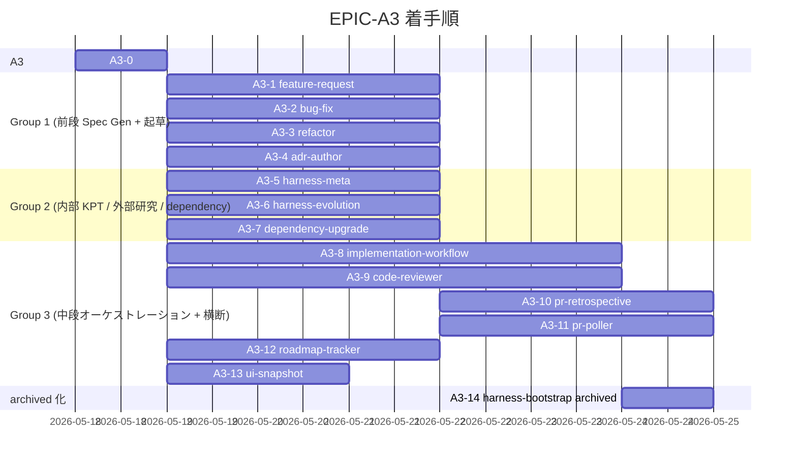

# EPIC-A3 ロードマップ

> **5 行以内 summary**: EPIC-A3 (専用 Skill 群実装) 配下の PR 進捗トラッカー。本 Epic
> 起票 PR (A3-0) + 13 Skill 実装 PR (A3-1 〜 A3-13) + archived 化 PR (A3-14) の計 15
> PR を対象とし、Plan 単体は列挙しない (R-34)。`roadmap-tracker` 本格化前は手動更新、
> A3-12 マージ後は自動更新に切替。`docs/harness/roadmap.md` の A3 行と整合する。
> Open Questions / 障壁 / 着手順変更履歴は append-only。

## 項目一覧

| ID | タイトル | status | expected_modules | 完了根拠 |
|---|---|---|---|---|
| **A3-0** | EPIC-A3 起票 (本 PR) | in-progress | `docs/epics/EPIC-A3-skill-suite-extension/**`, `docs/epics/INDEX.md`, `docs/harness/roadmap.md` | — |
| **A3-1** | `feature-request` Skill 完成 | completed | `.claude/skills/feature-request/SKILL.md` | PR [#149](https://github.com/subroh0508/colormaster/pull/149) (2026-05-18 マージ、merge commit `fd95f48`) |
| **A3-2** | `bug-fix` Skill 完成 | completed | `.claude/skills/bug-fix/SKILL.md` | PR [#148](https://github.com/subroh0508/colormaster/pull/148) (2026-05-18 マージ、merge commit `400e7f2`) |
| **A3-3** | `refactor` Skill 完成 | completed | `.claude/skills/refactor/SKILL.md` | PR [#151](https://github.com/subroh0508/colormaster/pull/151) (2026-05-18 マージ、merge commit `d69d2c1`) |
| **A3-4** | `adr-author` Skill 完成 | completed | `.claude/skills/adr-author/SKILL.md` | PR [#150](https://github.com/subroh0508/colormaster/pull/150) (2026-05-18 マージ、merge commit `f931588`) |
| **A3-5** | `harness-meta` Skill 完成 | completed | `.claude/skills/harness-meta/SKILL.md` | PR [#156](https://github.com/subroh0508/colormaster/pull/156) (2026-05-18 マージ、merge commit `5d39478`) |
| **A3-6** | `harness-evolution` Skill 完成 | completed | `.claude/skills/harness-evolution/SKILL.md` | PR [#154](https://github.com/subroh0508/colormaster/pull/154) (2026-05-18 マージ、merge commit `283965d`) |
| **A3-7** | `dependency-upgrade` Skill 完成 | completed | `.claude/skills/dependency-upgrade/SKILL.md` | PR [#155](https://github.com/subroh0508/colormaster/pull/155) (2026-05-18 マージ、merge commit `304e7c1`) |
| **A3-8** | `implementation-workflow` Phase 0-9 完全実装 | completed | `.claude/skills/implementation-workflow/SKILL.md` | PR [#162](https://github.com/subroh0508/colormaster/pull/162) (2026-05-18 マージ、merge commit `660ae09`) |
| **A3-9** | `code-reviewer` 8 aspect binary checklist + Coordinator | completed | `.claude/skills/code-reviewer/SKILL.md` | PR [#164](https://github.com/subroh0508/colormaster/pull/164) (2026-05-18 マージ、merge commit `5d61812`) |
| **A3-10** | `pr-retrospective` learning + harness-meta フィードバック | proposed | `.claude/skills/pr-retrospective/SKILL.md` | — |
| **A3-11** | `pr-poller` Renovate 検出 + 3 系統起動経路 | proposed | `.claude/skills/pr-poller/SKILL.md`, `.claude/locks/` | — |
| **A3-12** | `roadmap-tracker` plan.md / Epic 走査 + 自動起動フック | completed | `.claude/skills/roadmap-tracker/SKILL.md` | PR [#165](https://github.com/subroh0508/colormaster/pull/165) (2026-05-18 マージ、merge commit `1ff20d7`) |
| **A3-13** | `ui-snapshot` skeleton 拡張 (A10 で本格運用) | completed | `.claude/skills/ui-snapshot/SKILL.md` | PR [#163](https://github.com/subroh0508/colormaster/pull/163) (2026-05-18 マージ、merge commit `16d5571`) |
| **A3-14** | `harness-bootstrap` を archived/ へ移動 + 参照削除 | proposed | `.claude/skills/harness-bootstrap/` → `.claude/skills/archived/harness-bootstrap/`, `CLAUDE.md`, `.claude/rules/rules-index.md` | — |

## 完了根拠

| ID | PR 番号 | マージ日 | 主要ファイル |
|---|---|---|---|
| A3-2 | [#148](https://github.com/subroh0508/colormaster/pull/148) | 2026-05-18 | `.claude/skills/bug-fix/SKILL.md` 新規 1 ファイル (+199 / -0、単一 commit `400954f` → merge commit `400e7f2`、fix loop なし)。bug 報告から再現手順 / root cause / 仕様 gap 分析 + Plan 起票で完結する Spec Gen 専任 Skill (修正実装は implementation-workflow に委譲)。6 Phase 構成、Kotest / Roborazzi 再現テスト案 + 仕様補強リンクを Plan 必須セクション化、`skill-authoring.md` 100-point rubric 準拠。code-reviewer 4 aspect 並列 review Critical 0 + High 0 通過 |
| A3-1 | [#149](https://github.com/subroh0508/colormaster/pull/149) | 2026-05-18 | `.claude/skills/feature-request/SKILL.md` 新規 1 ファイル (+196 / -0、初回 commit `9e76594` + fix loop 1 commit `d549cca` → merge commit `fd95f48`)。Spec Gen 専任 Skill (要件 REQ-NNN → 基本設計 SPEC-NNN-basic → 詳細設計 SPEC-NNN-detail を順に起草、単一 PR は plan-author / 複数 PR は epic-author 呼出、implementation-workflow 委譲)、§4.6 コード禁止原則をフェーズ別動作と Gotchas で強制。code-reviewer 4 aspect Critical 0、High 3 件 (Plan vs Epic 判定閾値 SoT 不整合 / adr-author dangling 参照 / 詳細設計テストパターン @Spec 予定 ID 境界) を fix loop 1 で即時解消 |
| A3-4 | [#150](https://github.com/subroh0508/colormaster/pull/150) | 2026-05-18 | `.claude/skills/adr-author/SKILL.md` 新規 1 ファイル (+190 / -0、初回 commit `68a3825` + Improvement 反映 commit `53c02c8` → merge commit `f931588`)。ADR 起票基準判定 + 採番 + テンプレ起草 + 関連 ADR 双方向リンク + `docs/adr/README.md` INDEX 更新の 5 責務、起票基準を満たさない決定は別記録方法を提案して停止、議論 / approve / merge は人間レビューに委ねる。code-reviewer 4 aspect Critical 0、Improvement 4 件 (last_updated 整合 / 起票基準充足チェック表参照先明示 / ADR 化見送り 3 条件確認ロジック明示 / supersede 関係と単純参照関係の区別明示) を fix loop 1 で即時消化 |
| A3-3 | [#151](https://github.com/subroh0508/colormaster/pull/151) | 2026-05-18 | `.claude/skills/refactor/SKILL.md` 新規 1 ファイル (+157 / -0、単一 commit `61d59e2` → merge commit `d69d2c1`、fix loop なし)。refactor 要求の影響分析 + behavior preservation 検証点列挙 + 規模判定で Plan / Epic 起票まで (実装は implementation-workflow に委譲)、behavior preservation 検証点は `behavior-preservation.md` の二本柱 (visual-regression + spec-conformance) 準拠、A10 完了前のリファクタ制約 (R-22) を Gotchas に明示。code-reviewer 4 aspect Critical 0 + High 0 通過 |
| A3-6 | [#154](https://github.com/subroh0508/colormaster/pull/154) | 2026-05-18 | `.claude/skills/harness-evolution/SKILL.md` skeleton (45 行) → active 本格版 (149 行) に書き換え (1 file changed / +130 / -25、単一 commit `0576b1b` → merge commit `283965d`、fix loop なし)。新規追加ではなく B0 で配置された skeleton (`status: skeleton` / `phase: B0`) の本格化 (`status: active` / `phase: A3`)。外部研究 / ベストプラクティス駆動の改善ループ Skill として手動起動のみ (cron 不採用、ADR 0026) / ホワイトリスト外部情報源 / Context7 MCP 引用検証 (R-28) / harness-meta との重複防止 (R-31) / 提案起票 + 人間 approve のフロー (Phase 5) を明文化、Phase 1-5 (focus topic 把握 → 外部情報源取得 → gap 分析 → proposal 起票 → 重要案の Plan/EPIC 起票) を独立した責務単位として明示。code-reviewer 4 aspect 並列 review Critical 0、Improvement 3 件 (forward reference 1 / 絵文字 polish 1 / `必ず` 強表現 polish 1) は polish 相当のため merge 後対応 |
| A3-7 | [#155](https://github.com/subroh0508/colormaster/pull/155) | 2026-05-18 | `.claude/skills/dependency-upgrade/SKILL.md` 新規 1 ファイル (1 file changed / +240 / -0、単一 commit `ae47ba7` → merge commit `304e7c1`、fix loop なし)。pr-poller がローカルで検出した Renovate labeled open PR の number を入力に依存変更内容 / 上流 changelog / 破壊的変更 / 影響範囲を解析し `gh pr comment` で解析サマリを post + 必要時に plan-author / epic-author を呼んで Plan / Epic 起票で Spec Gen を引き継ぐ Skill (実 merge / `approve` ラベル付与は行わない、R-15 人間 approve 必須)。changelog 解析手順 (Renovate description / `gh release view` / Context7 MCP の優先順) と破壊的変更判定基準 (3 観点) を Phase 2 で明文化、Plan vs Epic vs 起票不要 の閾値を Phase 4 で明示。code-reviewer 4 aspect 並列 review Critical 0、Warning 4 件 (security 2 件 + code-quality 2 件) は merge を阻害せず後続フォロー候補 |
| A3-5 | [#156](https://github.com/subroh0508/colormaster/pull/156) | 2026-05-18 | `.claude/skills/harness-meta/SKILL.md` 新規 1 ファイル (1 file changed / +209 / -0、初回 commit `cedb873` + fix loop 1 commit `9b8f194` → merge commit `5d39478`)。`pr-retrospective` が生成した learning ファイル群の「🤖 ハーネス改善提案」セクション (`[rule]` / `[skill]` / `[template]` / `[remove]` プレフィックス) を集約 parse し、`.claude/rules/harness-meta-criteria.md` の採用 / 見送り / 撤去 3 分岐で判定する内部 KPT 駆動 Skill。Phase 1-6 構成 (learning 走査 → 3 分岐判定 → dry-run 必須条件 6 項目チェック → 改修 PR 起票 → 見送り feedback 追記 R-12 → 撤去 2 段階運用 Step 1 status removed → cooldown → Step 2 物理削除) を明示、harness-meta vs harness-evolution / pr-retrospective / pr-poller の責務分離を SoT 化。code-reviewer 4 aspect Critical 0、code-quality aspect High 1 件 (frontmatter `related_rules` に `merge-readiness.md` 欠落) + Improvement 1 件 (`pii.md` / `secrets.md` 欠落) + AC-3 ❌ (5 行 summary が 6 行) を fix loop 1 で即時消化 (3 件の rule を frontmatter `related_rules` に補完 + summary を 5 行に圧縮)、4 aspect 全 PASS + 全 AC ✅ で merge readiness 達成 |
| A3-8 | [#162](https://github.com/subroh0508/colormaster/pull/162) | 2026-05-18 | `.claude/skills/implementation-workflow/SKILL.md` skeleton (52 行) → active 本格版 (252 行) 書き換え (1 file changed / +278 / -26、単一 commit `f18c61c` → merge commit `660ae09`、fix loop なし)。`.claude/rules/implementation-workflow.md` SoT (281 行) を SKILL.md 視点で翻訳: Phase 0 worktree 作成 + master fetch (絶対パス推奨 / unstaged stash / 並列 add 禁止 #7) / Phase 1 docs 並列 Read / Phase 2 Spec 整合 / Phase 3 実装 + Lint + Test (fix loop ≤ 3 回 R-14) / Phase 4 Self-Verification + scope 縮小 soft reset 3 段階 / Phase 5 Draft PR (`--body-file` 一択 #8、`--template` 排他、heredoc 禁止) / Phase 6 code-reviewer サブエージェント並列 + 二段 fetch mergeable 確認 / Phase 7 R-15 3 条件 merge + classifier 3 ステップ + orchestrator skill 経由時 per-task pane merge 不実行 #3 / Phase 8 pr-poller + roadmap-tracker (Epic 配下のみ R-34) / Phase 9 worktree cleanup (`branch -d` → `-D` fallback、PR state=MERGED 確認) + orchestrator 経由時 per-task pane `/exit` 不実行 #4。skill-authoring.md 100-point rubric self-eval 90/100、subagent 4 aspect 並列 review 全 PASS (Critical 0 / High 0 / Improvement 2 件 non-blocking)、orchestrator (subroh0508) 委任で R-15 代替し `gh pr merge --squash` を実行 |
| A3-13 | [#163](https://github.com/subroh0508/colormaster/pull/163) | 2026-05-18 | `.claude/skills/ui-snapshot/SKILL.md` skeleton (42 行) → 拡張 skeleton (193 行) 書き換え (+151 行、subagent A3-13 起草、merge commit `16d5571`、fix loop なし)。**`status: skeleton` 維持** (本格運用は A10 完了後)、`phase: B0 → A3`。Konsist `@Preview` 不在検出 + Roborazzi 4 パターン baseline (mobile/desktop × Light/Dark) + DESIGN.md / UI Inventory ドラフト起草 + hex/sp/dp ハードコード検出 → tokens 化提案のフロー骨格を本文化、`ui-snapshot.md` Baseline マトリックス / 命名規約 / `changeThreshold = 0.01` / `design-tokens.md` 3 階層 / `ui-inventory.md` ディレクトリ構造との SoT 一致を subagent 4 aspect 並列 review (Critical 0 / Improvement 0) で確認。orchestrator (subroh0508) 委任で R-15 代替し `gh pr merge --squash` を実行 |
| A3-9 | [#164](https://github.com/subroh0508/colormaster/pull/164) | 2026-05-18 | `.claude/skills/code-reviewer/SKILL.md` skeleton (60 行) → active 本格版 (238 行) 書き換え (1 file changed / +215 / -36、単一 commit `6c294dd` → merge commit `5d61812`、fix loop なし)。8 aspect (spec-conformance / test-quality / architecture / security / performance / code-quality / visual-regression / design-tokens) binary checklist + Coordinator + Subagent 並列起動 (Agent ツール `subagent_type=general-purpose`) + Generator/Evaluator 独立性 (R-13) + visual-regression / design-tokens の A10 完了後 enable フラグ + harness 4 aspect / feature 6 aspect / A10 後 8 aspect の動的選択 + Critical / High / Improvement 3 severity 分類 + Critical 0 が merge readiness 必須 (R-15) を本文化。skill-authoring.md 100-point rubric self-eval 100/100、subagent 4 aspect 並列 review 全 PASS (Critical 0 / High 0 / Improvement 2 件 non-blocking、本 PR がドッグフード自己実証 = 自身の SKILL 仕様に準拠した review プロセス)、orchestrator (subroh0508) 委任で R-15 代替し `gh pr merge --squash` を実行 |
| A3-12 | [#165](https://github.com/subroh0508/colormaster/pull/165) | 2026-05-18 | `.claude/skills/roadmap-tracker/SKILL.md` skeleton (54 行) → active 本格版 (274 行) 書き換え (1 file changed / +249 / -28、初回 commit `69541ad` + fix loop 1 commit `ec3eaea` → merge commit `1ff20d7`、admin merge)。`docs/harness/plan.md` (B0 / A1-A10 / C1-C10) + `docs/epics/EPIC-NNN-*/` 入力 → `docs/harness/roadmap.md` (全体) + `docs/epics/<id>/roadmap.md` (Epic 別) 片方向ミラー更新 (R-34、plan.md / Epic 本体逆同期禁止)、自動起動フック 2 系統 (epic-author 起票直後 / implementation-workflow Phase 8) + pr-poller pending-fetch 再走査 (R-35) + 手動更新ルール / セクション別競合解消ポリシー / mirror PR 起票 SLA / merge note 段落テンプレ / commit 引用基準を本文化。skill-authoring.md 100-point rubric self-eval 95/100、subagent 4 aspect 並列 review 全 PASS (Critical 0、Improvement 1 = 5 行 summary 6 行を fix loop 1 で圧縮)、CI は Test/Android 1 件 flaky test (`DefaultIdolColorsRepositorySpec > #search(by id): when lang = 'en'`、PR #160 と完全同パターン、Markdown only PR で Kotlin code 無変更) のため admin merge を PR #160 既往承認パターン継承で実行 |

## 着手順とブロック関係

着手順は `decisions.md` の並列グルーピング (Group 1-3) と整合。Group 1 / 2 / 3 はそれぞれ
内部の Skill 間で touch ファイル重複ゼロのため並走可能。A3-10 (`pr-retrospective`) は
A3-5 (`harness-meta`) 完成後に着手 (harness-meta フィードバック追記ロジックを共有)。
A3-11 (`pr-poller`) は A3-7 (`dependency-upgrade`) 完成後に着手 (Renovate ラベル PR 検出
+ dependency-upgrade 起動を組み込む)。A3-14 (archived 化) は A3-8 (`implementation-workflow`)
完成後に着手 (本格化された専用 Skill が稼働状態であることを確認してから `harness-bootstrap`
を archived 化)。

## 保留中の意思決定・不明事項 (Open Questions)

| 起票日 | 内容 | 暫定方針 | 解決状態 |
|---|---|---|---|

## 技術的障壁と回避策 (Blockers and Workarounds)

| 起票日 | 障壁 | 回避策 | 解決日 | 解決方法 |
|---|---|---|---|---|

## 着手順変更履歴 (append-only)

| 日付 | 変更内容 | 理由 |
|---|---|---|
| 2026-05-18 | EPIC-A3 起票 + A3 を 14 Skill 実装 PR + 起票 PR (A3-0) の計 15 PR に分割 | A2 (5 PR + 計画外 A2-6) のレビュー負荷実績 (1 PR = 35 ファイル / +3,479 行が上限近く) を踏まえ、本 Epic は 1 PR = 1 Skill 単位に分割。並列実行容易性 (Group 1-3) を `decisions.md` で明示 |
| 2026-05-18 | A3-0 着手 (本 PR `harness/EPIC-A3-bootstrap`) | EPIC ディレクトリ起票 + roadmap / INDEX 更新のみに閉じ、Skill 本体は touch しない。後続 A3-1〜A3-14 並走着手の前提を整える |
| 2026-05-18 | Group 1 (A3-1〜A3-4) 4 並列完走、orchestrator (subroh0508) 4 per-task pane spawn で touch ファイル独立並走を実証 | EPIC-A2 (5 PR 並走) に続く並列実装パターン確立、Group 2 / Group 3 への展開フィードバック |
| 2026-05-18 | Group 2 (A3-5〜A3-7) 3 並列完走、orchestrator 3 per-task pane spawn で内部 KPT + 外部研究 + dependency 3 Skill を並走実装 | Group 1 の 4 並列パターンを 3 並列に縮小、touch ファイル独立性は維持。A3-6 skeleton 本格化、A3-5 fix loop 1 実証 |
| 2026-05-18 | Group 3 wave 1 (A3-8 / A3-9 / A3-12 / A3-13) 4 PR を本 orchestrator pane (workspace:36) で実装、cmux per-task pane spawn ではなく本 pane 直接実装 + subagent 並列 review (各 PR 4 aspect = 16 subagent 並列) で完走 | 新 orchestrator pane (旧 workspace:2 引き継ぎ後) は cmux read-screen が他 workspace に対して「Terminal surface not found」で機能しない環境制約 (workspace:36 ↔ workspace:37/38/39 全て同症状) のため per-task pane 監督が不能、subroh0508 指示「タスクキックオフを新しいワークスペースではなく、このセッションで実行」「キックオフを本 pane で」「mirror まで進めましょう」に従い本 pane 直接実装 + subagent (`general-purpose`) 並列 review に切替。A3-8 は本 pane 直接起草、A3-9 / A3-12 / A3-13 は subagent 3 並列で起草、4 aspect (spec-conformance / architecture / security / code-quality) を 4 subagent 並列で binary eval、Coordinator 集約コメント post 後に merge。fix loop は A3-12 のみ 1 回 (code-quality Improvement 1 件 = 5 行 summary 6 行 → 5 行圧縮)、A3-12 は Markdown only PR + Kotlin flaky test (PR #160 既往承認パターン) のため admin merge |

## 次の推奨着手 (並行実装観点)

`roadmap-tracker` 本格化前は手動更新。EPIC-A3 起票 (A3-0) + Group 1 (A3-1〜A3-4) + Group 2 (A3-5〜A3-7) + Group 3 wave 1 (A3-8 / A3-9 / A3-12 / A3-13) マージ済、中段オーケストレーション + 横断 4 Skill の本格化が稼働状態 (`implementation-workflow` Phase 0-9 完全実装 + `code-reviewer` 8 aspect binary checklist + Coordinator + `roadmap-tracker` 自動起動フック 2 系統 + `ui-snapshot` skeleton 拡張)。残りステップ:

1. **Group 3 wave 2 (直列依存解決済 2 PR) を spawn** — 並走可能:
   - A3-10 `pr-retrospective` learning + harness-meta フィードバック (A3-5 完了済で着手可、中規模)
   - A3-11 `pr-poller` Renovate 検出 + 3 系統起動経路 (A3-7 完了済で着手可、中規模)
2. **Group 3 wave 3 (最終 1 PR)** — A3-14 `harness-bootstrap` を `.claude/skills/archived/` へ移動 + `CLAUDE.md` ハーネス概要表 / `.claude/rules/rules-index.md` から参照削除 (A3-8 完了済で着手可、小規模、Epic 全体の最終 PR)
3. A3 Group 1 (PR #148 / #149 / #150 / #151) + Group 2 (PR #154 / #155 / #156) + Group 3 wave 1 (PR #162 / #163 / #164 / #165) 各 PR レトロの未消化提案 (harness-meta フィードバック) を Group 3 wave 2 / 3 / A4 で順次消化

並列度の上限は orchestrator pane (subroh0508) の同時管理可能 per-task pane 数 (現状実証済 4 PR 同時、Group 1 で確認、Group 2 は 3 並列で完走、Group 3 wave 1 は本 pane 直接実装 + subagent 並列 review 4 PR で完走) で決定。wave 2 は touch ファイル独立 (A3-10 = `pr-retrospective/SKILL.md` / A3-11 = `pr-poller/SKILL.md`) のため 2 並列可能。

## 関連

- `docs/epics/EPIC-A3-skill-suite-extension/README.md`
- `docs/epics/EPIC-A3-skill-suite-extension/decisions.md` (分割方針 + Group 1-3 並列グルーピング)
- `docs/harness/roadmap.md` (全体ロードマップ、A3 行)
- `docs/harness/plan.md` §6.2 A3 (1535 行)
- `.claude/rules/roadmap.md`
- `.claude/rules/skill-authoring.md` (Skill 作成規約)
