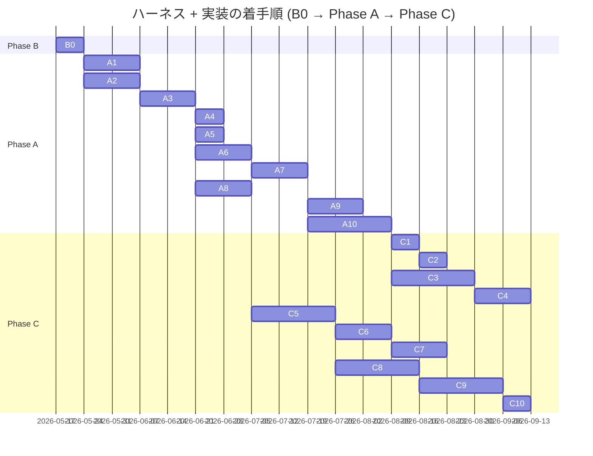

# ハーネス全体ロードマップ

> **5 行以内 summary**: `docs/harness/plan.md` 由来の B0 / A1-A10 / C1-C10 と
> `docs/epics/EPIC-NNN-*/` 全体の進捗トラッカー。`roadmap-tracker` Skill が
> 一方向ミラーで自動更新する。plan.md / Epic 本体への逆同期はしない。
> Plan は 1 PR 完結のため対象外。完了根拠 / Open Questions / 障壁 / 着手順変更履歴を集約。

## 項目一覧

| ID | タイトル | status | expected_modules | 完了根拠 |
|---|---|---|---|---|
| **B0** | ブートストラップ PR | completed | `.claude/**`, `docs/**`, `.github/**`, `scripts/**` | PR #117 (2026-05-17 マージ、commit `0256be9`) |
| **A1** | ADR 0001-0027 一括起草 | completed | `docs/adr/**` | PR [#119](https://github.com/subroh0508/colormaster/pull/119) (2026-05-17 マージ、commit `7f155b5`) |
| **A2** | `.claude/rules/*` 全ファイル本格化 + docs 全面拡充 | in-progress | `.claude/rules/**`, `docs/{architecture,api,security,requirements,specifications,runbooks}/**` | (EPIC-A2 で 5 PR に分割、A2-1 着手中) |
| **A3** | 専用 Skill 群実装 PR | proposed | `.claude/skills/**` | — |
| **A4** | ローカルポーリング機構の本格化 | proposed | `.claude/skills/pr-poller/**`, `.claude/rules/harness-meta-criteria.md` | — |
| **A5** | 不要モジュール撤去 | proposed | `js/**`, `kotlin-js-store/**`, `public/**`, `core/network/{auth,firestore}/**`, `firebase.json`, `.firebaserc`, `web-build-and-deploy.yml` | — |
| **A6** | Lint / Format 基盤 (Spotless + ktlint + detekt + Konsist + markdownlint + Gradle カスタムタスク + trufflehog) | proposed | `build.gradle.kts`, `plugins/**`, `.github/workflows/**` | — |
| **A7** | 三層テスト品質基盤 (Kover + Konsist Spec coverage + PITest) | proposed | `build.gradle.kts`, `plugins/**` | — |
| **A8** | im@sparql ローカル Docker 環境構築 (Fuseki) | proposed | `docker-compose.yml`, `docs/runbooks/local-imasparql.md`, `backend/**` | — |
| **A9** | 既存コード baseline 記録 + Spec coverage 適用準備 | proposed | `docs/specifications/basic/**`, `core/**`, `feature/**` (Spec 逆生成) | — |
| **A10** | UI/UX 現状記録 EPIC (DESIGN.md + UI Inventory + Roborazzi baseline) | proposed | `DESIGN.md`, `docs/design/inventory/**`, `feature/**` (Preview 追加) | — |
| **C1** | Renovate 強化 + dependency-upgrade ドッグフード | proposed | `renovate.json`, `.claude/skills/dependency-upgrade/**` | — |
| **C2** | C1 KPT を受けたハーネス改修 | proposed | `.claude/**` | — |
| **C3** | フィーチャ再編 + Decompose 撤去 + CMP Navigation 3 + 共通 ViewModel (EPIC-001) | proposed | `feature/**`, `core/**` | — |
| **C4** | i18n 移植 (EPIC-002) | proposed | `composeApp/src/commonMain/composeResources/**`, `public/locale/**` (撤去) | — |
| **C5** | Backend 強化 (EPIC-003) | proposed | `backend/**`, `core/network/**` | — |
| **C6** | upstream-driven 同期パイプライン (EPIC-004) | proposed | `.github/workflows/sync-imasparql.yml`, `data/idols.db` | — |
| **C7** | Cloud Run + Cloudflare Pages + R2 デプロイ | proposed | `.github/workflows/deploy.yml`, `Dockerfile` | — |
| **C8** | KMP - iOS ターゲット有効化 (EPIC-005) | proposed | `iosApp/**`, `core/**` (iosMain), `feature/**` (iosMain) | — |
| **C9** | KMP - wasmJs ターゲット有効化 (EPIC-006) | proposed | `webApp/**`, `core/**` (wasmJsMain), `feature/**` (wasmJsMain) | — |
| **C10** | Web 配信再開 (wasmJs を Cloudflare Pages にデプロイ) | proposed | `.github/workflows/deploy-web.yml`, `webApp/**` | — |

## 完了根拠

| ID | PR 番号 | マージ日 | 主要ファイル |
|---|---|---|---|
| B0 | [#117](https://github.com/subroh0508/colormaster/pull/117) | 2026-05-17 | `.claude/{rules,skills,mcp.json,settings.json}/**`, `docs/{adr,api,architecture,design,epics,harness,requirements,runbooks,security,specifications,README.md,glossary.md,codebase-map.md,traceability.md}`, `DESIGN.md`, `.github/{pull_request_template.md,PULL_REQUEST_TEMPLATE/**}`, `scripts/install-git-hooks.sh`, `CLAUDE.md`, `AGENTS.md` |
| A1 | [#119](https://github.com/subroh0508/colormaster/pull/119) | 2026-05-17 | `docs/adr/ADR-0001-*.md` 〜 `ADR-0027-*.md` (27 件)、`docs/adr/README.md`、`docs/plans/{PLAN-001-adr-bootstrap.md,INDEX.md}`、`docs/harness/roadmap.md` |
| A2-1 (EPIC-A2 配下) | [#121](https://github.com/subroh0508/colormaster/pull/121) | 2026-05-17 | EPIC-A2 5 ファイル起票 (`docs/epics/EPIC-A2-rules-docs-extension/{README,roadmap,open-questions,decisions,progress}.md`)、`.claude/rules/{rules-index,template-language,mcp-usage,db-protection,commit-message,roadmap}.md`、`.claude/skills/code-reviewer/SKILL.md` Gotchas、`.github/PULL_REQUEST_TEMPLATE/{harness,feature,bugfix}.md`、`CLAUDE.md`、`docs/adr/README.md`、`docs/harness/learnings/{flaky-tests,2026-05-17-pr-117,INDEX}.md`、`docs/harness/{plan,roadmap}.md` (commit `feb41b5`) |

(B0 は `implementation-workflow` を経由せず手動マージしたため `roadmap-tracker` の Phase 8 自動起動は発火せず、`pr-retrospective` の learning PR (`harness/learnings-batch-2026-W20`) で手動更新)

(A1 は `implementation-workflow` Phase 0-9 の枠組みで進めたが、`code-reviewer` / `pr-poller` / `roadmap-tracker` が skeleton 段階のため手動補助で実施。`code-reviewer` は 3 aspect (spec-conformance / architecture / security) を手動サブエージェント並列で実行し PR #119 にコメント post。owner 単一で self-approve 不可のため `gh pr merge --merge` で通常マージ。PR #120 は `roadmap-tracker` Phase 8 自動同期の手動代替)

(A2-1 は `implementation-workflow` Phase 0-9 の枠組みで進めた最初の EPIC 配下 PR。`code-reviewer` 4 aspect (spec-conformance / architecture / security / code-quality) を手動サブエージェント並列で実行し PR #121 にコメント post。Critical 1 (plan.md SSoT 矛盾) を fix loop で commit `2e820bc` で解消。owner 単一で self-approve 不可のため `gh pr merge --merge` で通常マージ (squash merge、commit `feb41b5`)。本 PR (`harness/roadmap-mirror-a2-1`) は `roadmap-tracker` Phase 8 自動同期の手動代替)

## 着手順とブロック関係

## 保留中の意思決定・不明事項 (Open Questions)

| 起票日 | 内容 | 暫定方針 | 解決状態 |
|---|---|---|---|

## 技術的障壁と回避策 (Blockers and Workarounds)

| 起票日 | 障壁 | 回避策 | 解決日 | 解決方法 |
|---|---|---|---|---|

## 着手順変更履歴 (append-only)

| 日付 | 変更内容 | 理由 |
|---|---|---|
| 2026-05-17 | 初期ロードマップ起草 (plan.md merge 時) | B0 ブートストラップ PR で `docs/harness/plan.md` §6 から取り込み |
| 2026-05-17 | A1 status を proposed → in-progress | PLAN-001 (ADR 0001-0027 一括起票) 作業着手、worktree feature/A1-adr-bootstrap で起草中 |
| 2026-05-17 | A1 status を in-progress → completed | PR #119 (commit `7f155b5`) で ADR 0001-0027 一括起票が merge 完了、PR #120 で `roadmap-tracker` Phase 8 自動同期の手動代替を実施 |
| 2026-05-17 | A2 status を proposed → in-progress + EPIC-A2 を 5 PR に分割 (A2-1〜A2-5) | B0 (96 files / +5408 行) のレビュー負荷上限に近く、A2 全体は B0 を超える規模が想定されるため。A1 レトロ Try「巨大 PR の aspect 並列 review における入力分割」と整合 |
| 2026-05-17 | A2-1 (EPIC-A2 配下、初の EPIC PR) マージ完了 (PR #121、commit `feb41b5`) | A1 レトロ 15 提案中 11 件を消化、EPIC-A2 起票、rules / docs / template 索引基盤を整備。後続 A2-2 / A2-4 並走着手の前提が整う。本 PR (`harness/roadmap-mirror-a2-1`) は `roadmap-tracker` Phase 8 自動同期の手動代替 |

## 次の推奨着手 (並行実装観点)

`roadmap-tracker` Skill が更新する想定。A2-1 マージ後 (PR #121、commit `feb41b5`) の手動更新例:

1. **A2-4 (docs/ コア + runbooks 拡充)** — `docs/` のみ touch、`.claude/rules/` と衝突しない。別 worktree で並走着手可
2. **A2-2 (rules 実装・コード系本格化)** — A2-4 と並走可 (touch ファイル重複ゼロ)。別 worktree で並走着手可
3. **A2-3 (rules プロセス系) 着手は A2-2 完了後** (`.claude/rules/rules-index.md` の連続編集回避のため)
4. **A2-5 (docs/architecture + api) 着手は A2-4 完了後または並走** (`docs/` 内のサブツリーが異なれば衝突なし)
5. **A3 着手は EPIC-A2 完了後** — ADR + 本格化された rules を参照する Skill 群実装のため

## 関連

- `docs/harness/plan.md` (Single Source of Truth)
- `docs/epics/EPIC-000-harness-foundation/roadmap.md` (EPIC-000 配下の PR 進捗)
- `.claude/rules/roadmap.md` (ロードマップ Markdown 規約)
- `.claude/skills/roadmap-tracker/SKILL.md`
