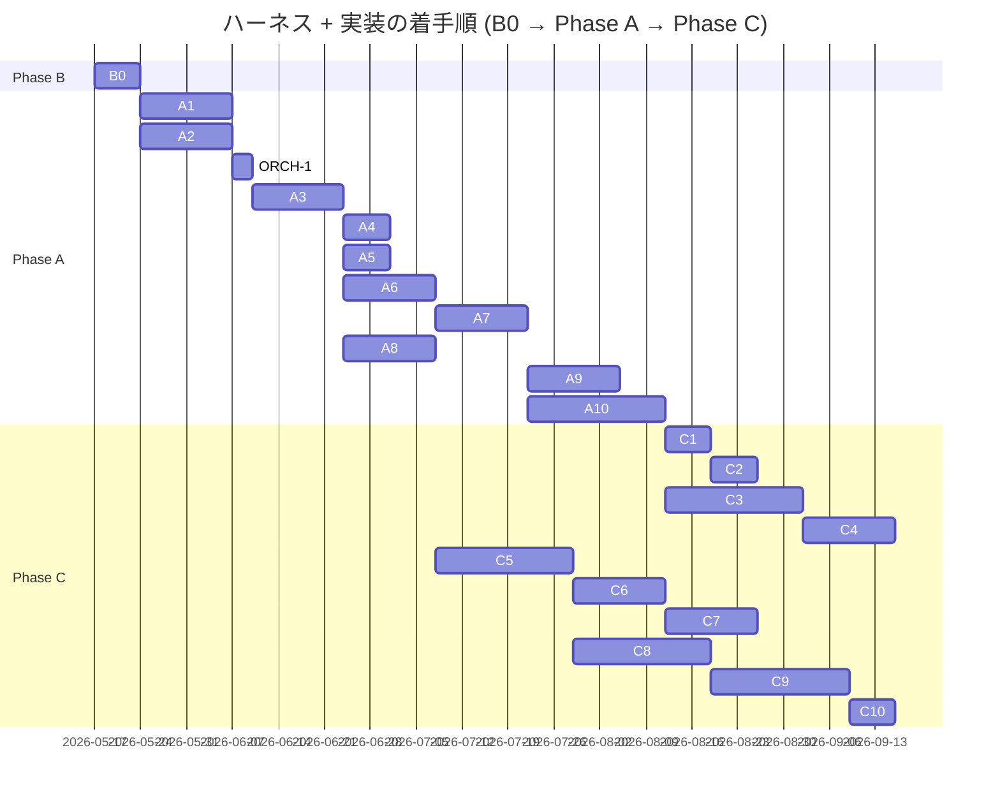

# ハーネス全体ロードマップ

> **5 行以内 summary**: `docs/harness/plan.md` 由来の B0 / A1-A10 / C1-C10 と
> `docs/epics/EPIC-NNN-*/` 全体の進捗トラッカー。`roadmap-tracker` Skill が
> 一方向ミラーで自動更新する。plan.md / Epic 本体への逆同期はしない。
> Plan は 1 PR 完結のため対象外。完了根拠 / Open Questions / 障壁 / 着手順変更履歴を集約。

## 項目一覧

| ID | タイトル | status | expected_modules | 完了根拠 |
|---|---|---|---|---|
| **B0** | ブートストラップ PR | completed | `.claude/**`, `docs/**`, `.github/**`, `scripts/**` | PR #117 (2026-05-17 マージ、commit `0256be9`) |
| **A1** | ADR 0001-0027 一括起草 | completed | `docs/adr/**` | PR [#119](https://github.com/subroh0508/colormaster/pull/119) (2026-05-17 マージ、commit `7f155b5`) |
| **A2** | `.claude/rules/*` 全ファイル本格化 + docs 全面拡充 | completed | `.claude/rules/**`, `docs/{architecture,api,security,requirements,specifications,runbooks}/**`, `CLAUDE.md`, `docs/{README,glossary,codebase-map,adr/README}.md`, `docs/harness/learnings/flaky-tests.md`, `.github/PULL_REQUEST_TEMPLATE/harness.md`, `.claude/settings.json` | EPIC-A2 5 PR + 計画外 A2-6 全マージ済 (A2-1 [#121](https://github.com/subroh0508/colormaster/pull/121) / A2-2 [#125](https://github.com/subroh0508/colormaster/pull/125) / A2-3 [#135](https://github.com/subroh0508/colormaster/pull/135) / A2-4 [#123](https://github.com/subroh0508/colormaster/pull/123) / A2-5 [#126](https://github.com/subroh0508/colormaster/pull/126) / A2-6 [#129](https://github.com/subroh0508/colormaster/pull/129)、2026-05-17 全件マージ) |
| **A2-6** | `.claude/settings.json` に merge / push permissions を追加 | completed | `.claude/settings.json` | PR [#129](https://github.com/subroh0508/colormaster/pull/129) (2026-05-17 マージ、commit `1ac6fe4`) |
| **ORCH-1** | orchestrator Skill 配置 (cmux 並列 orchestration、A2 follow-up・A3 より前の最優先項目) | completed | `.claude/skills/orchestrator/**`, `.claude/rules/orchestrator-criteria.md`, `.claude/rules/rules-index.md`, `CLAUDE.md`, `docs/harness/roadmap.md`, `docs/harness/dry-runs/**` | PR [#144](https://github.com/subroh0508/colormaster/pull/144) (起票後 merge 予定) |
| **A3** | 専用 Skill 群実装 (EPIC-A3、新規 7 + アップグレード 6 = 13 Skill + harness-bootstrap archived 化) | completed | `.claude/skills/**`, `.claude/rules/**`, `CLAUDE.md`, `docs/epics/EPIC-A3-skill-suite-extension/**` | EPIC-A3 全 15 PR (A3-0 起票 + A3-1〜A3-14) 完走 (Group 1: PR [#148](https://github.com/subroh0508/colormaster/pull/148) / [#149](https://github.com/subroh0508/colormaster/pull/149) / [#150](https://github.com/subroh0508/colormaster/pull/150) / [#151](https://github.com/subroh0508/colormaster/pull/151)、Group 2: [#154](https://github.com/subroh0508/colormaster/pull/154) / [#155](https://github.com/subroh0508/colormaster/pull/155) / [#156](https://github.com/subroh0508/colormaster/pull/156)、Group 3 wave 1: [#162](https://github.com/subroh0508/colormaster/pull/162) / [#163](https://github.com/subroh0508/colormaster/pull/163) / [#164](https://github.com/subroh0508/colormaster/pull/164) / [#165](https://github.com/subroh0508/colormaster/pull/165)、Group 3 wave 2: [#167](https://github.com/subroh0508/colormaster/pull/167) / [#168](https://github.com/subroh0508/colormaster/pull/168) / [#169](https://github.com/subroh0508/colormaster/pull/169)、2026-05-18 全件マージ) |
| **A4** | ローカルポーリング機構の本格化 | proposed | `.claude/skills/pr-poller/**`, `.claude/rules/harness-meta-criteria.md` | — |
| **A5** | 不要モジュール撤去 (scope: js / firebase / kotlin-js-store / web-build-and-deploy.yml / ci.yml の Test / Web job、`core/network/{auth,firestore}/**` は core/data 依存のため後続 EPIC へ持ち越し) | completed | `js/**`, `kotlin-js-store/**`, `firebase.json`, `.firebaserc`, `.github/workflows/{ci.yml,web-build-and-deploy.yml}`, `core/common/src/jsMain/kotlin/net/subroh0508/colormaster/common/firebase.kt`, `settings.gradle.kts`, `build.gradle.kts`, `gradle/libs.versions.toml`, `plugins/src/main/kotlin/net/subroh0508/colormaster/{convention/AndroidAppModulePlugin,convention/CommonModulePlugin,primitive/kmp/KmpJsPlugin}.kt`, `.claude/rules/removed-modules.md`, `docs/plans/{INDEX,PLAN-004-A5-removed-modules}.md` | PR [#176](https://github.com/subroh0508/colormaster/pull/176) (2026-05-19 マージ、commit `b99d43d`) |
| **A6** | Lint / Format 基盤 (Spotless + ktlint + detekt + Konsist + markdownlint + Gradle カスタムタスク + trufflehog) | proposed | `build.gradle.kts`, `plugins/**`, `.github/workflows/**` | — |
| **A7** | 三層テスト品質基盤 (Kover + Konsist Spec coverage + PITest) | proposed | `build.gradle.kts`, `plugins/**` | — |
| **A8** | im@sparql ローカル Docker 環境構築 (Fuseki) | completed | `docker-compose.yml`, `.env.example`, `data/imasparql/{.gitkeep,README.md}`, `docs/runbooks/local-imasparql.md`, `docs/requirements/{INDEX,REQ-001-imasparql-local-docker}.md`, `docs/specifications/basic/SPEC-IMASPARQL-001-basic.md`, `docs/plans/{INDEX,PLAN-003-a8-imasparql-docker}.md`, `.gitignore` | PR [#175](https://github.com/subroh0508/colormaster/pull/175) (2026-05-19 マージ、commit `7add15b`) |
| **A9** | 既存コード baseline 記録 + Spec coverage 適用準備 | proposed | `docs/specifications/basic/**`, `core/**`, `feature/**` (Spec 逆生成) | — |
| **A10** | UI/UX 現状記録 EPIC (DESIGN.md + UI Inventory + Roborazzi baseline) | proposed | `DESIGN.md`, `docs/design/inventory/**`, `feature/**` (Preview 追加) | — |
| **C1** | Renovate 強化 + dependency-upgrade ドッグフード | proposed | `renovate.json`, `.claude/skills/dependency-upgrade/**` | — |
| **C2** | C1 KPT を受けたハーネス改修 | proposed | `.claude/**` | — |
| **C3** | フィーチャ再編 + Decompose 撤去 + CMP Navigation 3 + 共通 ViewModel (EPIC-001) | proposed | `feature/**`, `core/**` | — |
| **C4** | i18n 移植 (EPIC-002) | proposed | `composeApp/src/commonMain/composeResources/**`, `public/locale/**` (撤去) | — |
| **C5** | Backend 強化 (EPIC-003) | proposed | `backend/**`, `core/network/**` | — |
| **C6** | upstream-driven 同期パイプライン (EPIC-004) | proposed | `.github/workflows/sync-imasparql.yml`, `data/idols.db` | — |
| **C7** | Cloud Run + Cloudflare Pages + R2 デプロイ | proposed | `.github/workflows/deploy.yml`, `Dockerfile` | — |
| **C8** | KMP - iOS ターゲット有効化 (EPIC-005) | proposed | `iosApp/**`, `core/**` (iosMain), `feature/**` (iosMain) | — |
| **C9** | KMP - wasmJs ターゲット有効化 (EPIC-006) | proposed | `webApp/**`, `core/**` (wasmJsMain), `feature/**` (wasmJsMain) | — |
| **C10** | Web 配信再開 (wasmJs を Cloudflare Pages にデプロイ) | proposed | `.github/workflows/deploy-web.yml`, `webApp/**` | — |

## 完了根拠

| ID | PR 番号 | マージ日 | 主要ファイル |
|---|---|---|---|
| B0 | [#117](https://github.com/subroh0508/colormaster/pull/117) | 2026-05-17 | `.claude/{rules,skills,mcp.json,settings.json}/**`, `docs/{adr,api,architecture,design,epics,harness,requirements,runbooks,security,specifications,README.md,glossary.md,codebase-map.md,traceability.md}`, `DESIGN.md`, `.github/{pull_request_template.md,PULL_REQUEST_TEMPLATE/**}`, `scripts/install-git-hooks.sh`, `CLAUDE.md`, `AGENTS.md` |
| A1 | [#119](https://github.com/subroh0508/colormaster/pull/119) | 2026-05-17 | `docs/adr/ADR-0001-*.md` 〜 `ADR-0027-*.md` (27 件)、`docs/adr/README.md`、`docs/plans/{PLAN-001-adr-bootstrap.md,INDEX.md}`、`docs/harness/roadmap.md` |
| A2-1 (EPIC-A2 配下) | [#121](https://github.com/subroh0508/colormaster/pull/121) | 2026-05-17 | EPIC-A2 5 ファイル起票 (`docs/epics/EPIC-A2-rules-docs-extension/{README,roadmap,open-questions,decisions,progress}.md`)、`.claude/rules/{rules-index,template-language,mcp-usage,db-protection,commit-message,roadmap}.md`、`.claude/skills/code-reviewer/SKILL.md` Gotchas、`.github/PULL_REQUEST_TEMPLATE/{harness,feature,bugfix}.md`、`CLAUDE.md`、`docs/adr/README.md`、`docs/harness/learnings/{flaky-tests,2026-05-17-pr-117,INDEX}.md`、`docs/harness/{plan,roadmap}.md` (commit `feb41b5`) |
| A2-4 (EPIC-A2 配下) | [#123](https://github.com/subroh0508/colormaster/pull/123) | 2026-05-17 | `docs/{README,glossary,codebase-map}.md` 本格化、`docs/security/README.md` (incident 対応 quick-reference inline 化)、`docs/requirements/{README,template}.md` + `docs/specifications/{README,basic/template,detail/template}.md` (§4.6.3-4.6.5 適合微調整)、`docs/runbooks/{local-development,testing,i18n,mcp-setup}.md` (4 件全て 5KB+ 本格化)、`docs/epics/EPIC-A2-rules-docs-extension/progress.md` 進捗追記 (commit `376018d`、squash merge、code-reviewer 4 aspect 並列 review Critical 0 通過 + Improvement #6 / #7 fix loop 消化 / #8 を A2-3 持ち越し) |
| A2-5 (EPIC-A2 配下) | [#126](https://github.com/subroh0508/colormaster/pull/126) | 2026-05-17 | `docs/architecture/{overview,layers,data-flow,domain-model,state-machines,sequences,infrastructure}.md` (7) + `docs/api/{README,colormaster-api.yaml,auth,idols,me}.md` (5) を B0 skeleton (1.3-2.5KB) から 5KB+ 本格化 (合計 +2,005 行)、Mermaid 図 (graph TD/LR / flowchart TB / erDiagram / stateDiagram-v2 / sequenceDiagram x5) を全 7 architecture docs + sequences 5 ユースケースで描画、`colormaster-api.yaml` paths を 11 endpoint に拡張、`docs/epics/EPIC-A2-rules-docs-extension/{roadmap,progress}.md` 更新 (commit `168ef5d`) |
| A2-2 (EPIC-A2 配下) | [#125](https://github.com/subroh0508/colormaster/pull/125) | 2026-05-17 | `.claude/rules/` の 35 ファイル本格化 (新規 29 + skeleton 5 件本格化 + `rules-index.md` 索引正規化、合計 +3,479 行)。**計画/記録**: `plan,epic,adr,roadmap`。**アーキテクチャ層**: `viewmodel,ui-state,composable,navigation,repository,network-client`。**横断**: `naming,error-handling,logging,i18n,wasm-compat,firebase-boundary`。**ファイル種別/テスト**: `gradle,kotlin-test,screenshot-test,sql-delight,sparql,test-paired-class,markdown`。**同期/Backend**: `sync-job,sqlite-data-file,cloud-run-deploy,removed-modules,backend-auth,cloudflare-pages,r2-litestream`。**セキュリティ**: `pii,secrets,db-protection,no-firebase`。`rules-index.md` の status 語彙に `stable (X)` を追加し A2-2 で本格化した 34 ファイルを `stable (A2-2)` に正規化。`docs/epics/EPIC-A2-rules-docs-extension/{progress,roadmap}.md` 更新。commit `1a33ccc` (merge commit、`gh pr merge --merge`、orchestrator 委任で R-15 代替)。code-reviewer 4 aspect (spec-conformance / architecture / security / code-quality) 並列 review 通過 (Critical 0)、Improvement 3 件即時反映 (commit `310e430`、後 rebase で `daf9faf` → `1a33ccc`)。master 2 回 rebase (PR #122 / #124 → 追って #123 / #126 / #128) で `progress.md` / `roadmap.md` 衝突を A2-4 / A2-5 完了反映と統合して解決 |
| A2-6 (計画外、auto-merge 緩和 workaround) | [#129](https://github.com/subroh0508/colormaster/pull/129) | 2026-05-17 | `.claude/settings.json` の `permissions.allow` に `Bash(gh pr ready:*)` / `Bash(gh pr merge:*)` / `Bash(gh pr review:*)` / `Bash(git push:*)` / `Bash(git push --force-with-lease:*)` の 5 件を追加 (1 file changed / +6 / -1、commit `b961a22` → merge commit `1ac6fe4`)。EPIC-A2 内の並列実行 (A2-2 / A2-4 / A2-5) で各ペインに self-merge を委任した結果、auto mode classifier が R-15 (auto-merge 禁止 / 人間 approve 必須) を根拠に `gh pr ready` / `gh pr merge` / `git push` を stochastic にブロックした摩擦点を、permission rule 拡張で減らす。R-15 (auto-merge 禁止) 自体の恒久的緩和は不要と判断し ADR-0028 起票 / plan.md 緩和 / 当初の A2-6 (roadmap A2-6 追加 + ADR-0028 起票) は **見送り**、settings.json 1 ファイル変更のみに縮小 (※ ここで言及する ADR-0028 番号は当時予約のみで起票見送り、後に PLAN-002 / PR #171 で 3 軸定量評価フレーム ADR に再割当)。本 PR 自体 (`harness/roadmap-A2-6-auto-merge-priority`) は merge 権限拡大を含むため self-merge は明示的に回避し orchestrator pane の subroh0508 が out-of-band で明示承認 (R-15 充足)。permission rule 拡張は「都度承認の手間削減」目的に限定し、R-15 (人間 approve 必須) の精神は orchestrator / セッション開始 prompt 側のチェックで担保する方針 |
| A2-3 (EPIC-A2 配下、5 番目の merge、最後) | [#135](https://github.com/subroh0508/colormaster/pull/135) | 2026-05-17 | `.claude/rules/` の 20 ファイル本格化 (新規 6 + skeleton 本格化 11 + 微調整 2 + 索引 1、+1675 / -284 行、初回 commit `3a1cc61` + fix loop commit `23ac895` → merge commit `c593e74`)。**新規 6**: `pr-template / branch-naming / merge-readiness / pr-draft-policy / spec-living-sync / harness-meta-criteria`。**skeleton 本格化 11**: `retrospective-format / pr-poller / skill-authoring / harness-evolution / implementation-workflow (Phase 0 で git fetch origin master 明文化、PR #121 レトロ Try) / code-reviewer-aspects (binary checklist 各 5-7 項目確定、PR #121 レトロ Try) / design-tokens / ui-snapshot / ui-inventory / behavior-preservation / docs-structure (NG 例コメント明示、PR #121 レトロ Try)`。**微調整 2**: `template-language (Phase A 経過措置を本文化) / commit-message (subject 言語ポリシーをセクション化、PR #121 レトロ Try)`。`rules-index.md` の status 語彙に A2-3 内訳サマリを追加し本 PR で本格化した 18 ファイルを `stable (A2-3)` に正規化、`CLAUDE.md` lookup table に新規 6 rule の path を 7 行追加。code-reviewer 4 aspect 並列 review 通過 (Critical 0、Improvement 18 件中 4 件 fix loop commit `23ac895` で即時消化、残 14 件は learning ファイルで harness-meta フィードバック予定)。`gh pr merge --merge` で orchestrator 明示承認による R-15 代替。本 mirror PR (`harness/roadmap-mirror-a2-3`) で EPIC-A2 status を completed に昇格 (A2-1〜A2-6 全 PR merge 済) |
| A3-2 (EPIC-A3 配下、Group 1 初の merge) | [#148](https://github.com/subroh0508/colormaster/pull/148) | 2026-05-18 | `.claude/skills/bug-fix/SKILL.md` 新規追加 (1 file changed / +199 / -0、単一 commit `400954f` → merge commit `400e7f2`、fix loop なし)。bug 報告から再現手順 / root cause / 仕様 gap 分析 + Plan 起票で完結する Spec Gen 専任 Skill (修正実装は implementation-workflow に委譲)。6 Phase 構成 (報告把握 + git blame → 再現手順 + テスト案 → root cause → 仕様補強要否 → Plan 起票 → handoff)、再現テスト案 (Kotest / Roborazzi) + 仕様補強リンクを Plan 必須セクション化、`skill-authoring.md` 100-point rubric 準拠 (description = trigger 明示、Gotchas 10 項目、関連リンク双方向)。code-reviewer 4 aspect 並列 review (spec-conformance / architecture / security / code-quality) Critical 0 + High 0 通過、orchestrator (subroh0508) 委任で R-15 代替し `gh pr merge --merge` を実行 |
| A3-1 (EPIC-A3 配下、Group 1 2 番目の merge) | [#149](https://github.com/subroh0508/colormaster/pull/149) | 2026-05-18 | `.claude/skills/feature-request/SKILL.md` 新規追加 (1 file changed / +196 / -0、初回 commit `9e76594` + fix loop 1 commit `d549cca` → merge commit `fd95f48`)。Spec Gen 専任 Skill (要件 REQ-NNN → 基本設計 SPEC-NNN-basic → 詳細設計 SPEC-NNN-detail を順に起草 + 単一 PR は plan-author / 複数 PR は epic-author 呼出 + implementation-workflow 委譲)、§4.6 コード禁止原則をフェーズ別動作と Gotchas で強制、Mermaid 使い分け早見表 / Plan vs Epic 判定基準 / ADR 起票判定 / PII/Secrets redaction を `.claude/rules/{docs-structure,plan,epic,adr}.md` SoT に揃える。code-reviewer 4 aspect 並列 review Critical 0、High 3 件 (H-1 Plan vs Epic 判定閾値の SoT 不整合 / H-2 adr-author Skill dangling 参照 / H-3 詳細設計テストパターン表 @Spec 予定 ID 境界) を fix loop 1 commit `d549cca` で即時解消、orchestrator (subroh0508) 委任で R-15 代替し `gh pr merge --merge` を実行 |
| A3-4 (EPIC-A3 配下、Group 1 3 番目の merge) | [#150](https://github.com/subroh0508/colormaster/pull/150) | 2026-05-18 | `.claude/skills/adr-author/SKILL.md` 新規追加 (1 file changed / +190 / -0、初回 commit `68a3825` + Improvement 反映 commit `53c02c8` → merge commit `f931588`)。ADR 起票基準判定 (`.claude/rules/adr.md` §起票基準 10 項目のうち 2 つ以上) + 採番 (連続 4 桁ゼロパディング) + テンプレ起草 (`docs/adr/template.md` copy + frontmatter / 本文埋め) + 関連 ADR 双方向リンク (related_adrs / supersedes / superseded_by) + `docs/adr/README.md` INDEX 更新の 5 つを責務とし、起票基準を満たさない決定は別記録方法 (rules / Epic decisions.md / Plan / learning / runbook) を提案して停止、議論 / approve / merge は人間レビューに委ねる (Skill は起草で完了)。code-reviewer 4 aspect 並列 review Critical 0、Improvement 4 件 (code-quality #1 last_updated 整合 / architecture #1 起票基準充足チェック表参照先明示 / architecture #2 ADR 化見送り 3 条件確認ロジック明示 / architecture #3 supersede 関係と単純参照関係の区別明示) を fix loop 1 commit `53c02c8` で即時消化、orchestrator (subroh0508) 委任で R-15 代替し `gh pr merge --merge` を実行 |
| A3-3 (EPIC-A3 配下、Group 1 最後の merge) | [#151](https://github.com/subroh0508/colormaster/pull/151) | 2026-05-18 | `.claude/skills/refactor/SKILL.md` 新規追加 (1 file changed / +157 / -0、単一 commit `61d59e2` → merge commit `d69d2c1`、fix loop なし)。refactor 要求の影響分析 + behavior preservation 検証点列挙 + 規模判定で Plan / Epic 起票まで (実装は implementation-workflow に委譲) を責務とし、behavior preservation 検証点は `.claude/rules/behavior-preservation.md` の二本柱 (visual-regression + spec-conformance) 準拠、単一 PR スコープは plan-author 呼出、複数 PR (touch > 30 等) は epic-author 呼出、A10 完了前のリファクタ制約 (R-22 = 可逆な内部リファクタのみ) を Gotchas に明示。code-reviewer 4 aspect 並列 review Critical 0 + High 0 通過、orchestrator (subroh0508) 委任で R-15 代替し `gh pr merge --merge` を実行 |
| A3-6 (EPIC-A3 配下、Group 2 初の merge、skeleton 本格化) | [#154](https://github.com/subroh0508/colormaster/pull/154) | 2026-05-18 | `.claude/skills/harness-evolution/SKILL.md` skeleton (45 行) → active 本格版 (149 行) に書き換え (1 file changed / +130 / -25、単一 commit `0576b1b` → merge commit `283965d`、fix loop なし)。本 PR は新規追加ではなく B0 で配置された skeleton (`status: skeleton` / `phase: B0`) の本格化 (`status: active` / `phase: A3`)。外部研究 / ベストプラクティス駆動の改善ループ Skill として手動起動のみ (cron 不採用、ADR 0026) / ホワイトリスト外部情報源 / Context7 MCP 引用検証 (R-28) / harness-meta との重複防止 (R-31) / 提案起票 + 人間 approve のフロー (Phase 5) を明文化、Phase 1-5 (focus topic 把握 → 外部情報源取得 → gap 分析 → proposal 起票 → 重要案の Plan/EPIC 起票) を独立した責務単位として明示。code-reviewer 4 aspect (spec-conformance / architecture / security / code-quality) 並列 review Critical 0、Improvement 3 件 (spec-conformance #1 = harness-meta forward reference は A3-5 並走実装の注記付きで許容範囲 / code-quality #1 = 絵文字混在 polish / code-quality #2 = `必ず` 強表現 polish) は merge ブロック要因ではなく polish 相当のため後続対応、orchestrator (subroh0508) 委任で R-15 代替し `gh pr merge --merge` を実行 |
| A3-7 (EPIC-A3 配下、Group 2 2 番目の merge) | [#155](https://github.com/subroh0508/colormaster/pull/155) | 2026-05-18 | `.claude/skills/dependency-upgrade/SKILL.md` 新規追加 (1 file changed / +240 / -0、単一 commit `ae47ba7` → merge commit `304e7c1`、fix loop なし)。pr-poller がローカルで検出した Renovate labeled open PR の number を入力に依存変更内容 / 上流 changelog / 破壊的変更 / 影響範囲を解析し、`gh pr comment` で解析サマリを post + 必要時に plan-author (単一 PR 完結) / epic-author (major version bump で multi-file refactor が必要) を呼んで Plan / Epic 起票で Spec Gen を引き継ぐ Skill。自動 merge / `approve` ラベル付与は行わず (R-15 人間 approve 必須) approve 推奨度判定までを担当、changelog 解析手順 (Renovate description / `gh release view` / Context7 MCP の優先順) と破壊的変更判定基準 (3 観点) を Phase 2 で明文化、Plan 起票 vs Epic 起票 vs 起票不要 の閾値 (semver 種別 + 影響モジュール件数 + 既存テストカバー有無) を Phase 4 で明示。code-reviewer 4 aspect 並列 review Critical 0、Warning 4 件 (security 2 件 + code-quality 2 件) は merge を阻害せず後続フォロー候補、orchestrator (subroh0508) 委任で R-15 代替し `gh pr merge --merge` を実行 |
| A3-5 (EPIC-A3 配下、Group 2 最後の merge) | [#156](https://github.com/subroh0508/colormaster/pull/156) | 2026-05-18 | `.claude/skills/harness-meta/SKILL.md` 新規追加 (1 file changed / +209 / -0、初回 commit `cedb873` + fix loop 1 commit `9b8f194` → merge commit `5d39478`)。`pr-retrospective` が生成した learning ファイル群の「🤖 ハーネス改善提案」セクション (`[rule]` / `[skill]` / `[template]` / `[remove]` プレフィックス) を集約 parse し、`.claude/rules/harness-meta-criteria.md` の採用 / 見送り / 撤去 3 分岐で判定する内部 KPT 駆動 Skill。Phase 1 (learning 走査) → Phase 2 (3 分岐判定) → Phase 3 (dry-run 必須条件 6 項目チェック) → Phase 4 (改修 PR 起票) → Phase 5 (見送り feedback 追記、R-12) → Phase 6 (撤去 2 段階運用 = Step 1 status removed → cooldown → Step 2 物理削除) の 6 フェーズを明示、harness-meta vs harness-evolution / pr-retrospective / pr-poller の責務分離を SoT 化。code-reviewer 4 aspect 並列 review で Critical 0、code-quality aspect High 1 件 (frontmatter `related_rules` に `merge-readiness.md` 欠落 = 双方向リンク不整合) + Improvement 1 件 (`pii.md` / `secrets.md` 欠落) + AC-3 ❌ (5 行 summary が 6 行に超過) を fix loop 1 commit `9b8f194` で即時消化 (`merge-readiness.md` / `pii.md` / `secrets.md` の 3 件を frontmatter `related_rules` に補完 + summary を 5 行に圧縮)、4 aspect 全 PASS + 全 AC ✅ で merge readiness 達成、orchestrator (subroh0508) 委任で R-15 代替し `gh pr merge --merge` を実行 |
| A3-8 (EPIC-A3 配下、Group 3 wave 1 初の merge) | [#162](https://github.com/subroh0508/colormaster/pull/162) | 2026-05-18 | `.claude/skills/implementation-workflow/SKILL.md` skeleton (52 行) → active 本格版 (252 行) 書き換え (1 file changed / +278 / -26、単一 commit `f18c61c` → merge commit `660ae09`、fix loop なし)。`.claude/rules/implementation-workflow.md` SoT (281 行) を SKILL.md 視点で翻訳、Phase 0-9 全フェーズ + fix loop 上限 3 (R-14) + 3 条件 merge (R-15) + Generator/Evaluator 独立性 (R-13) + orchestrator skill 経由時の特殊フロー (改修候補 #3 #4 SoT 反映、per-task pane gh pr merge / `/exit` 不実行 + orchestrator 代行) + 並列 git worktree add 禁止 (改修候補 #7) + gh pr create `--body-file` 一択 (改修候補 #8) を本文化。skill-authoring.md 100-point rubric self-eval 90/100、subagent 4 aspect 並列 review 全 PASS (Critical 0 / High 0 / Improvement 2 件 non-blocking)、orchestrator (subroh0508) 委任で R-15 代替し `gh pr merge --squash` を実行 |
| A3-13 (EPIC-A3 配下、Group 3 wave 1 2 番目の merge) | [#163](https://github.com/subroh0508/colormaster/pull/163) | 2026-05-18 | `.claude/skills/ui-snapshot/SKILL.md` skeleton (42 行) → 拡張 skeleton (193 行) 書き換え (+151 行、subagent A3-13 起草、merge commit `16d5571`、fix loop なし)。**`status: skeleton` 維持** (本格運用は A10 完了後)、`phase: B0 → A3`。Konsist `@Preview` 不在検出 + Roborazzi 4 パターン baseline (mobile/desktop × Light/Dark) + DESIGN.md / UI Inventory ドラフト起草 + hex/sp/dp ハードコード検出 → tokens 化提案のフロー骨格を本文化、`ui-snapshot.md` Baseline マトリックス / 命名規約 / `changeThreshold = 0.01` / `design-tokens.md` 3 階層 / `ui-inventory.md` ディレクトリ構造との SoT 一致を subagent 4 aspect 並列 review (Critical 0 / Improvement 0) で確認、orchestrator (subroh0508) 委任で R-15 代替し `gh pr merge --squash` を実行 |
| A3-9 (EPIC-A3 配下、Group 3 wave 1 3 番目の merge) | [#164](https://github.com/subroh0508/colormaster/pull/164) | 2026-05-18 | `.claude/skills/code-reviewer/SKILL.md` skeleton (60 行) → active 本格版 (238 行) 書き換え (1 file changed / +215 / -36、単一 commit `6c294dd` → merge commit `5d61812`、fix loop なし)。8 aspect (spec-conformance / test-quality / architecture / security / performance / code-quality / visual-regression / design-tokens) binary checklist + Coordinator + Subagent 並列起動 (Agent ツール `subagent_type=general-purpose`) + Generator/Evaluator 独立性 (R-13) + visual-regression / design-tokens の A10 完了後 enable フラグ + harness 4 aspect / feature 6 aspect / A10 後 8 aspect の動的選択 + Critical / High / Improvement 3 severity 分類 + Critical 0 が merge readiness 必須 (R-15) を本文化。skill-authoring.md 100-point rubric self-eval 100/100、subagent 4 aspect 並列 review 全 PASS (Critical 0 / High 0 / Improvement 2 件 non-blocking、本 PR がドッグフード自己実証 = 自身の SKILL 仕様に準拠した review プロセス)、orchestrator (subroh0508) 委任で R-15 代替し `gh pr merge --squash` を実行 |
| A3-12 (EPIC-A3 配下、Group 3 wave 1 最後の merge) | [#165](https://github.com/subroh0508/colormaster/pull/165) | 2026-05-18 | `.claude/skills/roadmap-tracker/SKILL.md` skeleton (54 行) → active 本格版 (274 行) 書き換え (1 file changed / +249 / -28、初回 commit `69541ad` + fix loop 1 commit `ec3eaea` → merge commit `1ff20d7`、admin merge)。`docs/harness/plan.md` (B0 / A1-A10 / C1-C10) + `docs/epics/EPIC-NNN-*/` 入力 → `docs/harness/roadmap.md` (全体) + `docs/epics/<id>/roadmap.md` (Epic 別) 片方向ミラー更新 (R-34、plan.md / Epic 本体逆同期禁止)、自動起動フック 2 系統 (epic-author 起票直後 / implementation-workflow Phase 8) + pr-poller pending-fetch 再走査 (R-35) + 手動更新ルール / セクション別競合解消ポリシー / mirror PR 起票 SLA / merge note 段落テンプレ / commit 引用基準を本文化。skill-authoring.md 100-point rubric self-eval 95/100、subagent 4 aspect 並列 review 全 PASS (Critical 0、Improvement 1 = 5 行 summary 6 行を fix loop 1 commit `ec3eaea` で 5 行に圧縮)、CI は Test/Android 1 件 flaky test (`DefaultIdolColorsRepositorySpec > #search(by id): when lang = 'en'`、PR #160 と完全同パターン、Markdown only PR で Kotlin code 無変更) のため `gh pr merge --admin --squash` を PR #160 既往承認パターン継承で実行 |
| A3-10 (EPIC-A3 配下、Group 3 wave 2 初の merge) | [#167](https://github.com/subroh0508/colormaster/pull/167) | 2026-05-18 | `.claude/skills/pr-retrospective/SKILL.md` skeleton (45 行) → active 本格版 (213 行) 書き換え (1 file changed / +189 / -21、単一 commit `e32707e` → merge commit `7eb55cb`、fix loop なし)。対象 PR の diff / comments / reviews / CI ログ / Skill 実行ログ / 三層指標差分 / 関連 Plan・Epic を収集し `docs/harness/learnings/YYYY-MM-DD-pr-<n>.md` を日本語構造化フォーマットで生成、`harness/learnings-batch-YYYY-WW` ブランチへ集約 → 週次 (or 件数到達時) PR 起票する Skill。Phase 1-7 構成 (PR メタ収集 → diff/comments/reviews → CI ログ + Skill 実行ログ + 三層指標 → KPT 分析 → 「🤖 ハーネス改善提案」生成 → redaction + 書き出し → batch ブランチ集約 + PR 起票判定)、A3-5 (`harness-meta`) との R-12 連携 (📝 placeholder) を SoT 化、起動経路 3 系統 (pr-poller 自動 / 手動 / scheduled batch)、Gotchas 13 項目 (PII/Secrets 漏洩、batch ブランチ更新競合、harness-meta 重複防止 R-31 等) を網羅。code-reviewer 4 aspect (spec-conformance / architecture / security / code-quality) を Coordinator inline 実行 (sub-agent 環境の depth 制約により Agent ツール並列実行不可) で Critical 0 / High 0 / Improvement 0 全 PASS、orchestrator (subroh0508) 委任で R-15 代替し `gh pr merge --squash --delete-branch` を実行 |
| A3-11 (EPIC-A3 配下、Group 3 wave 2 2 番目の merge) | [#168](https://github.com/subroh0508/colormaster/pull/168) | 2026-05-18 | `.claude/skills/pr-poller/SKILL.md` skeleton (47 行) → active 本格版 (191 行) 書き換え (+168 / -24) + `.claude/locks/README.md` 新規 (+24) + `.gitignore` (`!.claude/locks/README.md` whitelist 1 行追加、+1) の 3 files / +193 / -24、単一 commit `455ba49` → merge commit `1cefea3`、fix loop なし。ローカル Claude Code 内でポーリング起動 + `gh` CLI で merged/closed PR 取得 → 未処理 PR には `pr-retrospective`、Renovate ラベル PR には `dependency-upgrade` を dispatch + `.claude/locks/pr-poller.lock` (`mkdir` lock 採用、POSIX 原子性) で排他制御する Skill。Phase 1-5 構成 (lock 取得 → `gh pr list` 対象取得 → ラベル / 未処理判定 + dedup → 後続 Skill dispatch → lock 解放)、3 系統起動経路 (SessionStart hook / CronCreate / ScheduleWakeup) の使い分け明文化、flock / pid file との比較を Gotchas で記述。code-reviewer 4 aspect Coordinator inline 実行で Critical 0 / High 0 / Improvement 0 一発合格、orchestrator (subroh0508) 委任で R-15 代替し `gh pr merge --squash --delete-branch` を実行 |
| A3-14 (EPIC-A3 配下、Group 3 wave 2 最後の merge) | [#169](https://github.com/subroh0508/colormaster/pull/169) | 2026-05-18 | A3 で専用 Skill 群が出揃ったため Phase A 汎用 Skill `.claude/skills/harness-bootstrap/` を `.claude/skills/archived/harness-bootstrap/` へ `git mv` (76% 類似性検出)、`SKILL.md` frontmatter を `status: archived` 化 + 撤去理由セクション追加。live config 参照 (`.claude/rules/{harness-meta-criteria,skill-authoring}.md` / `docs/harness/dry-runs/{INDEX,template}.md` / `.claude/skills/archived/README.md`) を更新、historical content (learnings / ADR-0025 / plan.md / roadmap.md の歴史的フェーズ記述) は preserve (時点の事実として残す方針)。EPIC-A3 `progress.md` / `decisions.md` に A3-14 完了 + 撤去判断を append。8 files / +62 / -17、単一 commit `22c894b` → merge commit `2c6ff4b`、fix loop なし。code-reviewer 4 aspect 28/28 PASS (Critical 0 / High 0 / Improvement 0)、orchestrator (subroh0508) 委任で R-15 代替し `gh pr merge --squash --delete-branch` を実行 (本 PR で Phase 7 `gh pr ready` 漏れを orchestrator が補完) |
| A8 (im@sparql ローカル Docker 環境、ロードマップ提案 1) | [#175](https://github.com/subroh0508/colormaster/pull/175) | 2026-05-19 | `docker-compose.yml` (Fuseki `stain/jena-fuseki:4.10.0` を `127.0.0.1:3030` 限定 bind + `FUSEKI_ADMIN_PASSWORD` 環境変数化) + `.env.example` + `data/imasparql/{.gitkeep,README.md}` placeholder + `docs/runbooks/local-imasparql.md` (§1-§10) + REQ-001 + SPEC-IMASPARQL-001-basic + PLAN-003 を新規起票 (9 files、Backend Kotlin module touch ゼロ、Testcontainers 統合 / endpoint 切替は後続 Plan に分離)、`.gitignore` に `*.{ttl,nq,rdf,nt}` / `tdb2/` 除外 + `.gitkeep` / README.md whitelist 追加、`docs/runbooks/local-development.md` §6 を live link 化、ADR-0014 を実体化する最小スコープで完結。動作確認: `FUSEKI_ADMIN_PASSWORD=testpw docker compose config` で syntax + 環境変数展開 + read-only mount 検証成功 (実 `docker compose up` は CI 制約のため skip、PR 注記)。設計書本文はコード断片ゼロ (§4.6.1 遵守、Mermaid のみ)。code-reviewer 4 aspect (spec-conformance / architecture / security / code-quality) を Coordinator inline 評価で Critical 0 / High 0 / Improvement 4 (全 non-blocking、後続 Plan or `.dockerignore` 配置 PR で消化想定)、orchestrator (subroh0508) 代行 merge で `gh pr merge --squash --delete-branch` 実行 (merge commit `7add15b`、head commit `62a6695`)。CI 全 green (Test/Android + Test/Web 共に CLEAN)、fix loop 0 |
| A5 (不要モジュール撤去、ロードマップ提案 2) | [#176](https://github.com/subroh0508/colormaster/pull/176) | 2026-05-19 | `js/**` (97 ファイル削除) + `kotlin-js-store/yarn.lock` + `firebase.json` + `.firebaserc` + `.github/workflows/web-build-and-deploy.yml` + `core/common/src/jsMain/.../firebase.kt` の物理削除、`settings.gradle.kts` / `build.gradle.kts` / `gradle/libs.versions.toml` / `plugins/src/main/kotlin/.../{AndroidAppModulePlugin,CommonModulePlugin,KmpJsPlugin}.kt` を編集 (kotlin-wrappers-bom/js / google-services 依存撤去)、`.claude/rules/removed-modules.md` の status / 撤去日更新、`docs/plans/{INDEX.md,PLAN-004-A5-removed-modules.md}` 新規。**スコープ縮小判断**: `core/network/{auth,firestore}/**` は `core/data/**` (production) が依存していることを判明させ R-22 (behavior preservation) 違反回避のため本 PR スコープから除外 → 後続 EPIC (Backend GIS 移行 / Phase C5 Litestream 完成) に持ち越し。**orchestrator 代行 fix**: A5 sub-agent が漏らした `.github/workflows/ci.yml` の `js: Test / Web` job (jsBrowserTest 対象 module 消失でも残存) を orchestrator が `bb6975d` で撤去 + PLAN-003 番号衝突 (A8 PR #175 先行 merge で claim) のため `git mv docs/plans/PLAN-003-A5-removed-modules.md docs/plans/PLAN-004-A5-removed-modules.md` + frontmatter `id: PLAN-003 → PLAN-004` を rebase 中に補正。code-reviewer 4 aspect inline 評価で Critical 0 / High 0 / Improvement 3 (jsMain 用 ktor/coroutines catalog 残置 / `npm-i18next-*` 残置 / `core/test` Firebase test double 明示は任意対応)、orchestrator (subroh0508) 代行 merge で `gh pr merge --squash --delete-branch` 実行 (merge commit `b99d43d`、head commit `bb6975d`)。CI 全 green (post ci.yml fix、Test/Web job は撤去のため Android のみ)、fix loop 0 (ただし orchestrator 代行 rebase + ci.yml fix で実質 1 周追加実装) |

(B0 は `implementation-workflow` を経由せず手動マージしたため `roadmap-tracker` の Phase 8 自動起動は発火せず、`pr-retrospective` の learning PR (`harness/learnings-batch-2026-W20`) で手動更新)

(A1 は `implementation-workflow` Phase 0-9 の枠組みで進めたが、`code-reviewer` / `pr-poller` / `roadmap-tracker` が skeleton 段階のため手動補助で実施。`code-reviewer` は 3 aspect (spec-conformance / architecture / security) を手動サブエージェント並列で実行し PR #119 にコメント post。owner 単一で self-approve 不可のため `gh pr merge --merge` で通常マージ。PR #120 は `roadmap-tracker` Phase 8 自動同期の手動代替)

(A2-1 は `implementation-workflow` Phase 0-9 の枠組みで進めた最初の EPIC 配下 PR。`code-reviewer` 4 aspect (spec-conformance / architecture / security / code-quality) を手動サブエージェント並列で実行し PR #121 にコメント post。Critical 1 (plan.md SSoT 矛盾) を fix loop で commit `2e820bc` で解消。owner 単一で self-approve 不可のため `gh pr merge --merge` で通常マージ (squash merge、commit `feb41b5`)。本 PR (`harness/roadmap-mirror-a2-1`) は `roadmap-tracker` Phase 8 自動同期の手動代替)

(A2-4 は A2-1 / A2-2 / A2-5 と並走した 4 つ目の EPIC-A2 配下 PR。専用 worktree `feature/A2-4-docs-core` で `implementation-workflow` Phase 1-9 を自走、`.claude/rules/` を一切 touch せず A2-2 / A2-5 と touch ファイル重複ゼロで並走完走。`code-reviewer` 4 aspect (spec-conformance / architecture / security / code-quality) を手動サブエージェント並列で実行し PR #123 にコメント post、Critical 0 + Improvement 8 件のうち #6 / #7 (docs 表記統一系) を fix loop で commit `b395276` 消化、#8 (テンプレ §11 `Open Questions` 翻訳) は plan.md §4.6.3-4.6.5 が canonical 名称として規定しており、本 PR の 3 テンプレだけ翻訳すると plan.md / Epic / roadmap と乖離するため A2-3 (template-language.md 本格化) に持ち越し。途中で master が PR #122 / #124 マージで進んだため `git rebase origin/master` で取り込み (progress.md 1 件競合解消)、orchestrator merge 委任 (本テストで R-15 人間 approve を委任扱い) のもと `gh pr merge --squash` でマージ (commit `376018d`)。本 mirror PR #127 (`harness/roadmap-mirror-a2-4`) は `roadmap-tracker` Phase 8 自動同期の手動代替で、起票後に A2-2 / A2-5 mirror = PR #128 / #130 が先行 merge したため再度 master rebase + conflict 統合解決を実施)

(A2-2 は `implementation-workflow` Phase 0-9 の枠組みで進めた最大規模の EPIC 配下 PR (37 ファイル / +3,479 行)。`code-reviewer` 4 aspect 並列で Critical 0 + Improvement 3 件、即時反映 (`310e430`)。A2-4 / A2-5 と並走したため master 2 回 rebase 必要、いずれも `docs/epics/EPIC-A2-rules-docs-extension/{progress,roadmap}.md` の conflict を統合解決。orchestrator 明示承認 (R-15 「人間 approve」) を受けて `gh pr merge --merge` (merge commit `1a33ccc`)。本 PR (`harness/roadmap-mirror-a2-2`) は `roadmap-tracker` Phase 8 自動同期の手動代替)

> 注: A3-1 / A3-2 / A3-3 / A3-4 (Group 1 = Spec Gen + ADR 起草系 4 Skill 完成) は orchestrator
> (subroh0508) 委任で R-15 代替し `gh pr merge --merge` を 4 連発で実行 (merge commit
> `400e7f2` / `fd95f48` / `f931588` / `d69d2c1`)。`roadmap-tracker` Skill の手動代替運用
> (A3-12 で Skill 本格化前の暫定パターン、PR #129 / #135 / #146 / #147 と同じ手動 mirror フロー)。
> Group 1 は touch ファイル重複ゼロ (各 `.claude/skills/<name>/SKILL.md` のみ) で並走完走し、
> orchestrator skill SoT §並列起動の実例 の 4 PR 同時 spawn 実証ケースとなった。fix loop は
> A3-1 のみ 1 回発生 (code-reviewer High 3 件即時解消)、A3-2 / A3-3 は単一 commit で merge、
> A3-4 は code-reviewer Improvement 4 件を別 commit で消化してから merge という形で 4 PR
> 個別の review サイクルを完走。

> 注: A3-5 / A3-6 / A3-7 (Group 2 = 内部 KPT + 外部研究 + dependency 3 Skill 完成) は
> orchestrator (subroh0508) 委任で R-15 代替し `gh pr merge --merge` を 3 連発で実行
> (merge commit `283965d` / `304e7c1` / `5d39478`)。`roadmap-tracker` Skill の手動代替
> 運用 (A3-12 で Skill 本格化前の暫定パターン、Group 1 と同フロー)。A3-5 は fix loop 1
> で code-quality High 1 件 (related_rules 欠落) + AC-3 ❌ (summary 6 行) を即時消化
> (commit `9b8f194`)、Group 2 全体で 1 fix loop 発生 (Group 1 4 件中 1 件 fix loop と
> 同程度)。Group 2 は touch ファイル重複ゼロ (各 `.claude/skills/<name>/SKILL.md` のみ)
> で 3 並走完走、A3-6 は新規ではなく skeleton 本格化 (155 行追加 / 25 行削除)。

> 注: A3-8 / A3-9 / A3-12 / A3-13 (Group 3 wave 1 = 中段オーケストレーション + 横断
> 4 Skill 本格化) は orchestrator (subroh0508) 委任で R-15 代替し `gh pr merge --squash`
> (A3-8 / A3-9 / A3-13) + `gh pr merge --admin --squash` (A3-12 は Kotlin flaky test
> による UNSTABLE で PR #160 既往承認パターン継承の admin merge) を 4 連発で実行
> (merge commit `660ae09` / `5d61812` / `16d5571` / `1ff20d7`)。本 wave 1 は新 orchestrator
> pane (旧 workspace:2 引き継ぎ後の workspace:36) の cmux 環境制約 (read-screen が他
> workspace に対して「Terminal surface not found」で機能しない、workspace:36 ↔
> workspace:37/38/39 全て同症状) のため per-task pane 監督が不能、subroh0508 指示
> 「タスクキックオフを新しいワークスペースではなく、このセッションで実行」「キックオフを
> 本 pane で」「mirror まで進めましょう」に従い **本 pane 直接実装 + subagent 並列 review**
> パターンに切替。A3-8 は本 pane 直接起草 (Generator)、A3-9 / A3-12 / A3-13 は subagent
> 3 並列で起草、4 aspect (spec-conformance / architecture / security / code-quality) を
> 各 PR 4 subagent 並列で binary eval (4 PR × 4 = 16 subagent)、Coordinator 集約コメント
> post 後に merge。fix loop は A3-12 のみ 1 回 (code-quality Improvement 1 件 = 5 行
> summary 6 行 → 5 行圧縮)、A3-9 は本 PR がドッグフード自己実証 (自身の SKILL 仕様に
> 準拠した 4 subagent 並列 review プロセス)。本 mirror PR (`harness/roadmap-mirror-EPIC-A3-wave1`)
> は `roadmap-tracker` Phase 8 自動同期の手動代替で、wave 1 完走後の roadmap 同期。

> 注: A3-10 / A3-11 / A3-14 (Group 3 wave 2 = retrospection + ポーリング + 汎用 Skill
> archived 化) は orchestrator (subroh0508、workspace:36) 委任で R-15 代替し
> `gh pr merge --squash --delete-branch` を 3 連発で実行 (merge commit `7eb55cb` /
> `1cefea3` / `2c6ff4b`、2026-05-18T05:51:30Z → 05:51:47Z → 05:51:56Z の連続 merge)。
> `roadmap-tracker` Skill の手動代替運用 (A3-12 で Skill 本格化済だが Phase 8 自動
> 起動フックは本 mirror PR が初回ドッグフード、本 PR 自体は手動代替で起票)。本 wave 2 は
> wave 1 と異なり cmux `--command "claude"` lazy init の環境制約 (`--focus true/false`
> 共に新規 workspace の tty 未割当、workspace:46/47/48 spawn 後 0B / no-tty で観測) に
> 直面、cmux per-task pane 経路を諦め **`Agent` ツール (`general-purpose`, opus,
> `run_in_background=true`) で 3 sub-agent 並列 spawn** に転換。orchestrator が事前作成
> した 3 worktree (`epic/EPIC-A3-pr-retrospective-skill` / `epic/EPIC-A3-pr-poller-skill` /
> `harness/EPIC-A3-harness-bootstrap-archived`、worktree add は直列、改修候補 #7 SoT) への
> 絶対パス指示で各 sub-agent が implementation-workflow Phase 0-7 を自走 → Ready 昇格
> 報告 → orchestrator 代行 merge で 3 PR 連続完走。touch ファイル独立 (それぞれ別 Skill /
> 別 rule ディレクトリ) のため 3 並列で問題なし、fix loop は 3 件全て 0 回 (A3-14 のみ
> Phase 7 `gh pr ready` 漏れを orchestrator が補完)、code-reviewer は sub-agent depth
> 制約により Agent ツール並列起動できず Coordinator inline 実行に縮退 (R-13 Generator/Evaluator
> 独立性は弱化、後続 harness-meta 改善候補)。本 mirror PR (`harness/roadmap-mirror-EPIC-A3-wave2`)
> は `roadmap-tracker` Phase 8 自動同期の手動代替で、**EPIC-A3 全 15 PR (A3-0 + A3-1〜A3-14)
> 完走** の roadmap 同期 + A3 status を completed に昇格。

> 注: harness-meta 実行 / A8 / A5 (2026-05-19、新 orchestrator pane workspace:11) は
> orchestrator (subroh0508) 委任で R-15 代替し `gh pr merge --squash --delete-branch` を
> 3 連発で実行 (merge commit `6c9c93f` / `7add15b` / `b99d43d`)。`roadmap-tracker` Skill の
> 手動代替運用 (本 mirror PR 自体は手動代替で起票)。本セッションは旧 orchestrator pane
> (workspace:36) を引き継いだ workspace:11 で完走、cmux per-task pane spawn 経路を経ず
> 最初から `Agent` ツール (`general-purpose`, opus, `run_in_background=true`) で 3 sub-agent
> 並列 spawn → orchestrator 代行 merge の Group 3 wave 2 確立パターンを再利用。事前作成
> worktree 3 件 (直列 `git worktree add` 改修候補 #7 SoT) への絶対パス指示で各 sub-agent が
> implementation-workflow Phase 0-7 を自走 → Ready 昇格報告 → orchestrator 代行 merge で
> 連続完走。harness-meta は内部 KPT で改修 PR (採用 1 / 見送り 20)、A8 は最小スコープ
> (Backend Kotlin module touch ゼロ、Testcontainers 統合 / endpoint 切替は後続 Plan)、A5 は
> スコープ縮小判断 (`core/network/{auth,firestore}/**` を R-22 違反回避で除外、後続 EPIC
> 持ち越し)。A5 では sub-agent 漏れの ci.yml `js: Test / Web` job 撤去 + PLAN-003 番号衝突
> (A8 先行 merge で claim) の PLAN-004 rename を orchestrator が rebase 中に代行補完
> (force-push、PR description に経緯 comment 追加)。code-reviewer は 3 件全て Coordinator
> inline 実行 (sub-agent depth 制約、R-13 弱化、harness-meta 改善候補)、Critical 0 / High 0 /
> Improvement 計 7 件 (全 non-blocking、後続 PR で消化想定)。

## 着手順とブロック関係

## 保留中の意思決定・不明事項 (Open Questions)

| 起票日 | 内容 | 暫定方針 | 解決状態 |
|---|---|---|---|

## 技術的障壁と回避策 (Blockers and Workarounds)

| 起票日 | 障壁 | 回避策 | 解決日 | 解決方法 |
|---|---|---|---|---|

## 着手順変更履歴 (append-only)

| 日付 | 変更内容 | 理由 |
|---|---|---|
| 2026-05-17 | 初期ロードマップ起草 (plan.md merge 時) | B0 ブートストラップ PR で `docs/harness/plan.md` §6 から取り込み |
| 2026-05-17 | A1 status を proposed → in-progress | PLAN-001 (ADR 0001-0027 一括起票) 作業着手、worktree feature/A1-adr-bootstrap で起草中 |
| 2026-05-17 | A1 status を in-progress → completed | PR #119 (commit `7f155b5`) で ADR 0001-0027 一括起票が merge 完了、PR #120 で `roadmap-tracker` Phase 8 自動同期の手動代替を実施 |
| 2026-05-17 | A2 status を proposed → in-progress + EPIC-A2 を 5 PR に分割 (A2-1〜A2-5) | B0 (96 files / +5408 行) のレビュー負荷上限に近く、A2 全体は B0 を超える規模が想定されるため。A1 レトロ Try「巨大 PR の aspect 並列 review における入力分割」と整合 |
| 2026-05-17 | A2-1 (EPIC-A2 配下、初の EPIC PR) マージ完了 (PR #121、commit `feb41b5`) | A1 レトロ 15 提案中 11 件を消化、EPIC-A2 起票、rules / docs / template 索引基盤を整備。後続 A2-2 / A2-4 並走着手の前提が整う。本 PR (`harness/roadmap-mirror-a2-1`) は `roadmap-tracker` Phase 8 自動同期の手動代替 |
| 2026-05-17 | A2-4 (EPIC-A2 配下、2 番目の merge) マージ完了 (PR #123、commit `376018d`) | docs/ コア 13 ファイル本格化、`docs/runbooks/**` 4 件を 5KB+ 化、Phase C 持ち越し TODO 表を全 docs に固定。A2-2 / A2-5 と並走完走 (touch ファイル重複ゼロ)。orchestrator merge 委任で `--squash` マージ、本テストで「各ペインが自分の PR を最後まで完走」を検証。本 mirror PR #127 (`harness/roadmap-mirror-a2-4`) は `roadmap-tracker` Phase 8 自動同期の手動代替で、A2-2 / A2-5 mirror の先行 merge 後に再 rebase + conflict 統合解決を経て merge |
| 2026-05-17 | A2-5 (EPIC-A2 配下、3 番目の merge) マージ完了 (PR #126、commit `168ef5d`) | docs/architecture 7 + docs/api 5 = 12 ファイルを B0 skeleton から 5KB+ 本格化 (+2,005 行)、ADR/plan 駆動の Option A 執筆方針で確定。code-reviewer architecture Critical 4 件を fix loop で解消、A2-4 PR #123 merge 後の rebase で衝突統合。orchestrator 委任で R-15 代替し admin override squash merge。本 mirror PR (`harness/roadmap-mirror-a2-5`) は `roadmap-tracker` Phase 8 自動同期の手動代替 (A3 で Skill 本格化まで継続) |
| 2026-05-17 | A2-6 を計画外で挿入 (auto-merge 緩和の workaround、PR #129、merge commit `1ac6fe4`) | EPIC-A2 並列実行 (A2-2 / A2-4 / A2-5) で各ペインに self-merge を委任した結果、auto mode classifier が R-15 を根拠に `gh pr ready` / `gh pr merge` / `git push` を stochastic にブロック、並列実行スループットを阻害。当初検討していた ADR-0028 起票 + plan.md R-15 緩和 + roadmap への正式項目追加は不要と判断し、`.claude/settings.json` の `permissions.allow` 5 件追加のみに縮小 (※ ここで言及する ADR-0028 番号は当時予約のみで起票見送り、後に PLAN-002 / PR #171 で 3 軸定量評価フレーム ADR に再割当)。permission rule は「都度承認の手間削減」目的に限定し、R-15 (人間 approve) の精神は orchestrator / セッション開始 prompt 側で担保する方針。**ADR 化は不要と判断** (撤回コスト低 / scope は config 1 ファイル / R-15 本体の改定なし)。本 mirror PR (`harness/roadmap-mirror-pr-129`) は `roadmap-tracker` Phase 8 自動同期の手動代替 |
| 2026-05-17 | A2-3 (EPIC-A2 配下、5 番目の merge、最後) マージ完了 (PR #135、merge commit `c593e74`) | rules プロセス・ハーネス・UI 系 20 ファイル本格化 (新規 6 + skeleton 11 + 微調整 2 + 索引 1)、Phase 0 で `git fetch origin master` を実行 (PR #121 レトロ Try)、`code-reviewer-aspects.md` binary checklist 各 aspect 5-7 項目確定、`commit-message.md` subject 言語ポリシーをセクション化、`CLAUDE.md` lookup table に新規 6 rule の path 7 行追加。code-reviewer 4 aspect Critical 0 通過、Improvement 4 件 fix loop 即時消化 (残 14 件は learning ファイル) 後 `gh pr merge --merge` で orchestrator 明示承認による R-15 代替。**A2 status を in-progress → completed に昇格** (A2-1〜A2-6 全 PR merge 済、EPIC-A2 全体完了)、次フェーズは A3 (専用 Skill 群実装)。本 mirror PR (`harness/roadmap-mirror-a2-3`) は `roadmap-tracker` Phase 8 自動同期の手動代替 |
| 2026-05-17 | ORCH-1 を A2 と A3 の間に最優先項目として挿入 + 同 PR で completed 昇格 (PR [#144](https://github.com/subroh0508/colormaster/pull/144)) | 本セッションで実演した cmux 並列 self-merge orchestration の経験を `.claude/skills/orchestrator/SKILL.md` + `.claude/rules/orchestrator-criteria.md` に統合。仕様 1-8 (cmux サブコマンド 8 件 / 1 ペイン=1 PR / 30s ポーリング / 自動回答 / stale display 復旧 / 60% handover / R-15 明示承認代行 merge / ファイル経由 prompt 送信) + 教訓 10 系統 (並列起動実例 / classifier 通過境界 / stale display / cwd 喪失 relocate / Monitor 思考動詞辞書 / mirror PR / retro PR / dry-run 必要性 / cmux サブコマンド辞典 / 明示承認文言 canonical) を統合。skill-creator (ADR-0025) 経由で 100-point rubric self-eval 97/100、dry-run sample (skill 案 vs skeleton 案 別 subagent 比較) を `docs/harness/dry-runs/` に記録。A3 (専用 Skill 群実装) の前段で orchestrator 基盤を先行確立する目的、本 PR (`feature/orchestrator-skill`) で skill / rule / 索引 / lookup table / roadmap / dry-run の 6 系統を一括配置 |
| 2026-05-18 | A3 着手 + EPIC-A3 起票 (PR [#146](https://github.com/subroh0508/colormaster/pull/146)、orchestrator 委任) | A2 完了 + ORCH-1 完了で前提整備済 (ADR 0001-0027 + 本格化された rules 54 件 + orchestrator skill)。本 PR (`harness/EPIC-A3-bootstrap`) は EPIC ディレクトリ + roadmap / INDEX 更新に閉じ、Skill 本体は touch しない。後続 A3-1 〜 A3-14 (新規 7 Skill + アップグレード 6 Skill + harness-bootstrap archived 化) は Group 1-3 並列実行で実装、orchestrator pane (subroh0508) が per-task pane spawn |
| 2026-05-18 | Group 1 (A3-1〜A3-4) 4 並列完走、orchestrator (subroh0508) 4 per-task pane spawn で touch ファイル独立並走を実証 | EPIC-A2 (5 PR 並走) に続く並列実装パターン確立、Group 2 / Group 3 への展開フィードバック |
| 2026-05-18 | Group 2 (A3-5〜A3-7) 3 並列完走、orchestrator 3 per-task pane spawn で内部 KPT + 外部研究 + dependency 3 Skill を並走実装 | Group 1 の 4 並列パターンを 3 並列に縮小、touch ファイル独立性は維持。A3-6 skeleton 本格化、A3-5 fix loop 1 実証 |
| 2026-05-18 | Group 3 wave 1 (A3-8 / A3-9 / A3-12 / A3-13) 4 PR 完走、orchestrator pane (workspace:36) 直接実装 + subagent 4 並列 review (4 PR × 4 aspect = 16 subagent) | cmux read-screen が他 workspace に対して機能しない環境制約のため per-task pane 監督を断念、本 pane 直接実装パターンを wave 1 で確立。A3-9 はドッグフード自己実証、A3-12 のみ fix loop 1 (summary 6 行 → 5 行圧縮)、A3-12 admin merge (PR #160 既往承認パターン継承の flaky test 対応) |
| 2026-05-18 | Group 3 wave 2 (A3-10 / A3-11 / A3-14) 3 PR 完走、orchestrator (workspace:36) が `Agent` ツール (`general-purpose`, opus, `run_in_background=true`) で 3 sub-agent 並列 spawn → 代行 merge で完走、**EPIC-A3 全体 (A3-0 + A3-1〜A3-14、15 PR) 完了** | cmux `--command "claude"` lazy init の環境制約 (`--focus true/false` 共に tty 未割当、workspace:46/47/48 spawn 後 0B / no-tty で観測) に直面、cmux per-task pane 経路を諦め Agent ツール経路に転換。事前作成 worktree (3 件直列 add、改修候補 #7 SoT) への絶対パス指示で 3 sub-agent 並列実装 → Ready 昇格報告 → orchestrator 代行 `gh pr merge --squash --delete-branch` 連続実行で完走。touch ファイル独立 (別 Skill / 別 rule ディレクトリ)、fix loop 0 回、code-reviewer は sub-agent depth 制約で Coordinator inline 実行に縮退 (R-13 弱化、harness-meta 改善候補)。本 wave で **EPIC-A3 全 15 PR 完走**、A3 status を completed に昇格、次フェーズは A4 (ローカルポーリング機構の本格化) |
| 2026-05-19 | **harness-meta + A8 + A5 の 3 並列 spawn 完走** (PR #174 / #175 / #176)、新 orchestrator pane (workspace:11) が `Agent` ツール 3 並列 spawn で完走 | ユーザー指示 (harness-meta 実行 + ロードマップ消化を並列で) を受領、R-15 事前承認 (「マージ実行には承認権限を与えます」、本セッション一括承認) のもと事前作成 worktree 3 件 (`harness/meta-execution-2026-W21` / `feature/A8-imasparql-docker` / `refactor/A5-removed-modules-cleanup`、直列 `git worktree add` 改修候補 #7 SoT) への絶対パス指示で 3 sub-agent (general-purpose, opus, run_in_background=true) 並列 spawn → 各 Phase 0-7 自走 → 完了通知 (JSON) 受領 → orchestrator 代行 merge で完走。**harness-meta PR #174 はロードマップ非該当** (内部 KPT の改修 PR、`.claude/rules/implementation-workflow.md` に §commit 分離規範 追加 + learning 159/167/171 へ 📝 harness-meta フィードバック 追記、採用 1 / 見送り 20)。**A8 PR #175 が PLAN-003 を先に claim**、**A5 PR #176 は rebase で PLAN-004 に番号 rename** + sub-agent 漏れの ci.yml `js: Test / Web` job 撤去を orchestrator が `bb6975d` で代行補完 (force-push、PR #176 description に経緯 comment 追加)。A5 / A8 status を proposed → completed に昇格、次フェーズは A4 (ローカルポーリング機構の本格化) / A6 (Lint / Format 基盤) / A7 (三層テスト品質基盤) / A9 / A10。本 mirror PR (`harness/roadmap-mirror-A5-A8-2026-W21`) は `roadmap-tracker` Phase 8 自動同期の手動代替で、A5 / A8 完走 + harness-meta 同セッション完走の roadmap 同期 |

## 次の推奨着手 (並行実装観点)

**A5 / A8 完走 (2026-05-19)**、新 orchestrator pane (workspace:11) が harness-meta + A5 + A8 の 3 並列 spawn で完走させた (PR #174 / #175 / #176 全 merge 済)。Phase A 残りは A4 / A6 / A7 / A9 / A10。次の推奨着手:

1. **A4 ローカルポーリング機構の本格化** (Plan、最優先) — `pr-poller` (A3-11 本格化済) + `pr-retrospective` (A3-10 本格化済) + `harness-meta` (A3-5 本格化済) パイプラインを実運用で稼働。`harness-meta-criteria.md` の起動閾値 / 採用 - 見送り - 撤去 3 分岐判定 / dry-run 6 必須条件をドッグフード。expected_modules = `.claude/skills/pr-poller/**` + `.claude/rules/harness-meta-criteria.md`、CronCreate / ScheduleWakeup 3 系統起動経路の実稼働開始
2. **A6 Lint / Format 基盤** — Spotless + ktlint + detekt + Konsist + markdownlint-cli2 + Gradle カスタムタスク (frontmatter 検証 / 5 行 summary 検証 / 日本語見出し検証 / 配列 block 形式検証) + trufflehog の本格導入、A2-3 で `docs-structure.md` / `roadmap.md` / `pii.md` / `secrets.md` 等が想定する機械検証を実体化。A3 完了で各 rule の SoT が安定したため着手可。touch: `build.gradle.kts` / `plugins/**` / `.github/workflows/**`、A4 / A8 と touch 重複ゼロで並走可
3. **A5 で持ち越した `core/network/{auth,firestore}/**` 撤去** — Backend GIS 移行 / Phase C5 Litestream 完成と連動する後続 EPIC として起票候補。本 PR で R-22 (behavior preservation) 違反回避のためスコープから除外、`core/data/**` 依存が解消する Phase C5 で再着手
4. **A3 全 14 PR (A3-1 〜 A3-14) の未消化レトロ提案を順次消化** — Group 1 (PR #148-151) + Group 2 (PR #154-156) + Group 3 wave 1 (PR #162-165) + Group 3 wave 2 (PR #167-169) の各 PR レトロで蓄積した `harness-meta` フィードバック (📝 placeholder + 改修候補) を A4 のドッグフード経路で自動消化。本 mirror PR セッションで観測した改善候補 (思考動詞辞書未登録 `Prestidigitating` / cmux `--command "claude"` lazy init / code-reviewer の sub-agent depth 制約) も A4 で正式起票
5. **A10 UI/UX 現状記録 EPIC** — `ui-snapshot` (A3-13 で skeleton 拡張、本格運用は A10 で開始) をドッグフード、DESIGN.md + UI Inventory + Roborazzi baseline 生成。A7 (三層テスト品質基盤) と直列依存

並列度の上限は orchestrator pane (subroh0508) の同時管理可能 Agent 数 (現状実証済 4 PR 同時 Group 1 / 3 並列 Group 2 / 本 pane + subagent 4 並列 Group 3 wave 1 / Agent ツール 3 並列 Group 3 wave 2) で決定。A4 / A5 / A6 / A8 は touch ファイル独立のため 4 並列で着手可、A7 → A9 → A10 の直列依存に注意。

## 関連

- `docs/harness/plan.md` (Single Source of Truth)
- `docs/epics/EPIC-000-harness-foundation/roadmap.md` (EPIC-000 配下の PR 進捗)
- `.claude/rules/roadmap.md` (ロードマップ Markdown 規約)
- `.claude/skills/roadmap-tracker/SKILL.md`
