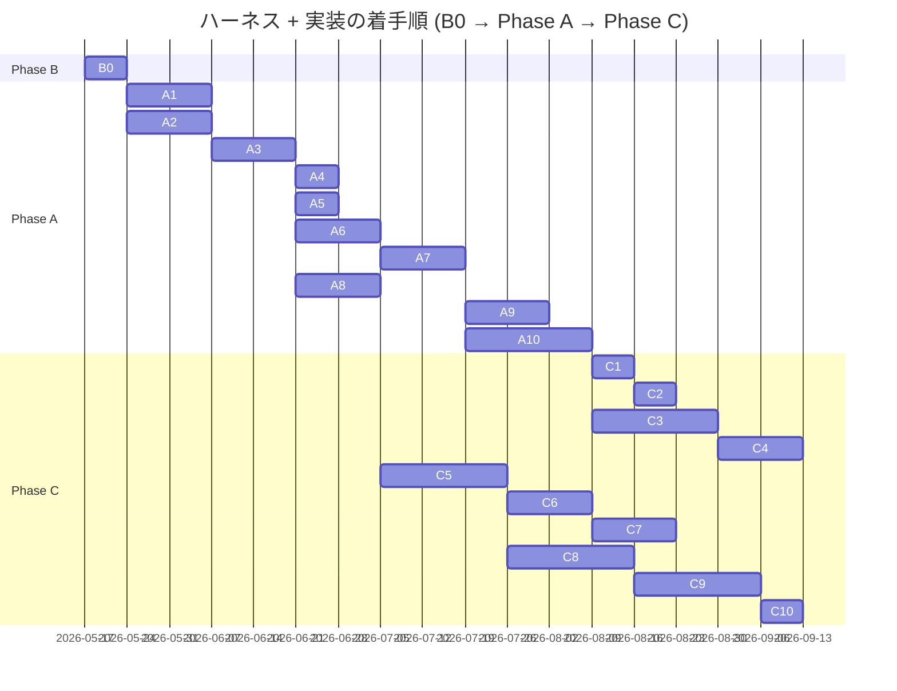

# ハーネス全体ロードマップ

> **5 行以内 summary**: `docs/harness/plan.md` 由来の B0 / A1-A10 / C1-C10 と
> `docs/epics/EPIC-NNN-*/` 全体の進捗トラッカー。`roadmap-tracker` Skill が
> 一方向ミラーで自動更新する。plan.md / Epic 本体への逆同期はしない。
> Plan は 1 PR 完結のため対象外。完了根拠 / Open Questions / 障壁 / 着手順変更履歴を集約。

## 項目一覧

| ID | タイトル | status | expected_modules | 完了根拠 |
|---|---|---|---|---|
| **B0** | ブートストラップ PR | in-progress | `.claude/**`, `docs/**`, `.github/**`, `scripts/**` | (本 PR で更新) |
| **A1** | ADR 0001-0027 一括起草 | proposed | `docs/adr/**` | — |
| **A2** | `.claude/rules/*` 全ファイル本格化 + docs 全面拡充 | proposed | `.claude/rules/**`, `docs/{architecture,api,security,requirements,specifications,runbooks}/**` | — |
| **A3** | 専用 Skill 群実装 PR | proposed | `.claude/skills/**` | — |
| **A4** | ローカルポーリング機構の本格化 | proposed | `.claude/skills/pr-poller/**`, `.claude/rules/harness-meta-criteria.md` | — |
| **A5** | 不要モジュール撤去 | proposed | `js/**`, `kotlin-js-store/**`, `public/**`, `core/network/{auth,firestore}/**`, `firebase.json`, `.firebaserc`, `web-build-and-deploy.yml` | — |
| **A6** | Lint / Format 基盤 (Spotless + ktlint + detekt + Konsist + markdownlint + Gradle カスタムタスク + trufflehog) | proposed | `build.gradle.kts`, `plugins/**`, `.github/workflows/**` | — |
| **A7** | 三層テスト品質基盤 (Kover + Konsist Spec coverage + PITest) | proposed | `build.gradle.kts`, `plugins/**` | — |
| **A8** | im@sparql ローカル Docker 環境構築 (Fuseki) | proposed | `docker-compose.yml`, `docs/runbooks/local-imasparql.md`, `backend/**` | — |
| **A9** | 既存コード baseline 記録 + Spec coverage 適用準備 | proposed | `docs/specifications/basic/**`, `core/**`, `feature/**` (Spec 逆生成) | — |
| **A10** | UI/UX 現状記録 EPIC (DESIGN.md + UI Inventory + Roborazzi baseline) | proposed | `DESIGN.md`, `docs/design/inventory/**`, `feature/**` (Preview 追加) | — |
| **C1** | Renovate 強化 + dependency-upgrade ドッグフード | proposed | `renovate.json`, `.claude/skills/dependency-upgrade/**` | — |
| **C2** | C1 KPT を受けたハーネス改修 | proposed | `.claude/**` | — |
| **C3** | フィーチャ再編 + Decompose 撤去 + CMP Navigation 3 + 共通 ViewModel (EPIC-001) | proposed | `feature/**`, `core/**` | — |
| **C4** | i18n 移植 (EPIC-002) | proposed | `composeApp/src/commonMain/composeResources/**`, `public/locale/**` (撤去) | — |
| **C5** | Backend 強化 (EPIC-003) | proposed | `backend/**`, `core/network/**` | — |
| **C6** | upstream-driven 同期パイプライン (EPIC-004) | proposed | `.github/workflows/sync-imasparql.yml`, `data/idols.db` | — |
| **C7** | Cloud Run + Cloudflare Pages + R2 デプロイ | proposed | `.github/workflows/deploy.yml`, `Dockerfile` | — |
| **C8** | KMP - iOS ターゲット有効化 (EPIC-005) | proposed | `iosApp/**`, `core/**` (iosMain), `feature/**` (iosMain) | — |
| **C9** | KMP - wasmJs ターゲット有効化 (EPIC-006) | proposed | `webApp/**`, `core/**` (wasmJsMain), `feature/**` (wasmJsMain) | — |
| **C10** | Web 配信再開 (wasmJs を Cloudflare Pages にデプロイ) | proposed | `.github/workflows/deploy-web.yml`, `webApp/**` | — |

## 完了根拠

| ID | PR 番号 | マージ日 | 主要ファイル |
|---|---|---|---|

(本 PR (B0) マージ時に `roadmap-tracker` Skill 起動 or 手動で B0 行を完了状態に更新する想定)

## 着手順とブロック関係

## 保留中の意思決定・不明事項 (Open Questions)

| 起票日 | 内容 | 暫定方針 | 解決状態 |
|---|---|---|---|

## 技術的障壁と回避策 (Blockers and Workarounds)

| 起票日 | 障壁 | 回避策 | 解決日 | 解決方法 |
|---|---|---|---|---|

## 着手順変更履歴 (append-only)

| 日付 | 変更内容 | 理由 |
|---|---|---|
| 2026-05-17 | 初期ロードマップ起草 (plan.md merge 時) | B0 ブートストラップ PR で `docs/harness/plan.md` §6 から取り込み |

## 次の推奨着手 (並行実装観点)

`roadmap-tracker` Skill が更新する想定。B0 マージ直後の手動更新例:

1. **A1 (ADR 0001-0027 一括起草)** — `docs/adr/**` のみ触る、他フェーズと重複しない
2. **A2 (.claude/rules/* 本格化 + docs 拡充)** — A1 と並行可 (`docs/adr/` と `docs/{architecture,api,...}/` で touch ファイル分離)
3. **A3 着手は A1 完了後** — ADR を参照する Skill 群実装のため

## 関連

- `docs/harness/plan.md` (Single Source of Truth)
- `docs/epics/EPIC-000-harness-foundation/roadmap.md` (EPIC-000 配下の PR 進捗)
- `.claude/rules/roadmap.md` (ロードマップ Markdown 規約)
- `.claude/skills/roadmap-tracker/SKILL.md`
