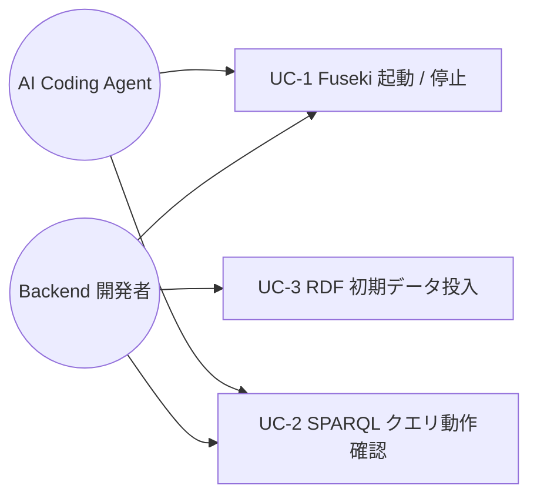

# im@sparql ローカル Docker 環境

> **5 行以内 summary**: ColorMaster の Backend / CLI が依存する im@sparql 公開 SPARQL endpoint
> (https://sparql.crssnky.xyz) をローカル開発・テストから切り離すための要件定義。
> Apache Jena Fuseki を `docker-compose` で起動し、開発者と AI Coding Agent が
> オフラインかつ deterministic に SPARQL クエリを試行できる環境を構築する。
> 本要件は ADR-0014 を実体化する Phase A8 の出発点。

## 1. 概要 / 目的 / 背景

ColorMaster は im@sparql 公開 endpoint からアイドル情報マスタを同期する
(ADR-0007 / ADR-0010)。`backend/cli/.../imasparql/ImasparqlApiClient.kt` は
`https://sparql.crssnky.xyz` を直接叩く構成のため、ローカル開発と Backend integration
test が外部稼働状況に依存し flaky 化するリスクがある (ADR-0014 コンテキスト参照)。

| 項目 | 内容 |
|---|---|
| 目的 | im@sparql クエリの試行とテストを公開 endpoint 非依存で実施できる環境を整備する |
| 背景 | 公開 endpoint の稼働揺れ / 外部負荷の倫理的懸念 / オフライン開発不可 (ADR-0014 §コンテキスト) |
| 期待効果 | integration test の deterministic 化、開発者の試行錯誤自由度向上、公開 endpoint への負荷ゼロ |

## 2. ステークホルダー / アクター

| アクター | 役割 | 主要なゴール |
|---|---|---|
| Backend 開発者 (subroh0508) | im@sparql クエリ / Backend integration test 実装 | 公開 endpoint 非依存でクエリ動作確認 |
| AI Coding Agent (Claude Code) | implementation-workflow Phase 3 でクエリ起草・検証 | docs/runbooks/local-imasparql.md の手順で再現可能に Fuseki 起動 |
| Renovate / dependency-upgrade Skill | Fuseki Docker image の version bump | image tag の固定 + 検証手順の維持 |

## 3. スコープ

### 含む

- `docker-compose.yml` (project root) に Fuseki service 定義 (Apache Jena Fuseki 公式 Docker image を採用)
- ローカル開発者向け運用 runbook `docs/runbooks/local-imasparql.md` の整備 (起動 / 停止 / 接続確認 / トラブルシュート)
- RDF 初期データ用ディレクトリ `data/imasparql/` の placeholder 配置 (`.gitkeep` + `README.md`)
- `.gitignore` に RDF データファイル (`*.ttl` / `*.nq` / `*.rdf` / `*.nt`) の除外規約を追加 (ライセンス上 commit しないため)
- Fuseki admin password を環境変数経由で渡す規約 (`.env.example` placeholder で運用)

### 含まない (スコープ外)

- Backend / CLI コード (`backend/cli/.../imasparql/ImasparqlApiClient.kt` 等) の endpoint 切替実装 (別 Plan)
- Testcontainers 統合 (ADR-0014 §決定で言及済、A8 後続 Plan で実装)
- RDF 初期データの実体取得 / 投入スクリプト (`scripts/seed-imasparql.sh`、A8 後続 Plan)
- CI 上での Fuseki 起動 (現状は手動 / Phase B-C の integration test 本格化と連動)
- 公開 endpoint と Fuseki の自動切替ロジック (環境変数 `IMASPARQL_ENDPOINT_URL` 対応は別 Plan)

## 4. ユースケース概要

| UC ID | 名称 | 事前条件 | 事後条件 |
|---|---|---|---|
| UC-1 | Fuseki 起動 / 停止 | Docker Desktop 起動 / `docker-compose.yml` 存在 | `http://localhost:3030` で Fuseki 管理 UI / SPARQL endpoint が応答 |
| UC-2 | SPARQL クエリ動作確認 | UC-1 完了 / dataset 投入済 | SPARQL `SELECT` で期待件数のレスポンスを得る |
| UC-3 | RDF 初期データ投入 | UC-1 完了 / `data/imasparql/*.ttl` 等が配置済 | dataset がメモリ / ファイルに load 済 |

## 5. 機能要件 (FR)

| FR ID | 機能名 | 説明 | 優先度 | 関連 UC |
|---|---|---|---|---|
| FR-1 | docker-compose で Fuseki 起動 | `docker compose up -d fuseki` で Apache Jena Fuseki が起動し、SPARQL endpoint が `http://localhost:3030/<dataset>/query` で応答する | must | UC-1 |
| FR-2 | 管理者認証の安全な扱い | Fuseki admin password を環境変数経由で渡し、`docker-compose.yml` に hardcode しない (`.env.example` に placeholder) | must | UC-1 |
| FR-3 | RDF 初期データ用ディレクトリ | `data/imasparql/` を placeholder として配置、開発者が任意の `*.ttl` 等を投入できる | must | UC-3 |
| FR-4 | RDF データの git 除外 | RDF データファイル (`*.ttl` / `*.nq` / `*.rdf` / `*.nt`) を `.gitignore` で除外、ライセンス確認前の意図しない commit を防止 | must | UC-3 |
| FR-5 | runbook によるゼロからの再現 | `docs/runbooks/local-imasparql.md` の手順に従えば初見開発者が 5 分以内に Fuseki を起動でき、SPARQL クエリ実行まで到達する | should | UC-1, UC-2 |
| FR-6 | 接続テスト手順の明示 | `curl -G http://localhost:3030/<dataset>/query --data-urlencode "query=..."` 等の接続確認手順を runbook に記載 | should | UC-2 |
| FR-7 | port 競合時の代替ポート提示 | port 3030 が競合した場合のオーバーライド方法を runbook に明示 | could | UC-1 |

## 6. 非機能要件 (NFR)

| 区分 | 指標 | 目標値 | 計測方法 |
|---|---|---|---|
| 可用性 | ローカル限定、production 影響なし | — | `docker-compose.yml` は dev profile 相当の扱い |
| 性能・拡張性 | Fuseki 起動完了までの時間 | 30 秒以内 (初回 image pull 除く) | `time docker compose up -d fuseki` |
| 運用・保守性 | runbook の再現性 | 5 分以内にゼロから起動可能 | 開発者 / AI Agent による手順実走 |
| 移行性 | 既存 Backend / CLI 動作非破壊 | `backend/cli` 既存 endpoint hardcode (`HOSTNAME = "sparql.crssnky.xyz"`) を一切 touch しない | `git diff backend/` で確認 |
| セキュリティ | admin password 漏洩なし | 環境変数経由のみ、`.env*` / リポジトリ追跡なし | `git ls-files` + `.gitignore` 検証 |
| システム環境・エコロジー | Docker Desktop 動作要件 | `docs/runbooks/local-development.md` 既存要件に追加 | 開発者環境マトリクス |

## 7. 制約 / 前提

- Docker Desktop (またはコンパチブルなランタイム) が開発者マシンにインストール済 (`docs/runbooks/local-development.md` §1)
- Apache Jena Fuseki 公式 Docker image (`stain/jena-fuseki` 系または公式後継) を採用、image tag は明示固定
- `.gitignore` の `*.db` 既存規約 (`db-protection.md` 由来) と衝突しないこと (Fuseki の TDB データは `data/imasparql/` 下に隔離)
- 公開 im@sparql endpoint の RDF データには **個別ライセンス確認が必要** (ADR-0014 §Negative / docs/harness/plan.md R-9)。本要件では initial data 自動取得は行わず、開発者が手動投入する placeholder に留める
- CI 環境では Fuseki を起動しない (現時点)、Phase B-C の integration test 本格化と連動

## 8. 用語定義

| 用語 | 説明 | 関連 |
|---|---|---|
| im@sparql | THE iDOLM@STER ドメイン RDF + SPARQL endpoint (https://sparql.crssnky.xyz/) | ADR-0007 / `.claude/rules/sparql.md` |
| Apache Jena Fuseki | Java 実装の SPARQL 1.1 サーバ、公式 Docker image 提供 | ADR-0014 / https://jena.apache.org/documentation/fuseki2/ |
| RDF | Resource Description Framework、グラフ形式の構造化データ | W3C RDF 1.1 |
| TDB / TDB2 | Jena の永続化バックエンド | Fuseki configuration |
| Turtle (`.ttl`) | RDF の人間可読シリアライゼーション | W3C Turtle |

## 9. トレーサビリティ

| FR ID | 関連 SPEC | 関連 EPIC | 関連 PLAN | 関連 ADR |
|---|---|---|---|---|
| FR-1 | SPEC-IMASPARQL-001-basic | — | PLAN-003 | ADR-0014 |
| FR-2 | SPEC-IMASPARQL-001-basic | — | PLAN-003 | ADR-0021 |
| FR-3 | SPEC-IMASPARQL-001-basic | — | PLAN-003 | ADR-0014 |
| FR-4 | SPEC-IMASPARQL-001-basic | — | PLAN-003 | ADR-0014 |
| FR-5 | SPEC-IMASPARQL-001-basic | — | PLAN-003 | ADR-0014 |
| FR-6 | SPEC-IMASPARQL-001-basic | — | PLAN-003 | ADR-0014 |
| FR-7 | SPEC-IMASPARQL-001-basic | — | PLAN-003 | — |

## 10. 受け入れ基準 (AC)

- [ ] AC-1: `docker compose config` が syntax error なしで成功する (FR-1)
- [ ] AC-2: `docker-compose.yml` に admin password / 認証情報の hardcode が含まれない (FR-2、`grep` で確認)
- [ ] AC-3: `data/imasparql/.gitkeep` と `data/imasparql/README.md` が配置され、当該ディレクトリが git で追跡される (FR-3)
- [ ] AC-4: `.gitignore` に `data/imasparql/*.ttl` / `*.nq` / `*.rdf` / `*.nt` の除外パターンが追加される (FR-4)
- [ ] AC-5: `docs/runbooks/local-imasparql.md` が「前提 / 起動 / 接続確認 / dataset 投入 / 停止 / トラブルシュート」の節を備える (FR-5 / FR-6 / FR-7)
- [ ] AC-6: `backend/**` 配下の既存ファイル (`HOSTNAME = "sparql.crssnky.xyz"` を含む) が一切 touch されないこと (`git diff backend/` が空) (NFR 移行性)
- [ ] AC-7: `docs/runbooks/local-development.md` §6 から `docs/runbooks/local-imasparql.md` への参照リンクが live link になる (FR-5)

## 11. Open Questions

| 起票日 | 内容 | 暫定方針 | 解決状態 |
|---|---|---|---|
| 2026-05-19 | RDF 初期データの取得元 (imas/imasparql repository) のライセンス | A8 後続 Plan で確認、本要件ではデータ取得は手動・placeholder のみ | open |
| 2026-05-19 | Fuseki Docker image tag の固定方針 (`stain/jena-fuseki` vs 公式後継) | SPEC-IMASPARQL-001-basic §7 で確定、Renovate 対象に組み込み | open |
| 2026-05-19 | Backend / CLI の endpoint 切替 (`IMASPARQL_ENDPOINT_URL`) | 別 Plan (A8 後続) に分離、本要件のスコープ外 | open |
| 2026-05-19 | Testcontainers 統合の本格化タイミング | Phase B-C で integration test 本格化と連動、ADR-0014 §決定で言及 | open |
