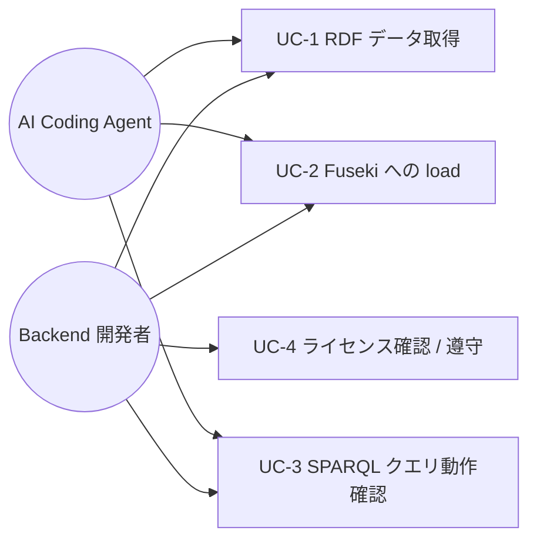

# im@sparql RDF データ取得と Fuseki への load

> **5 行以内 summary**: REQ-001 / SPEC-IMASPARQL-001-basic / PLAN-003 で配置済の Docker Fuseki
> 構成 (`docker-compose.yml` + `data/imasparql/` + `docs/runbooks/local-imasparql.md`) は
> dataset placeholder のため、実 RDF データの取得・Fuseki への load・SPARQL クエリ動作確認の
> 一連プロセスが未確立。本要件は upstream URL とライセンス確認、取得スクリプトと load 方式と
> 動作確認手順を ADR-0014 に従って整理する計画立案レイヤ。実装は本要件後続の Plan に分離。

## 1. 概要 / 目的 / 背景

ADR-0014 は im@sparql ローカル Fuseki の意思決定済 (2026-05-17)、REQ-001 / SPEC-IMASPARQL-001-basic
で Docker container 配置済 (PR #175)。ただし `data/imasparql/` は placeholder (空) のままで、
開発者と AI Coding Agent が **「ゼロから 5 分で Fuseki 起動 + SPARQL クエリ実行まで」を再現**
するための実 RDF データ取得 / load プロセスが未整備のため、本要件で計画立案を行う。

| 項目 | 内容 |
|---|---|
| 目的 | im@sparql RDF データを upstream から取得し、Fuseki container に load し、SPARQL クエリで参照確認できる開発フローを確立する |
| 背景 | REQ-001 / SPEC-IMASPARQL-001-basic で Docker 構成は配置済 (PR #175)、dataset placeholder のままで実データ取得・load 方式が未確定 (`data/imasparql/README.md` で手動配置と注意喚起のみ) |
| 期待効果 | ローカル integration test の deterministic 化、AI Coding Agent によるクエリ起草・検証の再現性向上、im@sparql 公開 endpoint への倫理的負荷低減 |

## 2. ステークホルダー / アクター

| アクター | 役割 | 主要なゴール |
|---|---|---|
| Backend 開発者 (subroh0508) | SPARQL クエリ起草 / Backend integration test 実装 | 公開 endpoint 非依存で実 RDF データに対するクエリ動作確認 |
| AI Coding Agent (Claude Code) | implementation-workflow Phase 3 でクエリ起草・検証 | runbook と取得スクリプトから再現可能に Fuseki load まで到達 |
| im@sparql upstream maintainer | RDF データ提供者 | CC BY-NC-SA 4.0 ライセンス遵守の下での二次利用 |

## 3. スコープ

### 含む

- im@sparql RDF dump の upstream 取得元 (URL / repository / Releases asset 等) と取得手段の明文化
- 取得スクリプト (`scripts/fetch-imasparql-data.sh` 想定、本要件では識別子のみ、実装は後続 Plan) の仕様定義
- Fuseki への dataset load 方式 (bind mount 自動 load / Admin API 経由 upload / TDB2 変換) の比較と方針確定
- SPARQL クエリ動作確認手順 (`ASK` / `SELECT` の最小サンプル) と検証スクリプト (`scripts/test-imasparql-query.sh` 想定、識別子のみ) の仕様定義
- ライセンス遵守 (CC BY-NC-SA 4.0) の明文化と `data/imasparql/` の git 追跡除外維持

### 含まない (スコープ外)

- 取得スクリプト / 検証スクリプトの実体実装 (本要件 merge 後の後続 Plan-A / Plan-B)
- `docs/runbooks/local-imasparql.md` の § RDF データ取得 / § 動作確認 セクション追加 (後続 Plan)
- Backend / CLI (`ImasparqlApiClient`) の endpoint 切替実装 (`IMASPARQL_ENDPOINT_URL`、別 Plan-C)
- Testcontainers 統合 / CI での Fuseki 自動起動 (Phase B-C で本格化、別 Plan)
- 公開 endpoint と Fuseki の自動 fallback ロジック
- RDF データそのものの git commit (ライセンス上 `.gitignore` で除外維持)

## 4. ユースケース概要

| UC ID | 名称 | 事前条件 | 事後条件 |
|---|---|---|---|
| UC-1 | RDF データ取得 | `docker compose up -d fuseki` 完了 (REQ-001) / upstream URL 解決 | `data/imasparql/*.ttl` 等が配置される (git 追跡対象外) |
| UC-2 | Fuseki への load | UC-1 完了 / dataset 名 (`imasparql`) 設定済 | Fuseki dataset にトリプルが load 済、件数 > 0 |
| UC-3 | SPARQL クエリ動作確認 | UC-2 完了 | `SELECT` / `ASK` 等のクエリが期待件数で応答する |
| UC-4 | ライセンス確認 / 遵守 | upstream URL 解決 | CC BY-NC-SA 4.0 を runbook / README で明示、git 追跡除外維持 |

## 5. 機能要件 (FR)

| FR ID | 機能名 | 説明 | 優先度 | 関連 UC |
|---|---|---|---|---|
| FR-1 | upstream URL 解決 | im@sparql RDF dump の upstream (GitHub repository / Releases asset / 公式配布パス) を解決し、SPEC-IMASPARQL-002-basic に明文化する | must | UC-1, UC-4 |
| FR-2 | 取得スクリプト仕様定義 | `scripts/fetch-imasparql-data.sh` (識別子のみ、実装は後続 Plan) の入出力 / retry / 保存先 / 失敗時挙動を SPEC-IMASPARQL-002-basic で定義する | must | UC-1 |
| FR-3 | Fuseki load 方式の選定 | bind mount 自動 load / Admin API 経由 upload / TDB2 変換の 3 方式を比較し、本要件用に 1 方式を SPEC で選定する | must | UC-2 |
| FR-4 | 動作確認クエリ仕様定義 | `ASK { ?s ?p ?o }` および `SELECT ?s ?p ?o WHERE { ?s ?p ?o } LIMIT 5` 等の最小クエリ仕様を SPEC で定義する | must | UC-3 |
| FR-5 | 検証スクリプト仕様定義 | `scripts/test-imasparql-query.sh` (識別子のみ、実装は後続 Plan) の入出力 / 期待応答を SPEC で定義する | should | UC-3 |
| FR-6 | ライセンス記述の明示 | CC BY-NC-SA 4.0 を REQ / SPEC / 後続 runbook に明示し、`.gitignore` による git 追跡除外を維持する | must | UC-4 |
| FR-7 | 後続 Plan placeholder の列挙 | 後続 Plan-A (取得スクリプト実装 + runbook 拡充) / Plan-B (検証スクリプト実装 + 動作確認結果記載) / Plan-C (Backend 接続実装) を PLAN-006 内に placeholder 列挙する | should | UC-1, UC-2, UC-3 |

## 6. 非機能要件 (NFR)

IPA 非機能要求グレード 6 大項目に沿った表。

| 区分 | 指標 | 目標値 | 計測方法 |
|---|---|---|---|
| 可用性 | ローカル開発限定、CI / production 非対象 | — | `docker-compose.yml` (REQ-001) は dev profile 相当 |
| 性能・拡張性 | RDF 取得時間 (目安) | 5 分以内 (RDF サイズ 100MB 想定、開発者帯域依存) | `time scripts/fetch-imasparql-data.sh` (実装後) |
| 性能・拡張性 | Fuseki load 完了時間 (目安) | 1 分以内 (bind mount 方式) | runbook 手順実走、後続 Plan-A で計測 |
| 運用・保守性 | 後続 Plan の独立性 | Plan-A / Plan-B / Plan-C を独立 PR で merge 可能 | 各 Plan の expected_modules が non-overlap |
| 移行性 | 既存 docker-compose.yml / data/imasparql/README.md / docs/runbooks/local-imasparql.md 非破壊 | 本要件 PR では一切 touch しない | `git diff` で確認 |
| セキュリティ | RDF データの git 追跡除外維持 | `.gitignore` で `data/imasparql/*.ttl` 等を除外 (REQ-001 で配置済) | `git check-ignore data/imasparql/sample.ttl` |
| セキュリティ | ライセンス遵守 (CC BY-NC-SA 4.0) | upstream 元データのライセンス文言を REQ / SPEC で明示 | 手動 review |
| システム環境・エコロジー | im@sparql 公開 endpoint への負荷 | 1 回限り取得 (CDN / Releases asset 経由想定)、re-evaluation loop なし | upstream 取得元の選定で担保 |

## 7. 制約 / 前提

- REQ-001 / SPEC-IMASPARQL-001-basic / PLAN-003 (PR #175) で Docker Fuseki 構成 + `data/imasparql/` placeholder + `docs/runbooks/local-imasparql.md` が配置済
- im@sparql RDF データのライセンスは **CC BY-NC-SA 4.0** (`data/imasparql/README.md` で placeholder として明記済)、二次配布 / 商用利用は upstream 規約に従う
- `data/imasparql/*.ttl` / `*.nq` / `*.rdf` / `*.nt` は `.gitignore` 対象 (REQ-001 / PLAN-003 で配置済)、本要件でも維持
- 本要件は **計画立案レイヤ**: 実体スクリプト / runbook 拡充 / Kotlin code touch は **全て本要件のスコープ外**、後続 Plan-A / Plan-B / Plan-C に分離
- `.claude/rules/sparql.md` の prefix 規約 / `LIMIT` 必須 / injection 対策と整合 (動作確認クエリは prefix セットを必須含)
- `Backend` Kotlin module への接続実装は Phase C5 / Litestream 連動の後続 Epic / Plan で扱う (本要件のスコープ外)

## 8. 用語定義

| 用語 | 説明 | 関連 |
|---|---|---|
| im@sparql | THE iDOLM@STER ドメイン RDF + SPARQL endpoint (https://sparql.crssnky.xyz/) | ADR-0007 / `.claude/rules/sparql.md` |
| RDF dump | im@sparql の triple を一括取得した Turtle / N-Quads / RDF/XML / N-Triples 形式のファイル群 | W3C RDF 1.1 |
| Apache Jena Fuseki | Java 実装の SPARQL 1.1 サーバ、本リポジトリは `stain/jena-fuseki:4.10.0` を使用 (REQ-001) | https://jena.apache.org/documentation/fuseki2/ |
| TDB2 | Jena の永続化バックエンド、in-memory より起動コスト高、再起動間でデータ保持 | Fuseki configuration |
| bind mount 自動 load | docker-compose の `volumes` 経由で staging ディレクトリを container に mount、Fuseki 起動時に `*.ttl` を読み込む方式 | docker-compose v2 |
| CC BY-NC-SA 4.0 | Creative Commons 表示 - 非営利 - 継承 4.0 ライセンス | https://creativecommons.org/licenses/by-nc-sa/4.0/ |

ドメイン用語の追加は `docs/glossary.md` を参照。

## 9. トレーサビリティ

| FR ID | 関連 SPEC | 関連 EPIC | 関連 PLAN | 関連 ADR |
|---|---|---|---|---|
| FR-1 | SPEC-IMASPARQL-002-basic | — | PLAN-006 | ADR-0007 / ADR-0014 |
| FR-2 | SPEC-IMASPARQL-002-basic | — | PLAN-006 | ADR-0014 |
| FR-3 | SPEC-IMASPARQL-002-basic | — | PLAN-006 | ADR-0014 |
| FR-4 | SPEC-IMASPARQL-002-basic | — | PLAN-006 | ADR-0014 |
| FR-5 | SPEC-IMASPARQL-002-basic | — | PLAN-006 | ADR-0014 |
| FR-6 | SPEC-IMASPARQL-002-basic | — | PLAN-006 | ADR-0014 / ADR-0021 |
| FR-7 | SPEC-IMASPARQL-002-basic | — | PLAN-006 | — |

## 10. 受け入れ基準 (AC)

- [ ] AC-1: `docs/specifications/basic/SPEC-IMASPARQL-002-basic.md` が起票され、FR-1 / FR-3 の選定結果 (upstream URL 候補 / Fuseki load 方式) が明示される (FR-1 / FR-3)
- [ ] AC-2: SPEC 内で `scripts/fetch-imasparql-data.sh` および `scripts/test-imasparql-query.sh` の入出力 / 失敗時挙動 / 保存先が **識別子レベル** で定義される (実体は本要件 PR では作成しない) (FR-2 / FR-5)
- [ ] AC-3: 動作確認クエリ仕様 (`ASK { ?s ?p ?o }` および `SELECT ?s ?p ?o WHERE { ?s ?p ?o } LIMIT 5`) が SPEC に記載され、`.claude/rules/sparql.md` prefix セットと整合する (FR-4)
- [ ] AC-4: ライセンス CC BY-NC-SA 4.0 が REQ-002 / SPEC-IMASPARQL-002-basic の双方で明示され、`data/imasparql/` の git 追跡除外維持を SPEC 内で確認する (FR-6)
- [ ] AC-5: `docs/plans/PLAN-006-imasparql-rdf-loading.md` が起票され、後続 Plan-A / Plan-B / Plan-C を placeholder で列挙する (FR-7)
- [ ] AC-6: `docs/requirements/INDEX.md` および `docs/plans/INDEX.md` に REQ-002 / PLAN-006 の行が追加される
- [ ] AC-7: 本 PR では `docker-compose.yml` / `data/imasparql/README.md` / `docs/runbooks/local-imasparql.md` / `backend/**` を一切 touch しない (`git diff` で確認)

## 11. Open Questions

| 起票日 | 内容 | 暫定方針 | 解決状態 |
|---|---|---|---|
| 2026-05-19 | im@sparql RDF dump の upstream URL 確定 (`imas/imasparql` GitHub repository / Releases asset / 公式配布パス) | SPEC-IMASPARQL-002-basic §7 (外部 I/F) で候補列挙 + 本要件後続 Plan-A の Phase 1 で確定 | open |
| 2026-05-19 | RDF データ実体サイズと取得時間の実測値 | 後続 Plan-A 完走時に実測、SPEC NFR 表を更新 | open |
| 2026-05-19 | Fuseki load 方式 (bind mount 自動 load vs Admin API upload) の最終選定 | SPEC-IMASPARQL-002-basic §2 で bind mount 自動 load を default として記述、Admin API 経由は補足 | open |
| 2026-05-19 | TDB2 永続化の本格採用タイミング | 後続 Plan-B 完走後に再評価 (in-memory での起動時 load 時間が許容範囲内か計測) | open |
| 2026-05-19 | 後続 Plan-C (Backend Kotlin module 接続実装) の起票時期 | Phase C5 / Litestream 連動と合わせて再評価、本要件では placeholder 列挙のみ | open |
