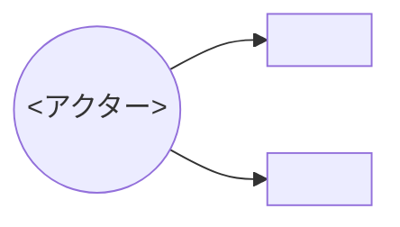

# <要件タイトル>

> **5 行以内 summary**: <この要件が答える問い / 主読者 / WHY と WHAT の境界 / 主要 FR の概要>
> AI 向け note: 本テンプレは `docs/requirements/README.md` の運用規約に従い、HOW は書かず
> (`docs/specifications/{basic,detail}/` に分離)、コード断片は含めない (§4.6.1)。
> 起票時に本コメント行は削除して 5 行以内の summary に置き換える。

## 1. 概要 / 目的 / 背景

<自然言語 5 行以内>

| 項目 | 内容 |
|---|---|
| 目的 | <この要件が達成したいこと> |
| 背景 | <現状の問題、解決必要性> |
| 期待効果 | <達成後の状態> |

## 2. ステークホルダー / アクター

| アクター | 役割 | 主要なゴール |
|---|---|---|
| <例: エンドユーザー> | <例: 担当アイドルを記録する人> | <例: 推し管理を維持できる> |

## 3. スコープ

### 含む

- ...

### 含まない (スコープ外)

- ...

## 4. ユースケース概要

| UC ID | 名称 | 事前条件 | 事後条件 |
|---|---|---|---|
| UC-1 | <名称> | <前提状態> | <成功後状態> |

## 5. 機能要件 (FR)

| FR ID | 機能名 | 説明 | 優先度 | 関連 UC |
|---|---|---|---|---|
| FR-1 | <名称> | <説明> | must \| should \| could \| won't | UC-1 |

## 6. 非機能要件 (NFR)

IPA 非機能要求グレード 6 大項目に沿った表。

| 区分 | 指標 | 目標値 | 計測方法 |
|---|---|---|---|
| 可用性 | <例: SLO 99.5%> | <値> | <Grafana 等> |
| 性能・拡張性 | <例: p95 レイテンシ> | <値> | <Cloud Run metrics> |
| 運用・保守性 | <例: デプロイ頻度> | <値> | <GitHub Actions 履歴> |
| 移行性 | <例: 既存ユーザーデータ非破壊> | — | <integration test> |
| セキュリティ | <例: PII 漏洩なし> | — | <trufflehog + 監査> |
| システム環境・エコロジー | <例: コンテナリソース上限> | <値> | <Cloud Run config> |

## 7. 制約 / 前提

- ...

## 8. 用語定義

| 用語 | 説明 | 関連 |
|---|---|---|
| <用語> | <説明> | `docs/glossary.md` |

## 9. トレーサビリティ

| FR ID | 関連 SPEC | 関連 EPIC | 関連 PLAN | 関連 ADR |
|---|---|---|---|---|
| FR-1 | SPEC-NNN-1, SPEC-NNN-2 | EPIC-NNN | PLAN-NNN | ADR-NNNN |

## 10. 受け入れ基準 (AC)

- [ ] AC-1: <検証可能な条件>
- [ ] AC-2: <検証可能な条件>

## 11. Open Questions

| 起票日 | 内容 | 暫定方針 | 解決状態 |
|---|---|---|---|
| YYYY-MM-DD | <未解決の意思決定> | <方針 or 未定> | open \| resolved |
