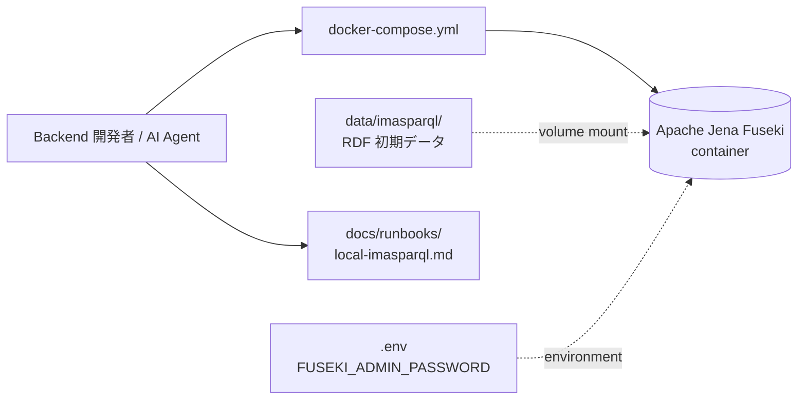
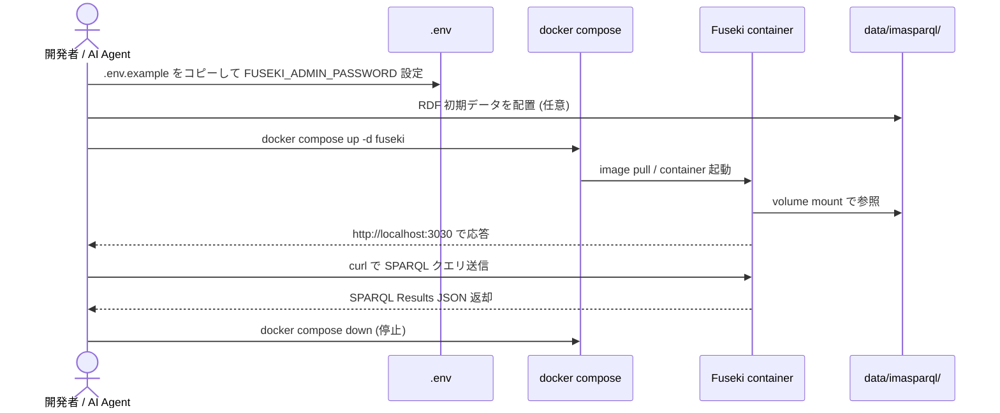
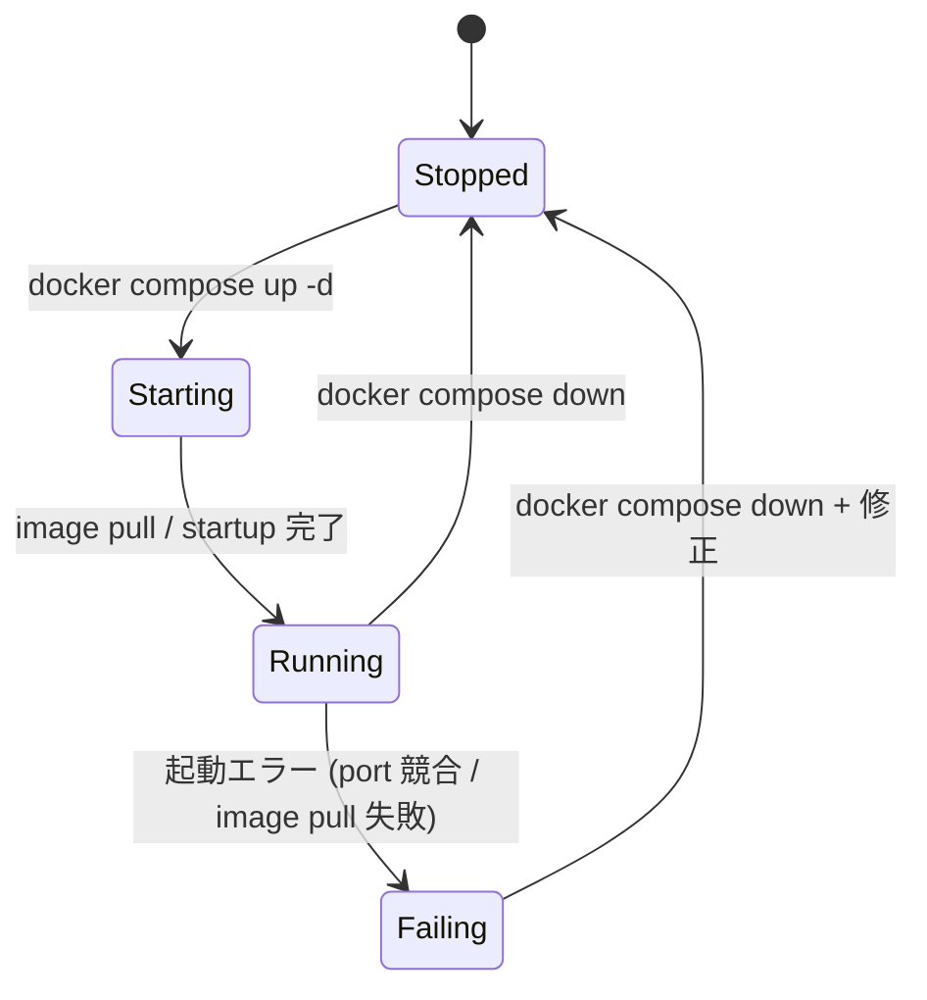
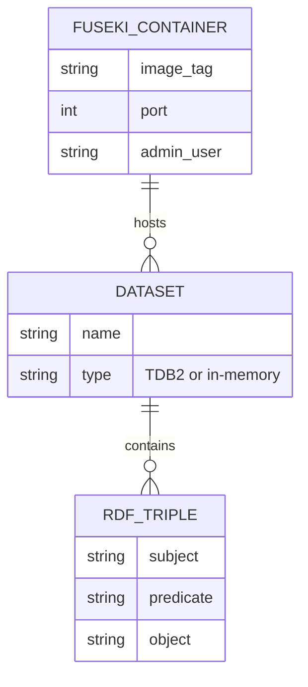

# im@sparql ローカル Docker 環境 基本設計

> **5 行以内 summary**: REQ-001 を実体化する基本設計。Apache Jena Fuseki 公式 Docker image を
> `docker-compose.yml` で起動し、RDF 初期データ用ディレクトリと runbook で運用フローを規定する。
> Backend / CLI Kotlin module は touch しないため、本基本設計に対応する詳細設計 (モジュール責務)
> は不要。Backend endpoint 切替は別 Plan のスコープ。コード断片は本文に書かない (§4.6.1)、
> 具体的な YAML / シェルは `docker-compose.yml` / `docs/runbooks/local-imasparql.md` を SoT とする。

## 1. 概要 (5 行以内サマリ)

ADR-0014 で意思決定済の「im@sparql ローカル Fuseki」を Phase A8 の最小単位で実体化する基本設計。
構成は `docker-compose.yml` (Fuseki service) + `data/imasparql/` (RDF 初期データ配置先、git 除外) +
`docs/runbooks/local-imasparql.md` (運用手順) の 3 点セット。Testcontainers 統合 / Backend endpoint
切替 / RDF seed スクリプトは本 SPEC のスコープ外で、A8 後続 Plan に分離する。

## 2. システム構成

| 構成要素 | 役割 | 関連 ADR |
|---|---|---|
| `docker-compose.yml` | Fuseki container 起動定義 (image / port / volume / env) | ADR-0014 |
| Apache Jena Fuseki container | SPARQL 1.1 endpoint + 管理 UI を `localhost:3030` で提供 | ADR-0014 |
| `data/imasparql/` | RDF 初期データ (`*.ttl` / `*.nq` 等) の配置先、git 除外 | ADR-0014 |
| `.env` (開発者ローカル) | `FUSEKI_ADMIN_PASSWORD` 等の秘密情報、git 除外 | ADR-0021 |
| `docs/runbooks/local-imasparql.md` | 起動 / 接続確認 / トラブルシュート手順の SoT | ADR-0014 |

## 3. 機能一覧と要件マッピング

| SPEC-ID | 機能名 | 関連 FR ID | 関連 AC ID |
|---|---|---|---|
| SPEC-IMASPARQL-001-1 | docker-compose による Fuseki 起動 | FR-1 | AC-1 |
| SPEC-IMASPARQL-001-2 | admin password 環境変数化 | FR-2 | AC-2 |
| SPEC-IMASPARQL-001-3 | RDF データディレクトリ placeholder | FR-3 | AC-3 |
| SPEC-IMASPARQL-001-4 | RDF データの git 除外 | FR-4 | AC-4 |
| SPEC-IMASPARQL-001-5 | runbook 整備 (起動 / 接続 / トラブルシュート) | FR-5 / FR-6 / FR-7 | AC-5 / AC-7 |
| SPEC-IMASPARQL-001-6 | 既存 Backend 非破壊 | NFR 移行性 | AC-6 |

## 4. 業務フロー

## 5. 画面遷移

| 画面 | 状態 | 遷移トリガー |
|---|---|---|
| Fuseki 管理 UI (`http://localhost:3030`) | Stopped / Running | container 起動 / 停止 |
| SPARQL endpoint (`http://localhost:3030/<dataset>/query`) | Running 時のみ応答 | container 起動完了 |

## 6. データモデル (論理)

| エンティティ | 属性 | 制約 | 説明 |
|---|---|---|---|
| FUSEKI_CONTAINER | image_tag / port / admin_user / admin_password | image_tag 固定、admin_password は環境変数経由 | docker container の論理表現 |
| DATASET | name / type | name は URL-safe、type は in-memory / TDB2 のいずれか | Fuseki が hosting する SPARQL dataset |
| RDF_TRIPLE | subject / predicate / object | RDF 1.1 準拠 | 開発者が `data/imasparql/*.ttl` 経由で投入 |

物理的な dataset 名や Fuseki configuration 詳細は `docker-compose.yml` / `docs/runbooks/local-imasparql.md` を SoT として参照。

## 7. 外部 I/F 一覧

詳細リクエスト/レスポンス JSON は SPARQL 1.1 Protocol (https://www.w3.org/TR/sparql11-protocol/) を Single Source of Truth として参照。

| I/F 名 | 種別 | エンドポイント | 入力概要 | 出力概要 | 関連 ADR |
|---|---|---|---|---|---|
| SPARQL Query | HTTP GET / POST | `http://localhost:3030/<dataset>/query` | SPARQL `SELECT` / `ASK` / `CONSTRUCT` / `DESCRIBE` | SPARQL Results JSON / Turtle | ADR-0014 |
| SPARQL Update | HTTP POST | `http://localhost:3030/<dataset>/update` | SPARQL `INSERT` / `DELETE` | 204 No Content | ADR-0014 |
| Fuseki 管理 API | HTTP GET / POST | `http://localhost:3030/$/server` 等 | 管理操作 (dataset 作成 / 削除) | JSON | ADR-0014 |
| 管理 UI | HTTP GET (browser) | `http://localhost:3030/` | — | HTML | ADR-0014 |

本 PR では `backend/cli/.../imasparql/ImasparqlApiClient.kt` (`HOSTNAME = "sparql.crssnky.xyz"`) との接続切替は **行わない** (REQ-001 スコープ外 / 別 Plan)。

## 8. エラーケース / 例外パターン

| ケース | 発生条件 | UX | ログ | メトリクス |
|---|---|---|---|---|
| port 3030 競合 | 別プロセスが占有 | runbook §トラブルシュートに代替 port 設定方法を明示 | `docker compose up` がエラー出力 | — |
| image pull 失敗 | ネットワーク障害 / DNS 不通 | runbook §トラブルシュートに retry / proxy 設定方法 | `docker compose` ログ | — |
| admin password 未設定 | `.env` 未配置 | runbook §起動手順 §2 の `.env.example` コピー指示 | Fuseki 起動失敗 / default password 警告 | — |
| RDF データ未投入 | `data/imasparql/` が空 | runbook で「データなしでも起動成功、クエリ結果は空」を明示 | — | — |
| dataset 未作成 | Fuseki 起動後に dataset 設定なし | 管理 UI / API で dataset 作成手順を runbook に記載 | Fuseki 404 応答 | — |

## 9. 受け入れ基準 (AC) ↔ テストマップ

| AC ID | 内容 | 対応 SPEC-ID-detail | 期待テスト種別 |
|---|---|---|---|
| AC-1 | `docker-compose config` syntax 成功 | (詳細設計なし / 本 PR のみで完結) | 手動 (`docker-compose config 2>&1`) |
| AC-2 | password hardcode なし | 同上 | 手動 (`grep -i password docker-compose.yml`) |
| AC-3 | placeholder 配置 | 同上 | 手動 (`git ls-files data/imasparql/`) |
| AC-4 | `.gitignore` RDF 除外追加 | 同上 | 手動 (`git check-ignore data/imasparql/sample.ttl`) |
| AC-5 | runbook 節構成 | 同上 | 手動 (見出し review) |
| AC-6 | backend 非破壊 | 同上 | 手動 (`git diff backend/` 空確認) |
| AC-7 | local-development.md からの参照 live | 同上 | 手動 (link review) |

詳細設計 (`SPEC-IMASPARQL-001-detail`) は本 SPEC では作成しない (本 PR は Kotlin モジュール touch ゼロ / docker-compose + runbook のみで完結するため、モジュール責務 / 状態遷移 / 例外パターンを Kotlin 視点で記述する対象が存在しない)。Phase B-C 以降で Backend integration test + Testcontainers + endpoint 切替を本格化する別 Plan / SPEC で詳細設計を起こす。

## 10. 関連 ADR / リスク

- ADR-0007 (im@sparql upstream-driven 同期、本 SPEC はそのテスト基盤側)
- ADR-0014 (Apache Jena Fuseki Docker 採用、本 SPEC は ADR-0014 の Phase A8 実体化)
- ADR-0021 (Secrets 管理、admin password の環境変数化根拠)
- リスク: Fuseki Docker image (`stain/jena-fuseki` 系) の長期メンテナンス継続性。公式 Apache 提供 image に切替が必要になった場合は image tag を更新、Renovate 対象とする
- リスク: RDF 初期データのライセンス未確認 (`docs/harness/plan.md` R-9)。本 SPEC では placeholder のみ、データ取得は A8 後続 Plan で著作権確認後に着手

## 11. Open Questions

| 起票日 | 内容 | 暫定方針 | 解決状態 |
|---|---|---|---|
| 2026-05-19 | Fuseki image (`stain/jena-fuseki` vs 公式 `atomgraph/fuseki` 等) の最終選定 | runbook 起草時に最新メンテ状況を再確認、当面は広く使われる `stain/jena-fuseki` 系 | open |
| 2026-05-19 | Fuseki dataset の永続化方式 (in-memory vs TDB2 volume) | runbook と `docker-compose.yml` で in-memory を default、TDB2 永続化はオプション節として記載 | open |
| 2026-05-19 | CI 上での Fuseki 起動可否 | 現時点では CI 起動しない、A8 後続 Plan で Testcontainers 統合と合わせて再評価 | open |
| 2026-05-19 | docker-compose v1 (`docker-compose`) と v2 (`docker compose`) の表記統一 | runbook 内では v2 (`docker compose`) を推奨、v1 系記法は補足 | open |
