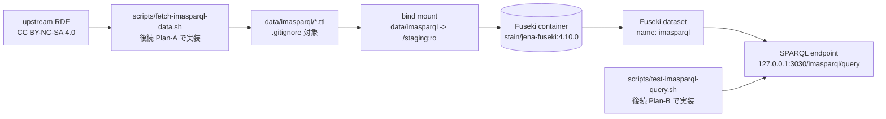
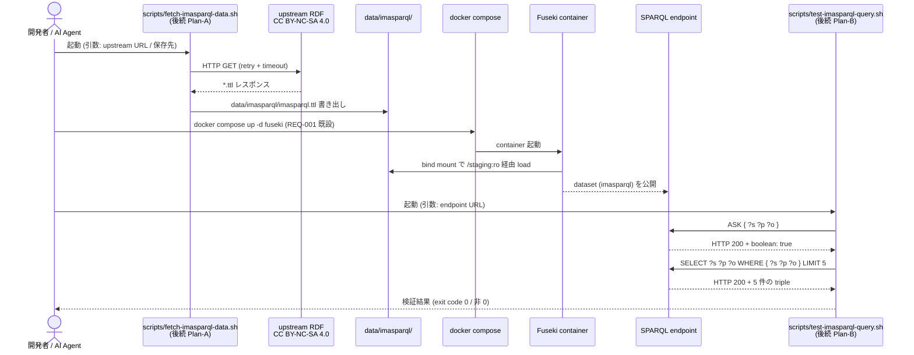
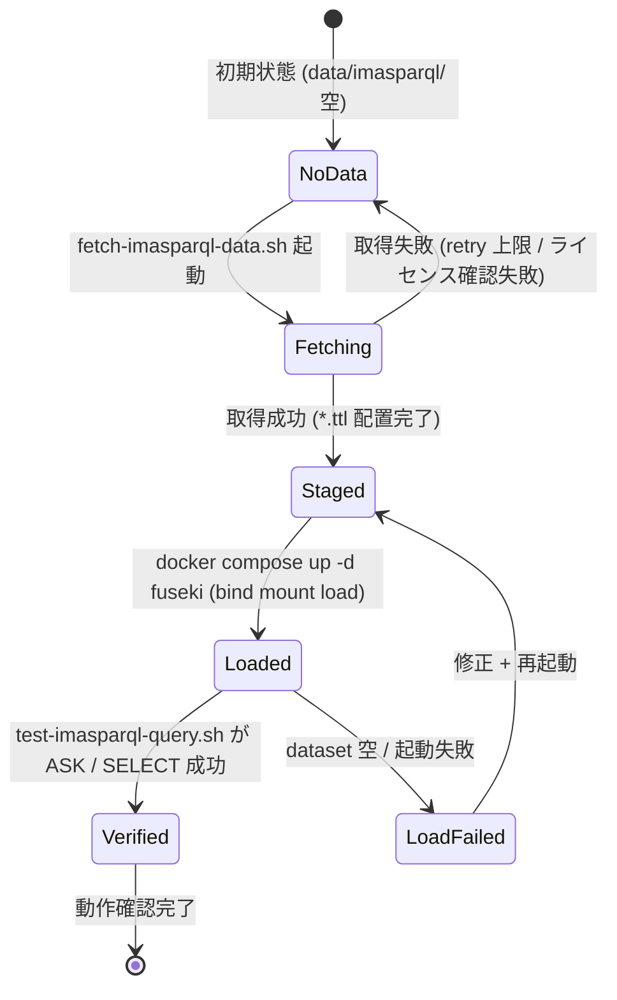
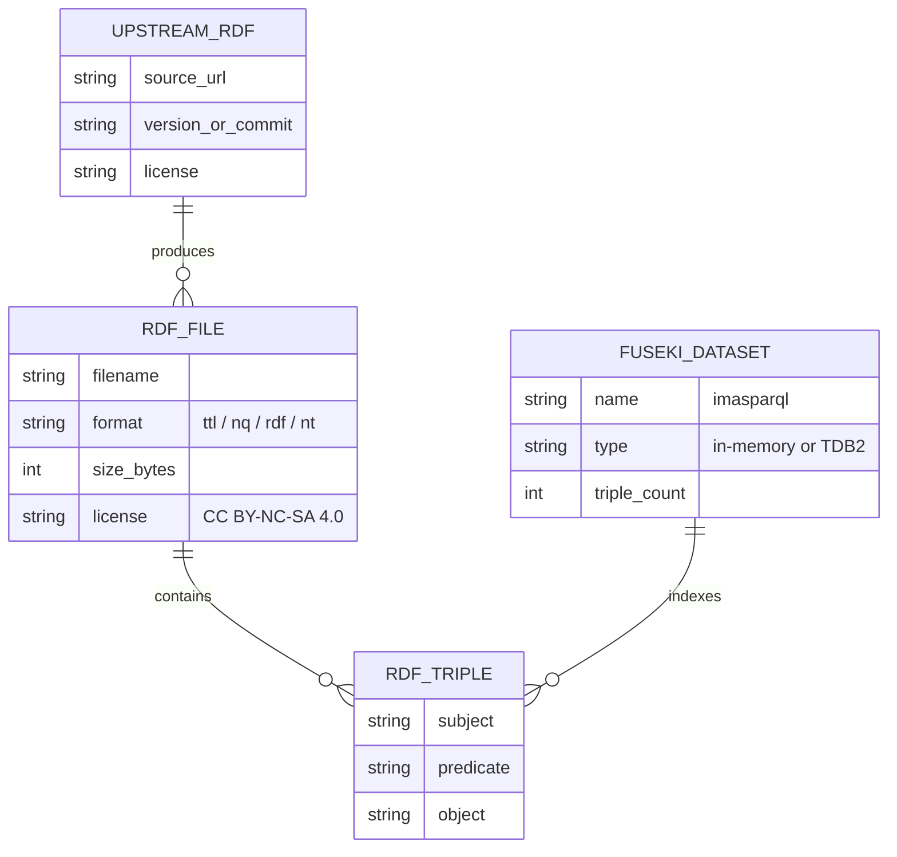

# im@sparql RDF データ取得と Fuseki への load 基本設計

> **5 行以内 summary**: REQ-002 を実体化する基本設計。upstream RDF 取得元 / 取得スクリプト
> (`scripts/fetch-imasparql-data.sh`) / Fuseki load 方式 (bind mount 自動 load 推奨) /
> 動作確認クエリ (`ASK` + `SELECT` LIMIT 5) / 検証スクリプト (`scripts/test-imasparql-query.sh`)
> の仕様を定義する。本 SPEC は **識別子レベル定義** で実体実装は後続 Plan-A / Plan-B に分離、
> 詳細設計 (`SPEC-IMASPARQL-002-detail`) は本 PR では起票しない (`related_detail: []`)。

## 1. 概要 (5 行以内サマリ)

REQ-001 / SPEC-IMASPARQL-001-basic で配置済の Docker Fuseki 構成に、実 RDF データを upstream
から取得し dataset として load して SPARQL クエリで参照確認するまでの一連プロセスを定義する。
upstream は CC BY-NC-SA 4.0 ライセンス遵守、取得スクリプトと検証スクリプトは識別子レベル定義
(実体実装は後続 Plan)、Fuseki load 方式は既設 `data/imasparql:/staging` bind mount を流用する
方針で、`docs/runbooks/local-imasparql.md` の §5 dataset 投入手順を後続 Plan で拡充する形に
段階移行する。

## 2. システム構成

| 構成要素 | 役割 | 関連 ADR / 関連 SPEC |
|---|---|---|
| upstream RDF 配布元 | im@sparql RDF dump の取得元 (GitHub repository / Releases asset / 公式配布パス) | ADR-0007 |
| `scripts/fetch-imasparql-data.sh` | upstream から `*.ttl` を取得し `data/imasparql/` に配置する取得スクリプト (本 SPEC では識別子のみ、実装は後続 Plan-A) | ADR-0014 |
| `data/imasparql/` (staging) | RDF データの配置先、`.gitignore` で git 追跡除外 (REQ-001 / PLAN-003 で配置済) | SPEC-IMASPARQL-001-basic |
| Fuseki container | SPARQL 1.1 endpoint + 管理 UI を `127.0.0.1:3030` で提供 (REQ-001 で配置済) | SPEC-IMASPARQL-001-basic / ADR-0014 |
| Fuseki dataset (`imasparql`) | `FUSEKI_DATASET_1=imasparql` (REQ-001 で配置済) で公開される SPARQL dataset | SPEC-IMASPARQL-001-basic |
| `scripts/test-imasparql-query.sh` | `ASK` / `SELECT` 最小クエリで Fuseki dataset の non-empty を検証する (識別子のみ、実装は後続 Plan-B) | `.claude/rules/sparql.md` |

## 3. 機能一覧と要件マッピング

| SPEC-ID | 機能名 | 関連 FR ID | 関連 AC ID |
|---|---|---|---|
| SPEC-IMASPARQL-002-1 | upstream URL 解決と SPEC 記述 | FR-1 | AC-1 |
| SPEC-IMASPARQL-002-2 | 取得スクリプト (`fetch-imasparql-data.sh`) 仕様定義 | FR-2 | AC-2 |
| SPEC-IMASPARQL-002-3 | Fuseki load 方式選定 (bind mount 自動 load 推奨) | FR-3 | AC-1 |
| SPEC-IMASPARQL-002-4 | 動作確認クエリ仕様定義 (`ASK` / `SELECT` LIMIT 5) | FR-4 | AC-3 |
| SPEC-IMASPARQL-002-5 | 検証スクリプト (`test-imasparql-query.sh`) 仕様定義 | FR-5 | AC-2 |
| SPEC-IMASPARQL-002-6 | ライセンス CC BY-NC-SA 4.0 遵守の明示 | FR-6 | AC-4 |
| SPEC-IMASPARQL-002-7 | 後続 Plan placeholder 列挙 | FR-7 | AC-5 |

## 4. 業務フロー

## 5. 画面遷移

| 状態 | 説明 | 遷移トリガー |
|---|---|---|
| NoData | 初期状態、`data/imasparql/` が `.gitkeep` + `README.md` のみ | 取得スクリプト起動 |
| Fetching | upstream から RDF 取得中 | HTTP GET 完了 / 失敗 |
| Staged | RDF が `data/imasparql/*.ttl` 等として配置済 (git 追跡対象外) | Fuseki container 起動 |
| Loaded | Fuseki dataset にトリプル load 完了 | 動作確認スクリプト起動 |
| LoadFailed | dataset 件数 0 / 起動失敗 | 修正 → 再起動 |
| Verified | `ASK` / `SELECT` クエリ成功 | — |

## 6. データモデル (論理)

| エンティティ | 属性 | 制約 | 説明 |
|---|---|---|---|
| UPSTREAM_RDF | source_url / version_or_commit / license | license = CC BY-NC-SA 4.0、source_url は SPEC §7 で候補列挙 | im@sparql RDF dump の upstream 識別子 |
| RDF_FILE | filename / format / size_bytes / license | format ∈ {ttl, nq, rdf, nt}、`data/imasparql/` 配下、`.gitignore` 対象 | 取得スクリプトが配置する RDF ファイル |
| RDF_TRIPLE | subject / predicate / object | RDF 1.1 準拠 | Fuseki dataset の triple 単位 |
| FUSEKI_DATASET | name / type / triple_count | name = `imasparql` (REQ-001 既設)、type は in-memory default | Fuseki が hosting する SPARQL dataset |

物理的な `*.ttl` フォーマット / Fuseki configuration 詳細は upstream 配布物 + `docker-compose.yml` (REQ-001) を SoT として参照。

## 7. 外部 I/F 一覧

詳細リクエスト / レスポンス JSON は SPARQL 1.1 Protocol (https://www.w3.org/TR/sparql11-protocol/) を Single Source of Truth として参照。

| I/F 名 | 種別 | エンドポイント / パス | 入力概要 | 出力概要 | 関連 ADR |
|---|---|---|---|---|---|
| upstream RDF 取得 (候補 1) | HTTP GET | `imas/imasparql` GitHub repository の raw / Releases asset (要確認、PLAN-006 後続 Plan-A の Phase 1 で確定) | URL | `*.ttl` バイナリ | ADR-0007 |
| upstream RDF 取得 (候補 2、フォールバック) | HTTP GET | im@sparql 公開 endpoint (https://sparql.crssnky.xyz) への `CONSTRUCT { ?s ?p ?o } WHERE { ... }` クエリ | SPARQL CONSTRUCT | Turtle | ADR-0007 |
| Fuseki SPARQL Query | HTTP GET / POST | `http://127.0.0.1:3030/imasparql/query` | `ASK` / `SELECT` | SPARQL Results JSON / boolean | ADR-0014 |
| Fuseki Admin Data Upload (代替) | HTTP POST | `http://127.0.0.1:3030/imasparql/data` | RDF (`text/turtle` 等) | 204 No Content | ADR-0014 / SPEC-IMASPARQL-001-basic |
| Fuseki Ping | HTTP GET | `http://127.0.0.1:3030/$/ping` | — | `pong\n` 相当 | SPEC-IMASPARQL-001-basic |

### 7.1. 取得スクリプト仕様 (識別子レベル、SPEC-IMASPARQL-002-2)

| 項目 | 内容 |
|---|---|
| パス | `scripts/fetch-imasparql-data.sh` (本 PR では識別子のみ、実装は後続 Plan-A) |
| 入力 | `--source-url <URL>` (default: upstream 候補 1) / `--dest <path>` (default: `data/imasparql/imasparql.ttl`) |
| 出力 | RDF ファイル 1 つ以上を `data/imasparql/` 配下に配置、exit code 0 (成功) / 非 0 (失敗) |
| retry | HTTP 取得失敗時に exponential backoff で 3 回 retry |
| timeout | 1 回あたり 60 秒、合計 5 分以内 |
| ライセンス確認 | スクリプト起動時に標準出力で「CC BY-NC-SA 4.0 を確認しましたか? (y/n)」確認 (将来は環境変数 `IMASPARQL_LICENSE_ACK=1` で skip 可) |

### 7.2. 検証スクリプト仕様 (識別子レベル、SPEC-IMASPARQL-002-5)

| 項目 | 内容 |
|---|---|
| パス | `scripts/test-imasparql-query.sh` (本 PR では識別子のみ、実装は後続 Plan-B) |
| 入力 | `--endpoint <URL>` (default: `http://127.0.0.1:3030/imasparql/query`) |
| 出力 | 検証結果を標準出力に表示、exit code 0 (成功) / 非 0 (失敗) |
| 試行クエリ 1 | `ASK { ?s ?p ?o }` → 期待: HTTP 200 + boolean: true |
| 試行クエリ 2 | `SELECT ?s ?p ?o WHERE { ?s ?p ?o } LIMIT 5` → 期待: HTTP 200 + 5 件の triple |
| prefix | `.claude/rules/sparql.md` の必須 prefix セット (`rdf` / `rdfs` / `schema` / `imas` / `imass`) を含む |
| HTTP Accept | `application/sparql-results+json` |

### 7.3. Fuseki load 方式選定 (SPEC-IMASPARQL-002-3)

| 方式 | 採用 | 理由 |
|---|---|---|
| **bind mount 自動 load** (推奨) | ✅ default | REQ-001 で既に `data/imasparql:/staging` mount が配置済、Fuseki container 起動時の environment / 起動オプション (`FUSEKI_DATASET_1=imasparql` + staging ディレクトリ参照) で自動 load 可能、開発者操作が最小 |
| Admin API 経由 upload | △ 補足 | runbook `§5.2` (`docs/runbooks/local-imasparql.md`) で既に手順記載済、bind mount 自動 load が失敗した場合のフォールバック |
| TDB2 直接配置 / 変換 | ✗ 現時点不採用 | TDB2 永続化は REQ-001 §8 オプション扱い、本 SPEC では in-memory + bind mount を default。再評価は後続 Plan-B 完走時 |

## 8. エラーケース / 例外パターン

| ケース | 発生条件 | UX | ログ | メトリクス |
|---|---|---|---|---|
| upstream URL 解決失敗 | upstream repository が存在しない / 廃止 | 後続 Plan-A の Phase 1 で再選定、SPEC §7 の候補 2 (公開 endpoint からの CONSTRUCT 抽出) にフォールバック | 取得スクリプト stderr | — |
| ライセンス確認 NG | 取得スクリプト起動時の対話で `n` 応答 | スクリプト exit code 非 0、データ取得中断 | stderr に「CC BY-NC-SA 4.0 を確認してから再実行してください」 | — |
| RDF 取得 timeout | 60 秒以内 / 3 回 retry 後も失敗 | スクリプト exit code 非 0、ネットワーク状況 / proxy 設定を runbook §トラブルシュートで確認 | stderr に retry 履歴 | — |
| RDF format 不一致 | upstream が Turtle 以外の形式で配布 | 取得スクリプトが Turtle 以外を検出した場合 stderr で警告、Fuseki 側で load 成否を切り分け | stderr | — |
| bind mount load 失敗 | Fuseki が `/staging` を認識できない / dataset 空 | Fuseki 管理 UI で dataset 件数 0 を確認、Admin API 経由 upload にフォールバック (runbook §5.2) | Fuseki ログ | — |
| 検証クエリ 0 件応答 | dataset 件数 0 (load 失敗) | 検証スクリプト exit code 非 0、bind mount / upload を再試行 | stderr | — |
| 検証クエリ 4xx / 5xx | endpoint URL 誤り / Fuseki 停止 | 検証スクリプト exit code 非 0、Fuseki container 起動状態を `docker compose ps` で確認 | stderr | — |

## 9. 受け入れ基準 (AC) ↔ テストマップ

| AC ID | 内容 | 対応 SPEC-ID-detail | 期待テスト種別 |
|---|---|---|---|
| AC-1 | SPEC 内で upstream URL 候補 + Fuseki load 方式選定が明示される | (詳細設計なし / 本 PR のみで完結) | 手動 review (§2 / §7 / §7.3 を確認) |
| AC-2 | 取得スクリプト / 検証スクリプトの入出力 / 失敗時挙動 / 保存先が識別子レベルで定義される | 同上 | 手動 review (§7.1 / §7.2 を確認) |
| AC-3 | 動作確認クエリ仕様が `.claude/rules/sparql.md` prefix セットと整合する | 同上 | 手動 review (§7.2 prefix 行を確認) |
| AC-4 | ライセンス CC BY-NC-SA 4.0 が SPEC §1 / §7 / §11 に明示される | 同上 | 手動 (`grep -c "CC BY-NC-SA"` で 2 以上) |
| AC-5 | 後続 Plan-A / Plan-B / Plan-C を placeholder で列挙する | (PLAN-006 メモセクションで列挙) | 手動 review (PLAN-006 を確認) |
| AC-6 | `docs/requirements/INDEX.md` / `docs/plans/INDEX.md` に REQ-002 / PLAN-006 行が追加される | — | 手動 (`git diff docs/{requirements,plans}/INDEX.md` で差分確認) |
| AC-7 | 本 PR では `docker-compose.yml` / `data/imasparql/README.md` / `docs/runbooks/local-imasparql.md` / `backend/**` を一切 touch しない | — | 手動 (`git diff` で確認) |

詳細設計 (`SPEC-IMASPARQL-002-detail`) は本 SPEC では作成しない (本 PR は docs 起票のみ / 実体スクリプト / Kotlin module touch ゼロのため、モジュール責務 / 状態遷移 / 例外パターンを Kotlin 視点で記述する対象が存在しない、SPEC-IMASPARQL-001-basic §9 の判断と同一基準)。後続 Plan-A / Plan-B 完走後、または Phase B-C の Backend integration test 本格化時に詳細設計を起こす方針。

## 10. 関連 ADR / リスク

- ADR-0007 (im@sparql upstream-driven 同期、本 SPEC は取得側)
- ADR-0014 (Apache Jena Fuseki Docker 採用、本 SPEC は REQ-001 の dataset load 拡張)
- ADR-0021 (Secrets 管理、`.env` / `FUSEKI_ADMIN_PASSWORD` 規約と整合)
- リスク 1: upstream RDF 配布元の長期メンテナンス継続性 (`imas/imasparql` の運用状況に依存)。配布元廃止時は公開 endpoint からの CONSTRUCT 抽出 (§7 候補 2) にフォールバック
- リスク 2: RDF データの実体サイズが想定 (100MB) を大きく超える場合、bind mount + in-memory load の起動時間が悪化。後続 Plan-B 完走時に実測して TDB2 永続化 (SPEC-IMASPARQL-001-basic §11 Open Question) を再評価
- リスク 3: CC BY-NC-SA 4.0 の二次配布制約により、`data/imasparql/` の git 追跡除外 / repository commit 禁止を継続。商用利用 / fork 時は upstream 規約を再確認
- リスク 4: upstream 取得が公開 endpoint への倫理的負荷を生まないよう、配布元 (GitHub Releases asset 等) の優先度を高く保ち、CONSTRUCT 抽出は最小限・キャッシュ前提に留める

## 11. Open Questions

| 起票日 | 内容 | 暫定方針 | 解決状態 |
|---|---|---|---|
| 2026-05-19 | upstream URL 確定 (`imas/imasparql` GitHub repository / Releases asset / 公式配布パス) | 後続 Plan-A の Phase 1 で確定、本 SPEC §7 候補 1 + 候補 2 (フォールバック) を列挙 | open |
| 2026-05-19 | bind mount 自動 load の Fuseki 設定 (`FUSEKI_DATASET_1` のみで startup hook が staging ディレクトリを読むか、追加 env / startup script が必要か) | 後続 Plan-A の Phase 2 で `stain/jena-fuseki:4.10.0` のドキュメントを再確認、必要なら `docker-compose.yml` 拡張 (本 SPEC scope 外、後続 Plan-A) | open |
| 2026-05-19 | RDF データ実体サイズの実測値と取得時間 | 後続 Plan-A 完走時に実測、SPEC NFR 表 (REQ-002 §6) を更新 | open |
| 2026-05-19 | TDB2 永続化の本格採用タイミング | 後続 Plan-B 完走後に再評価 (in-memory での起動時 load 時間が許容範囲内か計測)、SPEC-IMASPARQL-001-basic §11 Open Question と統合判断 | open |
| 2026-05-19 | 詳細設計 `SPEC-IMASPARQL-002-detail` の起票時期 | 後続 Plan-A / Plan-B 完走後、または Phase C5 / Backend integration test 本格化時 | open |
| 2026-05-19 | 後続 Plan-C (Backend Kotlin module 接続実装) の起票時期と Epic 化判定 | Phase C5 / Litestream 連動と合わせて Epic 化判定、本 SPEC では Plan placeholder のみ列挙 | open |
