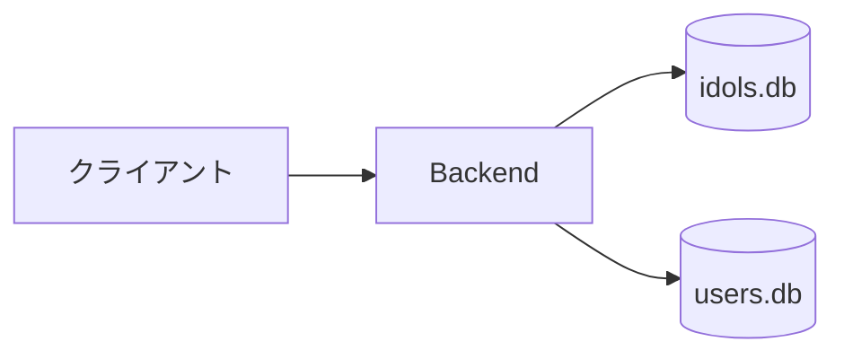
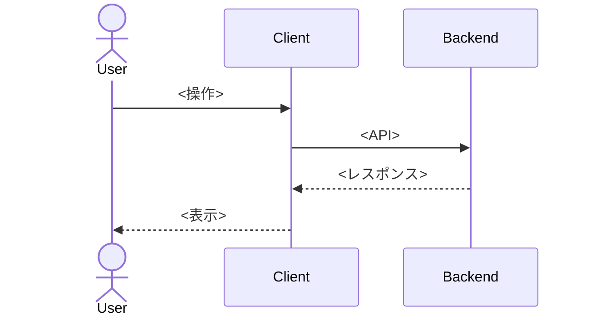
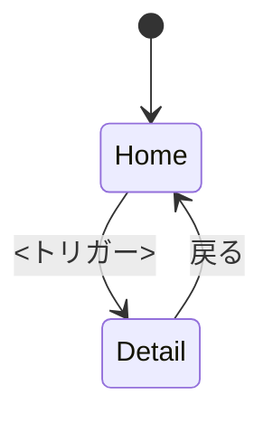
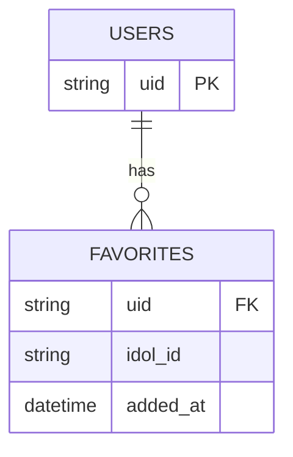

# <基本設計タイトル>

> **5 行以内 summary**: <この基本設計が答える問い / 対応する要件 / システム外形の概要 / 主要構成要素>
> AI 向け note: 業務 / システム外形視点で記述。HOW (モジュール責務 / 例外詳細) は detail 側で展開。
> コード断片禁止 (§4.6.1)。外部 I/F の詳細は `docs/api/colormaster-api.yaml` を Single Source of Truth として参照。
> 起票時に本コメント行は削除する。

## 1. 概要 (5 行以内サマリ)

<自然言語>

## 2. システム構成

| 構成要素 | 役割 | 関連 ADR |
|---|---|---|
| <要素> | <役割> | ADR-NNNN |

## 3. 機能一覧と要件マッピング

| SPEC-ID | 機能名 | 関連 FR ID | 関連 AC ID |
|---|---|---|---|
| SPEC-NNN-1 | <機能名> | FR-1 | AC-1 |

## 4. 業務フロー

## 5. 画面遷移

| 画面 | 状態 | 遷移トリガー |
|---|---|---|

## 6. データモデル (論理)

| エンティティ | 属性 | 制約 | 説明 |
|---|---|---|---|

## 7. 外部 I/F 一覧

詳細リクエスト/レスポンス JSON は **`docs/api/colormaster-api.yaml` (OpenAPI 3.1)** を Single Source of Truth として参照。

| I/F 名 | 種別 | エンドポイント | 入力概要 | 出力概要 | 関連 ADR |
|---|---|---|---|---|---|
| <I/F 名> | REST/SPARQL | <パス> | <概要> | <概要> | ADR-NNNN |

## 8. エラーケース / 例外パターン

| ケース | 発生条件 | UX | ログ | メトリクス |
|---|---|---|---|---|

## 9. 受け入れ基準 (AC) ↔ テストマップ

| AC ID | 内容 | 対応 SPEC-ID-detail | 期待テスト種別 |
|---|---|---|---|

## 10. 関連 ADR / リスク

- ADR-NNNN: <内容>

## 11. Open Questions

| 起票日 | 内容 | 暫定方針 | 解決状態 |
|---|---|---|---|
