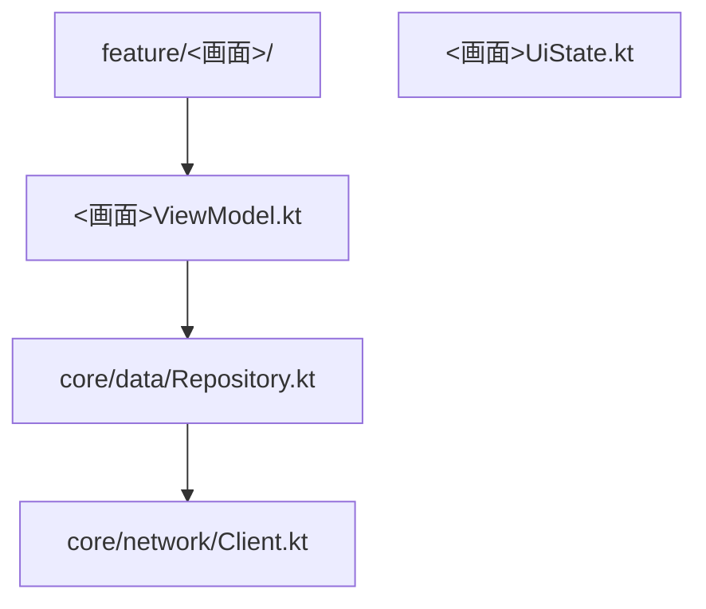
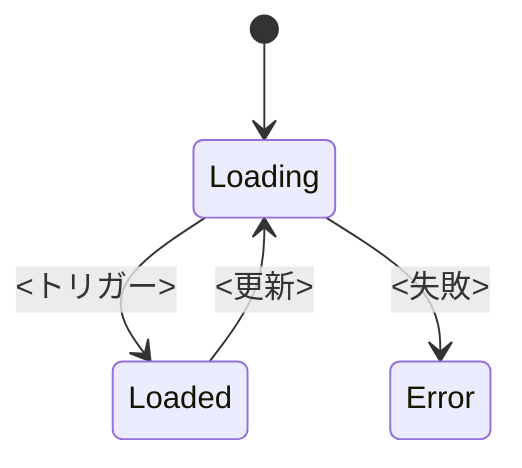
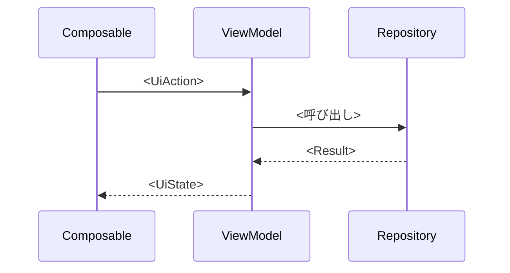

# <詳細設計タイトル>

> **5 行以内 summary**: <この詳細設計が答える問い / 対応する基本設計 / モジュール責務の概要>

## 1. 概要 (5 行以内サマリ)

<自然言語>

## 2. モジュール / ファイル配置

| パス | 責務 | 関連 SPEC-ID | 関連 `.claude/rules/` |
|---|---|---|---|

## 3. 主要クラスの責務

| クラス名 | 種別 | 責務 | 保持する状態 | 主要メソッドの責務 (シグネチャでなく自然言語) |
|---|---|---|---|---|

## 4. 状態遷移

| 状態 | UI 表示 | 遷移トリガー | 副作用 |
|---|---|---|---|

## 5. シーケンス (主要ユースケース)

## 6. データ構造 (論理スキーマ)

| 構造名 | フィールド | 型 (論理: String / Long / Instant 等) | 制約 | 説明 |
|---|---|---|---|---|

## 7. 例外 / リトライ / タイムアウト

| 発生位置 | ケース | 振る舞い | リトライ方針 | タイムアウト | Result 型での扱い |
|---|---|---|---|---|---|

## 8. 設定値 / 環境変数

| 名前 | 用途 | デフォルト | スコープ (build / runtime / secret) |
|---|---|---|---|

## 9. テストパターン

| テスト ID | 観点 | パターン (正常 / 異常 / 境界) | 関連 AC ID | `@Spec` 予定 ID |
|---|---|---|---|---|

## 10. 関連 Plan / Epic / ADR / Rules

- PLAN-NNN: <内容>
- EPIC-NNN: <内容>
- ADR-NNNN: <内容>
- `.claude/rules/<rule>.md`

## 11. Open Questions

| 起票日 | 内容 | 暫定方針 | 解決状態 |
|---|---|---|---|
